Perspectives on Computational Modeling PS7
================
HyungJin Cho
February 27, 2017

Part 1: Sexy Joe Biden
======================

#### 1.Estimate the training MSE of the model using the traditional approach. Fit the linear regression model using the entire dataset and calculate the mean squared error for the training set.

``` r
# <Model>
FIT_1A = lm(biden ~ ., data=DATA_1)

# <MSE Function> 
FUNC_MSE = function(model, data){
  x = modelr:::residuals(model, data)
  mean(x^2, na.rm=TRUE)
}

# <Model Estimation Summary> 
pander(summary(FIT_1A))
```

<table style="width:86%;">
<colgroup>
<col width="25%" />
<col width="15%" />
<col width="18%" />
<col width="13%" />
<col width="13%" />
</colgroup>
<thead>
<tr class="header">
<th align="center"> </th>
<th align="center">Estimate</th>
<th align="center">Std. Error</th>
<th align="center">t value</th>
<th align="center">Pr(&gt;|t|)</th>
</tr>
</thead>
<tbody>
<tr class="odd">
<td align="center"><strong>female</strong></td>
<td align="center">4.103</td>
<td align="center">0.9482</td>
<td align="center">4.327</td>
<td align="center">1.593e-05</td>
</tr>
<tr class="even">
<td align="center"><strong>age</strong></td>
<td align="center">0.04826</td>
<td align="center">0.02825</td>
<td align="center">1.708</td>
<td align="center">0.08773</td>
</tr>
<tr class="odd">
<td align="center"><strong>educ</strong></td>
<td align="center">-0.3453</td>
<td align="center">0.1948</td>
<td align="center">-1.773</td>
<td align="center">0.07641</td>
</tr>
<tr class="even">
<td align="center"><strong>dem</strong></td>
<td align="center">15.42</td>
<td align="center">1.068</td>
<td align="center">14.44</td>
<td align="center">8.145e-45</td>
</tr>
<tr class="odd">
<td align="center"><strong>rep</strong></td>
<td align="center">-15.85</td>
<td align="center">1.311</td>
<td align="center">-12.09</td>
<td align="center">2.157e-32</td>
</tr>
<tr class="even">
<td align="center"><strong>(Intercept)</strong></td>
<td align="center">58.81</td>
<td align="center">3.124</td>
<td align="center">18.82</td>
<td align="center">2.694e-72</td>
</tr>
</tbody>
</table>

<table style="width:85%;">
<caption>Fitting linear model: biden ~ .</caption>
<colgroup>
<col width="20%" />
<col width="30%" />
<col width="11%" />
<col width="22%" />
</colgroup>
<thead>
<tr class="header">
<th align="center">Observations</th>
<th align="center">Residual Std. Error</th>
<th align="center"><span class="math inline"><em>R</em><sup>2</sup></span></th>
<th align="center">Adjusted <span class="math inline"><em>R</em><sup>2</sup></span></th>
</tr>
</thead>
<tbody>
<tr class="odd">
<td align="center">1807</td>
<td align="center">19.91</td>
<td align="center">0.2815</td>
<td align="center">0.2795</td>
</tr>
</tbody>
</table>

``` r
# <MSE Calculation>
MSE_1 = FUNC_MSE(model=FIT_1A, data=DATA_1)
MSE_1
```

    ## [1] 395.2702

The Mean Squared Error is 395.2701693.

#### 2.Estimate the test MSE of the model using the validation set approach. Split the sample set into a training set (70%) and a validation set (30%). Be sure to set your seed prior to this part of your code to guarantee reproducibility of results. Fit the linear regression model using only the training observations. Calculate the MSE using only the test set observations. How does this value compare to the training MSE from step 1?

``` r
# <Function Definition>
FUNC_VALIDATION_1 = function(DATA){
  # <Validation Set Classification>
  set.seed(1234)
  DATA_SPLIT = resample_partition(DATA, c(train=0.7, test=0.3))
  DATA_TRAIN = DATA_SPLIT$train %>%
    tbl_df()
  DATA_TEST = DATA_SPLIT$test %>%
    tbl_df()
  # <Model>
  FIT = lm(biden ~ ., data=DATA_TRAIN)
  # <MSE Calculation>
  MSE = FUNC_MSE(model=FIT, data=DATA_TEST)

  # <Model Estimation Summary>
  return(pander(summary(FIT)))
}

# <Function Definition>
FUNC_VALIDATION_2 = function(DATA){
  # <Validation Set Classification>
  set.seed(1234)
  DATA_SPLIT = resample_partition(DATA, c(train=0.7, test=0.3))
  DATA_TRAIN = DATA_SPLIT$train %>%
    tbl_df()
  DATA_TEST = DATA_SPLIT$test %>%
    tbl_df()
  # <Model>
  FIT = lm(biden ~ ., data=DATA_TRAIN)
  # <MSE Calculation>
  MSE = FUNC_MSE(model=FIT, data=DATA_TEST)

  # <MSE Calculation>
  return(MSE_2 = MSE)
}

# <MSE Calculation>
FUNC_VALIDATION_1(DATA_1)
```

<table style="width:86%;">
<colgroup>
<col width="25%" />
<col width="15%" />
<col width="18%" />
<col width="13%" />
<col width="13%" />
</colgroup>
<thead>
<tr class="header">
<th align="center"> </th>
<th align="center">Estimate</th>
<th align="center">Std. Error</th>
<th align="center">t value</th>
<th align="center">Pr(&gt;|t|)</th>
</tr>
</thead>
<tbody>
<tr class="odd">
<td align="center"><strong>female</strong></td>
<td align="center">3.794</td>
<td align="center">1.126</td>
<td align="center">3.37</td>
<td align="center">0.0007757</td>
</tr>
<tr class="even">
<td align="center"><strong>age</strong></td>
<td align="center">0.04319</td>
<td align="center">0.03325</td>
<td align="center">1.299</td>
<td align="center">0.1943</td>
</tr>
<tr class="odd">
<td align="center"><strong>educ</strong></td>
<td align="center">-0.4777</td>
<td align="center">0.2258</td>
<td align="center">-2.116</td>
<td align="center">0.03454</td>
</tr>
<tr class="even">
<td align="center"><strong>dem</strong></td>
<td align="center">15.6</td>
<td align="center">1.257</td>
<td align="center">12.41</td>
<td align="center">1.826e-33</td>
</tr>
<tr class="odd">
<td align="center"><strong>rep</strong></td>
<td align="center">-15.91</td>
<td align="center">1.566</td>
<td align="center">-10.16</td>
<td align="center">2.297e-23</td>
</tr>
<tr class="even">
<td align="center"><strong>(Intercept)</strong></td>
<td align="center">60.96</td>
<td align="center">3.658</td>
<td align="center">16.66</td>
<td align="center">1.701e-56</td>
</tr>
</tbody>
</table>

<table style="width:85%;">
<caption>Fitting linear model: biden ~ .</caption>
<colgroup>
<col width="20%" />
<col width="30%" />
<col width="11%" />
<col width="22%" />
</colgroup>
<thead>
<tr class="header">
<th align="center">Observations</th>
<th align="center">Residual Std. Error</th>
<th align="center"><span class="math inline"><em>R</em><sup>2</sup></span></th>
<th align="center">Adjusted <span class="math inline"><em>R</em><sup>2</sup></span></th>
</tr>
</thead>
<tbody>
<tr class="odd">
<td align="center">1264</td>
<td align="center">19.74</td>
<td align="center">0.2851</td>
<td align="center">0.2823</td>
</tr>
</tbody>
</table>

``` r
MSE_2 = FUNC_VALIDATION_2(DATA_1)
```

The testing Mean Squared Error is 413.0424354. The test MSE of the model using the validation set approach has higher value compared to the training MSE of the model using the traditional approach (Difference between Step2 and Step1 = 17.7722661).

#### 3.Repeat the validation set approach 100 times, using 100 different splits of the observations into a training set and a validation set. Comment on the results obtained.

``` r
# <Function Definition>
FUNC_VALIDATION_3 = function(DATA){
  # <Validation Set Classification>
  DATA_SPLIT = resample_partition(DATA, c(train=0.7, test=0.3))
  DATA_TRAIN = DATA_SPLIT$train %>%
    tbl_df()
  DATA_TEST = DATA_SPLIT$test %>%
    tbl_df()
  # <Model>
  FIT = lm(biden ~ ., data=DATA_TRAIN)
  # <MSE Calculation>
  MSE = FUNC_MSE(model=FIT, data=DATA_TEST)

  # <Mean Squared Error>
  return(data_frame(MSE))
}

# <MSE Calculation>
set.seed(1234)
MSE_3A = rerun(100, FUNC_VALIDATION_3(DATA_1)) %>%
  bind_rows()
MSE_3 = mean(MSE_3A$MSE)
MSE_3
```

    ## [1] 400.111

The average Mean Squared Error is 400.1109607. The average MSE of the model using the validation set approach with 100 different splits of the observations has higher value compared to the training MSE of the model using the traditional approach, but has lower value compared to the test MSE of the model using the validation set approach (Difference between Step3 and Step1 = 4.8407915, Difference between Step3 and Step2 = -12.9314747).

### 4.Estimate the test MSE of the model using the leave-one-out cross-validation (LOOCV) approach. Comment on the results obtained.

``` r
# <Function Definition: Leave-one-out cross-validation>
FUNC_LOOCV_1 = function(data, nrow){
  LOOCV_DATA = crossv_kfold(data, nrow)
  LOOCV_MODEL = map(LOOCV_DATA$train, ~ lm(biden ~ ., data=.))
  LOOCV_MSE = map2_dbl(LOOCV_MODEL, LOOCV_DATA$test, FUNC_MSE)
  
  print(mean(LOOCV_MSE, na.rm=TRUE))
}

# <MSE Calculation>
MSE_4 = FUNC_LOOCV_1(DATA_1, nrow(DATA_1))
```

    ## [1] 397.9555

The test Mean Squared Error is 397.9555046. The test MSE of the model using the leave-one-out cross-validation (LOOCV) approach has lower value compared to the test MSE of the model using the validation set approach, but has higher value compare to the training MSE of the model using the traditional approach (Difference between Step4 and Step3 = -2.1554562, Difference between Step4 and Step2 = -15.0869308, Difference between Step4 and Step1 = 2.6853353).

### 5.Estimate the test MSE of the model using the 10-fold cross-validation approach. Comment on the results obtained.

``` r
# <MSE Calculation>
MSE_5 = FUNC_LOOCV_1(DATA_1, 10)
```

    ## [1] 397.414

The test Mean Squared Error is 397.4139652. The test MSE of the model using the 10-fold cross-validation approach has lower value compared to the test MSE of the model using the validation set approach or the model using the leave-one-out cross-validation (LOOCV) approach, but has higher value compare to the training MSE of the model using the traditional approach (Difference between Step5 and Step4 = -0.5415394, Step5 and Step3 = -2.6969956, Difference between Step5 and Step2 = -15.6284702, Difference between Step4 and Step1 = 2.1437959).

### 6.Repeat the 10-fold cross-validation approach 100 times, using 100 different splits of the observations into 10-folds. Comment on the results obtained.

``` r
# <Function Definition>
FUNC_FOLD_2 = function(data, nrow){
  FOLD_DATA = crossv_kfold(data, nrow)
  FOLD_MODEL = map(FOLD_DATA$train, ~ lm(biden ~ ., data=.))
  FOLD_MSE = map2_dbl(FOLD_MODEL, FOLD_DATA$test, FUNC_MSE)

  return(data_frame(FOLD_MSE))
}

# <MSE Calculation>
set.seed(1234)
MSE_6A = rerun(100, FUNC_FOLD_2(DATA_1, 10)) %>%
  bind_rows()
MSE_6 = mean(MSE_6A$FOLD_MSE)
MSE_6
```

    ## [1] 398.0642

The average Mean Squared Error is 398.0641646. The average MSE of the model using the 10-fold cross-validation approach with 100 different splits of the observations has higher value compared to the previous MSE (Difference between Step6 and Step5 = 0.6501994).

### 7.Compare the estimated parameters and standard errors from the original model in step 1 (the model estimated using all of the available data) to parameters and standard errors estimated using the bootstrap (n=1000).

``` r
# <Model Estimation Summary> 
pander(summary(FIT_1A))
```

<table style="width:86%;">
<colgroup>
<col width="25%" />
<col width="15%" />
<col width="18%" />
<col width="13%" />
<col width="13%" />
</colgroup>
<thead>
<tr class="header">
<th align="center"> </th>
<th align="center">Estimate</th>
<th align="center">Std. Error</th>
<th align="center">t value</th>
<th align="center">Pr(&gt;|t|)</th>
</tr>
</thead>
<tbody>
<tr class="odd">
<td align="center"><strong>female</strong></td>
<td align="center">4.103</td>
<td align="center">0.9482</td>
<td align="center">4.327</td>
<td align="center">1.593e-05</td>
</tr>
<tr class="even">
<td align="center"><strong>age</strong></td>
<td align="center">0.04826</td>
<td align="center">0.02825</td>
<td align="center">1.708</td>
<td align="center">0.08773</td>
</tr>
<tr class="odd">
<td align="center"><strong>educ</strong></td>
<td align="center">-0.3453</td>
<td align="center">0.1948</td>
<td align="center">-1.773</td>
<td align="center">0.07641</td>
</tr>
<tr class="even">
<td align="center"><strong>dem</strong></td>
<td align="center">15.42</td>
<td align="center">1.068</td>
<td align="center">14.44</td>
<td align="center">8.145e-45</td>
</tr>
<tr class="odd">
<td align="center"><strong>rep</strong></td>
<td align="center">-15.85</td>
<td align="center">1.311</td>
<td align="center">-12.09</td>
<td align="center">2.157e-32</td>
</tr>
<tr class="even">
<td align="center"><strong>(Intercept)</strong></td>
<td align="center">58.81</td>
<td align="center">3.124</td>
<td align="center">18.82</td>
<td align="center">2.694e-72</td>
</tr>
</tbody>
</table>

<table style="width:85%;">
<caption>Fitting linear model: biden ~ .</caption>
<colgroup>
<col width="20%" />
<col width="30%" />
<col width="11%" />
<col width="22%" />
</colgroup>
<thead>
<tr class="header">
<th align="center">Observations</th>
<th align="center">Residual Std. Error</th>
<th align="center"><span class="math inline"><em>R</em><sup>2</sup></span></th>
<th align="center">Adjusted <span class="math inline"><em>R</em><sup>2</sup></span></th>
</tr>
</thead>
<tbody>
<tr class="odd">
<td align="center">1807</td>
<td align="center">19.91</td>
<td align="center">0.2815</td>
<td align="center">0.2795</td>
</tr>
</tbody>
</table>

``` r
# <Bootstrap>
set.seed(1234)
BOOT_1 = DATA_1 %>%
  modelr::bootstrap(1000) %>%
  mutate(model=map(strap, ~ lm(biden ~ ., data=.)),
         coef=map(model, tidy)) %>%
  unnest(coef) %>%
  group_by(term) %>%
  summarize(est.boot=mean(estimate),
            se.boot=sd(estimate, na.rm=TRUE)) %>%
  pander()
```

In general, parameters and standard errors are simillar. For the estimates, the values using the bootstrap are slightly higher for intercept and lower for the other variables. For the standard errors, the values using the bootstrap are slightly higher for `age`, `dem`, `female`, `rep` and lower for the other variables.

Part 2: College
===============

#### `Room.Board` Room and board costs.

``` r
# <Model>
FIT_2A = lm(Outstate ~ Room.Board, data=DATA_2)
FIT_2AA = lm(Outstate ~ poly(Room.Board, 2), data=DATA_2)
DATA_2 %>%
  add_predictions(FIT_2A) %>%
  add_residuals(FIT_2A) %>%
  {.} -> GRID_2A
DATA_2 %>%
  add_predictions(FIT_2AA) %>%
  add_residuals(FIT_2AA) %>%
  {.} -> GRID_2AA
# <Model Estimation Summary> 
pander(summary(FIT_2A))
```

<table style="width:86%;">
<colgroup>
<col width="25%" />
<col width="15%" />
<col width="18%" />
<col width="13%" />
<col width="13%" />
</colgroup>
<thead>
<tr class="header">
<th align="center"> </th>
<th align="center">Estimate</th>
<th align="center">Std. Error</th>
<th align="center">t value</th>
<th align="center">Pr(&gt;|t|)</th>
</tr>
</thead>
<tbody>
<tr class="odd">
<td align="center"><strong>Room.Board</strong></td>
<td align="center">2.4</td>
<td align="center">0.09965</td>
<td align="center">24.08</td>
<td align="center">4.135e-96</td>
</tr>
<tr class="even">
<td align="center"><strong>(Intercept)</strong></td>
<td align="center">-17.45</td>
<td align="center">447.8</td>
<td align="center">-0.03896</td>
<td align="center">0.9689</td>
</tr>
</tbody>
</table>

<table style="width:85%;">
<caption>Fitting linear model: Outstate ~ Room.Board</caption>
<colgroup>
<col width="20%" />
<col width="30%" />
<col width="11%" />
<col width="22%" />
</colgroup>
<thead>
<tr class="header">
<th align="center">Observations</th>
<th align="center">Residual Std. Error</th>
<th align="center"><span class="math inline"><em>R</em><sup>2</sup></span></th>
<th align="center">Adjusted <span class="math inline"><em>R</em><sup>2</sup></span></th>
</tr>
</thead>
<tbody>
<tr class="odd">
<td align="center">777</td>
<td align="center">3044</td>
<td align="center">0.4281</td>
<td align="center">0.4273</td>
</tr>
</tbody>
</table>

``` r
pander(summary(FIT_2AA))
```

<table style="width:99%;">
<colgroup>
<col width="37%" />
<col width="15%" />
<col width="18%" />
<col width="13%" />
<col width="13%" />
</colgroup>
<thead>
<tr class="header">
<th align="center"> </th>
<th align="center">Estimate</th>
<th align="center">Std. Error</th>
<th align="center">t value</th>
<th align="center">Pr(&gt;|t|)</th>
</tr>
</thead>
<tbody>
<tr class="odd">
<td align="center"><strong>poly(Room.Board, 2)1</strong></td>
<td align="center">73321</td>
<td align="center">3037</td>
<td align="center">24.14</td>
<td align="center">2.031e-96</td>
</tr>
<tr class="even">
<td align="center"><strong>poly(Room.Board, 2)2</strong></td>
<td align="center">-6535</td>
<td align="center">3037</td>
<td align="center">-2.151</td>
<td align="center">0.03175</td>
</tr>
<tr class="odd">
<td align="center"><strong>(Intercept)</strong></td>
<td align="center">10441</td>
<td align="center">109</td>
<td align="center">95.82</td>
<td align="center">0</td>
</tr>
</tbody>
</table>

<table style="width:85%;">
<caption>Fitting linear model: Outstate ~ poly(Room.Board, 2)</caption>
<colgroup>
<col width="20%" />
<col width="30%" />
<col width="11%" />
<col width="22%" />
</colgroup>
<thead>
<tr class="header">
<th align="center">Observations</th>
<th align="center">Residual Std. Error</th>
<th align="center"><span class="math inline"><em>R</em><sup>2</sup></span></th>
<th align="center">Adjusted <span class="math inline"><em>R</em><sup>2</sup></span></th>
</tr>
</thead>
<tbody>
<tr class="odd">
<td align="center">777</td>
<td align="center">3037</td>
<td align="center">0.4315</td>
<td align="center">0.43</td>
</tr>
</tbody>
</table>

``` r
# <Comment>
print("The linear regression model appears 'Outstate = -17.45 + 2.4*Room.Board' with statistical significance. The model's fitness represented by R square is 0.4281")
```

    ## [1] "The linear regression model appears 'Outstate = -17.45 + 2.4*Room.Board' with statistical significance. The model's fitness represented by R square is 0.4281"

``` r
# <Graph: Regression Model>
ggplot(data=DATA_2, mapping=aes(y=Outstate, x=Room.Board)) +
  geom_point() +
  geom_smooth(data=GRID_2A, mapping=aes(y=pred), color='blue', size=2) +
  geom_smooth(data=GRID_2AA, mapping=aes(y=pred), color='orange', size=2) +
  labs(title="Regression Model", subtitle="Out-of-state Tuition ~ Room and Board Costs",
       y="Out-of-state Tuition", x="Room and Board costs")
```

    ## `geom_smooth()` using method = 'loess'
    ## `geom_smooth()` using method = 'loess'

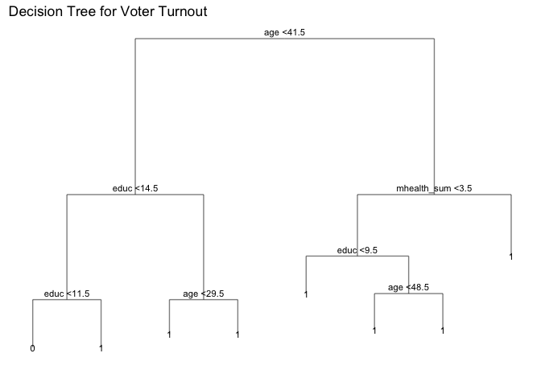

``` r
# <Graph: Predicted Value and Residuals>
ggplot(data=GRID_2A, mapping=aes(y=resid, x=pred)) +
  geom_point(data=GRID_2A, color='blue', alpha=0.5) +
  geom_hline(yintercept=0, linetype='dashed', color='blue', size=2) +
  labs(title="Predicted Value and Residuals", subtitle="Out-of-state Tuition ~ Room and Board Costs",
       y="Residuals", x="Predicted Out-of-state Tuition")
```

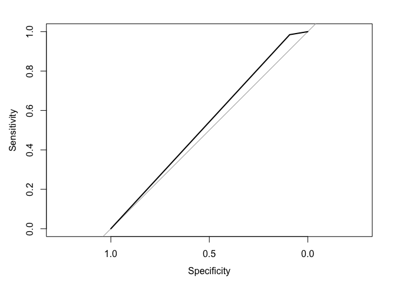

``` r
# <Comment>
print("The graph of regression model and the graph of predicted value and residuals show that there is a positive linear relationship between Outstate and Room.Board and the residuals are randomly located around 0.")
```

    ## [1] "The graph of regression model and the graph of predicted value and residuals show that there is a positive linear relationship between Outstate and Room.Board and the residuals are randomly located around 0."

``` r
# <10-fold cross-validation>
set.seed(1234)
FOLD_VECTOR = vector("numeric", 5)
TERM = 1:5
for(i in TERM){
  FOLD_DATA = crossv_kfold(DATA_2, k=10)
  FOLD_MODEL = map(FOLD_DATA$train, ~ lm(Outstate ~ poly(Room.Board, i), data = .))
  FOLD_MSE = map2_dbl(FOLD_MODEL, FOLD_DATA$test, FUNC_MSE)
  FOLD_VECTOR[[i]] = mean(FOLD_MSE, na.rm=TRUE)
}
# <Graph: MSE Estimates>
data_frame(terms=TERM, MSE=FOLD_VECTOR) %>%
  ggplot(mapping=aes(y=MSE, x=terms)) +
  geom_line() +
  labs(title="MSE Estimates", subtitle="Out-of-state Tuition ~ Room and Board Costs",
       y="Mean Squared Error", x="Degree of Polynomial")
```

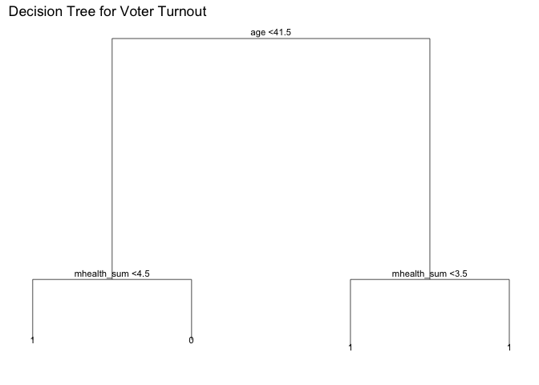

``` r
# <Comment>
DIFF_2A = round(((FOLD_VECTOR[2] - FOLD_VECTOR[1])/FOLD_VECTOR[1] * 100), 2)
sprintf("The graph of MSE estimates shows that MSE is lowest at degree 2. However, the MSE only decreases %s percent. Therefore, 1-degree line is selected. In conclusion, there is a positive relationship between Outstate and Room.Board with a coefficient of 2.4.", DIFF_2A)
```

    ## [1] "The graph of MSE estimates shows that MSE is lowest at degree 2. However, the MSE only decreases -0.8 percent. Therefore, 1-degree line is selected. In conclusion, there is a positive relationship between Outstate and Room.Board with a coefficient of 2.4."

#### `Top10perc` Percent of new students from top 10% of H.S. class.

``` r
# <Model>
FIT_2B = lm(Outstate ~ Top10perc, data=DATA_2)
FIT_2BB = lm(Outstate ~ sqrt(Top10perc), data=DATA_2)
DATA_2 %>%
  add_predictions(FIT_2B) %>%
  add_residuals(FIT_2B) %>%
  {.} -> GRID_2B
DATA_2 %>%
  add_predictions(FIT_2BB) %>%
  add_residuals(FIT_2BB) %>%
  {.} -> GRID_2BB
# <Model Estimation Summary> 
pander(summary(FIT_2B))
```

<table style="width:86%;">
<colgroup>
<col width="25%" />
<col width="15%" />
<col width="18%" />
<col width="13%" />
<col width="13%" />
</colgroup>
<thead>
<tr class="header">
<th align="center"> </th>
<th align="center">Estimate</th>
<th align="center">Std. Error</th>
<th align="center">t value</th>
<th align="center">Pr(&gt;|t|)</th>
</tr>
</thead>
<tbody>
<tr class="odd">
<td align="center"><strong>Top10perc</strong></td>
<td align="center">128.2</td>
<td align="center">6.774</td>
<td align="center">18.93</td>
<td align="center">5.459e-66</td>
</tr>
<tr class="even">
<td align="center"><strong>(Intercept)</strong></td>
<td align="center">6906</td>
<td align="center">221.6</td>
<td align="center">31.16</td>
<td align="center">7.504e-139</td>
</tr>
</tbody>
</table>

<table style="width:85%;">
<caption>Fitting linear model: Outstate ~ Top10perc</caption>
<colgroup>
<col width="20%" />
<col width="30%" />
<col width="11%" />
<col width="22%" />
</colgroup>
<thead>
<tr class="header">
<th align="center">Observations</th>
<th align="center">Residual Std. Error</th>
<th align="center"><span class="math inline"><em>R</em><sup>2</sup></span></th>
<th align="center">Adjusted <span class="math inline"><em>R</em><sup>2</sup></span></th>
</tr>
</thead>
<tbody>
<tr class="odd">
<td align="center">777</td>
<td align="center">3329</td>
<td align="center">0.3162</td>
<td align="center">0.3153</td>
</tr>
</tbody>
</table>

``` r
pander(summary(FIT_2BB))
```

<table style="width:92%;">
<colgroup>
<col width="30%" />
<col width="15%" />
<col width="18%" />
<col width="13%" />
<col width="13%" />
</colgroup>
<thead>
<tr class="header">
<th align="center"> </th>
<th align="center">Estimate</th>
<th align="center">Std. Error</th>
<th align="center">t value</th>
<th align="center">Pr(&gt;|t|)</th>
</tr>
</thead>
<tbody>
<tr class="odd">
<td align="center"><strong>sqrt(Top10perc)</strong></td>
<td align="center">1410</td>
<td align="center">75.49</td>
<td align="center">18.68</td>
<td align="center">1.506e-64</td>
</tr>
<tr class="even">
<td align="center"><strong>(Intercept)</strong></td>
<td align="center">3387</td>
<td align="center">396.3</td>
<td align="center">8.547</td>
<td align="center">6.702e-17</td>
</tr>
</tbody>
</table>

<table style="width:85%;">
<caption>Fitting linear model: Outstate ~ sqrt(Top10perc)</caption>
<colgroup>
<col width="20%" />
<col width="30%" />
<col width="11%" />
<col width="22%" />
</colgroup>
<thead>
<tr class="header">
<th align="center">Observations</th>
<th align="center">Residual Std. Error</th>
<th align="center"><span class="math inline"><em>R</em><sup>2</sup></span></th>
<th align="center">Adjusted <span class="math inline"><em>R</em><sup>2</sup></span></th>
</tr>
</thead>
<tbody>
<tr class="odd">
<td align="center">777</td>
<td align="center">3343</td>
<td align="center">0.3104</td>
<td align="center">0.3095</td>
</tr>
</tbody>
</table>

``` r
# <Comment>
print("The linear regression model appears 'Outstate = 6906 + 128.2*Top10perc' with statistical significance. The model's fitness represented by R square is 0.3162")
```

    ## [1] "The linear regression model appears 'Outstate = 6906 + 128.2*Top10perc' with statistical significance. The model's fitness represented by R square is 0.3162"

``` r
# <Graph: Regression Model>
ggplot(data=DATA_2, mapping=aes(y=Outstate, x=Top10perc)) +
  geom_point() +
  geom_smooth(data=GRID_2B, mapping=aes(y=pred), color='blue', size=2) +
  geom_smooth(data=GRID_2BB, mapping=aes(y=pred), color='orange', size=2) +
  labs(title="Regression Model", subtitle="Out-of-state Tuition ~ Percent of New Students from Top 10% of H.S. Class",
       y="Out-of-state Tuition", x="Out-of-state Tuition ~ Percent of New Students from Top 10% of H.S. Class")
```

    ## `geom_smooth()` using method = 'loess'
    ## `geom_smooth()` using method = 'loess'


``` r
# <Graph: Predicted Value and Residuals>
ggplot(mapping=aes(y=resid, x=pred)) +
  geom_point(data=GRID_2B, color='blue', alpha=0.5) +
  geom_point(data=GRID_2BB, color='orange', alpha=0.5) +
  geom_hline(yintercept=0, linetype='dashed', color='blue', size=2) +
  labs(title="Predicted Value and Residuals", subtitle="Out-of-state Tuition ~ Out-of-state Tuition ~ Percent of New Students from Top 10% of H.S. Class",
       y="Residuals", x="Predicted Out-of-state Tuition")
```

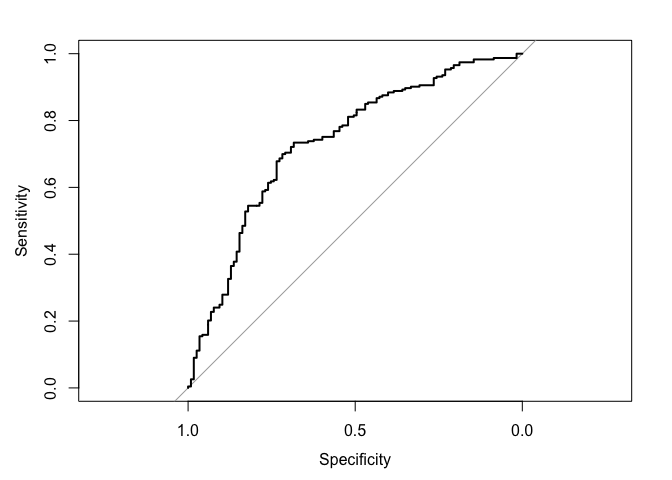

``` r
# <Comment>
print("The graph of regression model and the graph of predicted value and residuals show that there is a positive linear relationship between Outstate and Top10perc and the residuals are randomly located around 0. Thus, the square root-transformation is not applied.")
```

    ## [1] "The graph of regression model and the graph of predicted value and residuals show that there is a positive linear relationship between Outstate and Top10perc and the residuals are randomly located around 0. Thus, the square root-transformation is not applied."

``` r
# <10-fold cross-validation>
set.seed(1234)
FOLD_VECTOR = vector("numeric", 5)
TERM = 1:5
for(i in TERM){
  FOLD_DATA = crossv_kfold(DATA_2, k=10)
  FOLD_MODEL = map(FOLD_DATA$train, ~ lm(Outstate ~ poly(Top10perc, i), data = .))
  FOLD_MSE = map2_dbl(FOLD_MODEL, FOLD_DATA$test, FUNC_MSE)
  FOLD_VECTOR[[i]] = mean(FOLD_MSE, na.rm=TRUE)
}

# <Graph: MSE Estimates>
data_frame(terms=TERM, MSE=FOLD_VECTOR) %>%
  ggplot(mapping=aes(y=MSE, x=terms)) +
  geom_line() +
  labs(title="MSE Estimates", subtitle="Out-of-state Tuition ~ Percent of New Students from Top 10% of H.S. Class",
       y="Mean Squared Error", x="Degree of Polynomial")
```

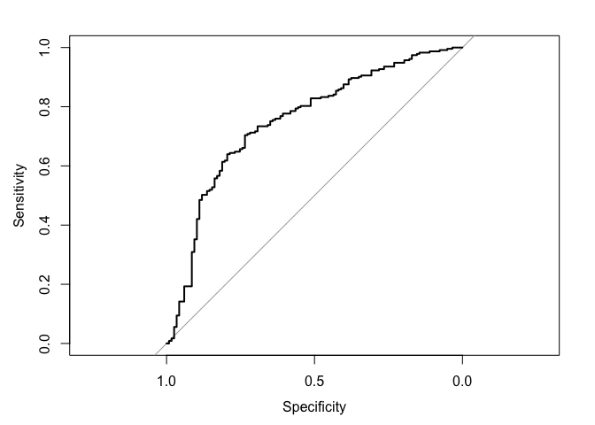

``` r
# <Comment>
DIFF_2B = round(((FOLD_VECTOR[2] - FOLD_VECTOR[1])/FOLD_VECTOR[1] * 100), 2)
sprintf("The graph of MSE estimates shows that MSE is lowest at degree 2. However, the MSE only decreases %s percent. Therefore, 1-degree line is selected. In conclusion, there is a positive relationship between Outstate and Top10perc with a coefficient of 128.2.", DIFF_2B)
```

    ## [1] "The graph of MSE estimates shows that MSE is lowest at degree 2. However, the MSE only decreases -0.08 percent. Therefore, 1-degree line is selected. In conclusion, there is a positive relationship between Outstate and Top10perc with a coefficient of 128.2."

#### `Expend` Instructional expenditure per student.

``` r
# <Model>
FIT_2C = lm(Outstate ~ Expend, data=DATA_2)
FIT_2CC = lm(Outstate ~ log(Expend), data=DATA_2)
DATA_2 %>%
  add_predictions(FIT_2C) %>%
  add_residuals(FIT_2C) %>%
  {.} -> GRID_2C
DATA_2 %>%
  add_predictions(FIT_2CC) %>%
  add_residuals(FIT_2CC) %>%
  {.} -> GRID_2CC
# <Model Estimation Summary> 
pander(summary(FIT_2C))
```

<table style="width:86%;">
<colgroup>
<col width="25%" />
<col width="15%" />
<col width="18%" />
<col width="13%" />
<col width="13%" />
</colgroup>
<thead>
<tr class="header">
<th align="center"> </th>
<th align="center">Estimate</th>
<th align="center">Std. Error</th>
<th align="center">t value</th>
<th align="center">Pr(&gt;|t|)</th>
</tr>
</thead>
<tbody>
<tr class="odd">
<td align="center"><strong>Expend</strong></td>
<td align="center">0.5183</td>
<td align="center">0.02047</td>
<td align="center">25.32</td>
<td align="center">1.63e-103</td>
</tr>
<tr class="even">
<td align="center"><strong>(Intercept)</strong></td>
<td align="center">5434</td>
<td align="center">224.8</td>
<td align="center">24.17</td>
<td align="center">1.258e-96</td>
</tr>
</tbody>
</table>

<table style="width:85%;">
<caption>Fitting linear model: Outstate ~ Expend</caption>
<colgroup>
<col width="20%" />
<col width="30%" />
<col width="11%" />
<col width="22%" />
</colgroup>
<thead>
<tr class="header">
<th align="center">Observations</th>
<th align="center">Residual Std. Error</th>
<th align="center"><span class="math inline"><em>R</em><sup>2</sup></span></th>
<th align="center">Adjusted <span class="math inline"><em>R</em><sup>2</sup></span></th>
</tr>
</thead>
<tbody>
<tr class="odd">
<td align="center">777</td>
<td align="center">2978</td>
<td align="center">0.4526</td>
<td align="center">0.4519</td>
</tr>
</tbody>
</table>

``` r
pander(summary(FIT_2CC))
```

<table style="width:86%;">
<colgroup>
<col width="25%" />
<col width="15%" />
<col width="18%" />
<col width="13%" />
<col width="13%" />
</colgroup>
<thead>
<tr class="header">
<th align="center"> </th>
<th align="center">Estimate</th>
<th align="center">Std. Error</th>
<th align="center">t value</th>
<th align="center">Pr(&gt;|t|)</th>
</tr>
</thead>
<tbody>
<tr class="odd">
<td align="center"><strong>log(Expend)</strong></td>
<td align="center">7482</td>
<td align="center">229.9</td>
<td align="center">32.54</td>
<td align="center">4.059e-147</td>
</tr>
<tr class="even">
<td align="center"><strong>(Intercept)</strong></td>
<td align="center">-57502</td>
<td align="center">2090</td>
<td align="center">-27.51</td>
<td align="center">8.347e-117</td>
</tr>
</tbody>
</table>

<table style="width:85%;">
<caption>Fitting linear model: Outstate ~ log(Expend)</caption>
<colgroup>
<col width="20%" />
<col width="30%" />
<col width="11%" />
<col width="22%" />
</colgroup>
<thead>
<tr class="header">
<th align="center">Observations</th>
<th align="center">Residual Std. Error</th>
<th align="center"><span class="math inline"><em>R</em><sup>2</sup></span></th>
<th align="center">Adjusted <span class="math inline"><em>R</em><sup>2</sup></span></th>
</tr>
</thead>
<tbody>
<tr class="odd">
<td align="center">777</td>
<td align="center">2617</td>
<td align="center">0.5774</td>
<td align="center">0.5769</td>
</tr>
</tbody>
</table>

``` r
# <Comment>
print("The linear regression model appears 'Outstate = 5434 + 0.5183*Expend' with statistical significance. The model's fitness represented by R square is 0.4526")
```

    ## [1] "The linear regression model appears 'Outstate = 5434 + 0.5183*Expend' with statistical significance. The model's fitness represented by R square is 0.4526"

``` r
# <Graph: Regression Model>
ggplot(data=DATA_2, mapping=aes(y=Outstate, x=Expend)) +
  geom_point() +
  geom_smooth(data=GRID_2C, mapping=aes(y=pred), color='blue', size=2) +
  geom_smooth(data=GRID_2CC, mapping=aes(y=pred), color='orange', size=2) +
  labs(title="Regression Model", subtitle="Out-of-state Tuition ~ Instructional Expenditure per Student",
       y="Out-of-state Tuition", x="Instructional Expenditure per Student")
```

    ## `geom_smooth()` using method = 'loess'
    ## `geom_smooth()` using method = 'loess'


``` r
# <Graph: Predicted Value and Residuals>
ggplot(mapping=aes(y=resid, x=pred)) +
  geom_point(data=GRID_2C, color='blue', alpha=0.5) +
  geom_point(data=GRID_2CC, color='orange', alpha=0.5) +
  geom_hline(yintercept=0, linetype='dashed', color='blue', size=2) +
  labs(title="Predicted Value and Residuals", subtitle="Out-of-state Tuition ~ Instructional Expenditure per Student",
       y="Residuals", x="Predicted Out-of-state Tuition")
```

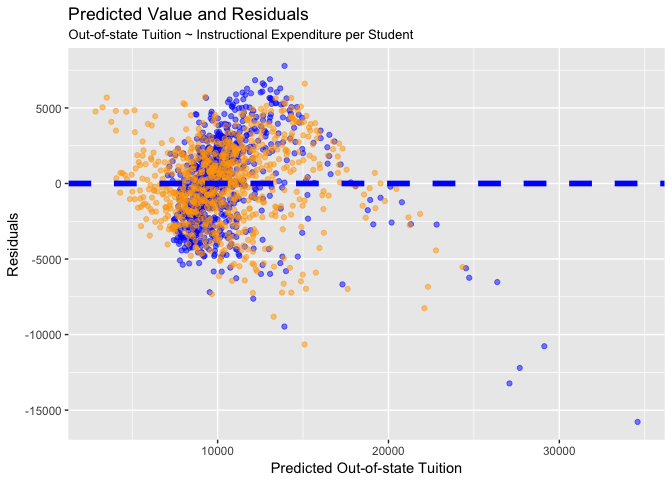

``` r
# <Comment>
print("The graph of regression model and the graph of predicted value and residuals show that the model doen't suit for the linear relationship between Outstate and Expend. Thus, the log-transformation is applied.")
```

    ## [1] "The graph of regression model and the graph of predicted value and residuals show that the model doen't suit for the linear relationship between Outstate and Expend. Thus, the log-transformation is applied."

``` r
# <10-fold cross-validation>
set.seed(1234)
FOLD_VECTOR = vector("numeric", 5)
TERM = 1:5
for(i in TERM){
  FOLD_DATA = crossv_kfold(DATA_2, k=10)
  FOLD_MODEL = map(FOLD_DATA$train, ~ lm(Outstate ~ poly(Expend, i), data = .))
  FOLD_MSE = map2_dbl(FOLD_MODEL, FOLD_DATA$test, FUNC_MSE)
  FOLD_VECTOR[[i]] = mean(FOLD_MSE, na.rm=TRUE)
}
FUNC_LOG = function(data, nrow){
  FOLD_DATA = crossv_kfold(data, nrow)
  FOLD_MODEL = map(FOLD_DATA$train, ~ lm(Outstate ~ log(Expend), data = .))
  FOLD_MSE = map2_dbl(FOLD_MODEL, FOLD_DATA$test, FUNC_MSE)
  return(mean(FOLD_MSE, na.rm=TRUE))
}
FOLD_LOG = FUNC_LOG(DATA_2, 10)

# <Graph: MSE Estimates>
data_frame(terms=TERM, MSE=FOLD_VECTOR) %>%
  ggplot(mapping=aes(y=MSE, x=terms)) +
  geom_line() +
  geom_hline(mapping=aes(yintercept=FOLD_LOG, color='MSE for Log Transformation'),
             linetype='dashed') + 
  scale_colour_manual("", values=c("MSE for Log Transformation"="orange"))
```

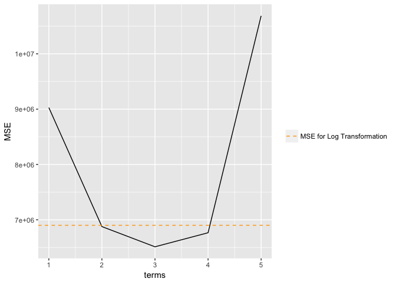

``` r
  labs(title="MSE Estimates", subtitle="Out-of-state Tuition ~ Instructional Expenditure per Student",
       y="Mean Squared Error", x="Degree of Polynomial")
```

    ## $title
    ## [1] "MSE Estimates"
    ## 
    ## $subtitle
    ## [1] "Out-of-state Tuition ~ Instructional Expenditure per Student"
    ## 
    ## $y
    ## [1] "Mean Squared Error"
    ## 
    ## $x
    ## [1] "Degree of Polynomial"
    ## 
    ## attr(,"class")
    ## [1] "labels"

``` r
# <Comment>
DIFF_2C = round(((FOLD_VECTOR[3] - FOLD_LOG)/FOLD_LOG * 100), 2)
sprintf("The graph of MSE estimates shows that MSE is lowest at degree 3. However, the MSE only decreases %s percent. Therefore, log-transformation is selected. In conclusion, there is a positive relationship between Outstate and log(Expend) with a coefficient of 7482.", DIFF_2C)
```

    ## [1] "The graph of MSE estimates shows that MSE is lowest at degree 3. However, the MSE only decreases -5.63 percent. Therefore, log-transformation is selected. In conclusion, there is a positive relationship between Outstate and log(Expend) with a coefficient of 7482."

Part 3: College
===============

#### 1.Split the data into a training set and a test set.

``` r
# <Validation Set Classification>
set.seed(1234)
DATA_2_SPLIT = resample_partition(DATA_2, c(train=0.7, test=0.3))
```

#### 2.Estimate an OLS model on the training data, using out-of-state tuition (Outstate) as the response variable and the other six variables as the predictors. Interpret the results and explain your findings, using appropriate techniques (tables, graphs, statistical tests, etc.).

``` r
# <OLS model>
FIT_3A = lm(Outstate ~ Private + Room.Board + PhD + perc.alumni + log(Expend) + Grad.Rate, data=DATA_2_SPLIT$train)
pander(summary(FIT_3A))
```

<table style="width:86%;">
<colgroup>
<col width="25%" />
<col width="15%" />
<col width="18%" />
<col width="13%" />
<col width="13%" />
</colgroup>
<thead>
<tr class="header">
<th align="center"> </th>
<th align="center">Estimate</th>
<th align="center">Std. Error</th>
<th align="center">t value</th>
<th align="center">Pr(&gt;|t|)</th>
</tr>
</thead>
<tbody>
<tr class="odd">
<td align="center"><strong>PrivateYes</strong></td>
<td align="center">2365</td>
<td align="center">246.8</td>
<td align="center">9.584</td>
<td align="center">3.464e-20</td>
</tr>
<tr class="even">
<td align="center"><strong>Room.Board</strong></td>
<td align="center">0.8441</td>
<td align="center">0.1015</td>
<td align="center">8.316</td>
<td align="center">7.558e-16</td>
</tr>
<tr class="odd">
<td align="center"><strong>PhD</strong></td>
<td align="center">25.22</td>
<td align="center">6.688</td>
<td align="center">3.772</td>
<td align="center">0.0001803</td>
</tr>
<tr class="even">
<td align="center"><strong>perc.alumni</strong></td>
<td align="center">35.75</td>
<td align="center">8.891</td>
<td align="center">4.021</td>
<td align="center">6.639e-05</td>
</tr>
<tr class="odd">
<td align="center"><strong>log(Expend)</strong></td>
<td align="center">3750</td>
<td align="center">293.8</td>
<td align="center">12.76</td>
<td align="center">9.361e-33</td>
</tr>
<tr class="even">
<td align="center"><strong>Grad.Rate</strong></td>
<td align="center">29.32</td>
<td align="center">6.328</td>
<td align="center">4.634</td>
<td align="center">4.512e-06</td>
</tr>
<tr class="odd">
<td align="center"><strong>(Intercept)</strong></td>
<td align="center">-33606</td>
<td align="center">2292</td>
<td align="center">-14.66</td>
<td align="center">3.68e-41</td>
</tr>
</tbody>
</table>

<table style="width:85%;">
<caption>Fitting linear model: Outstate ~ Private + Room.Board + PhD + perc.alumni + log(Expend) + Grad.Rate</caption>
<colgroup>
<col width="20%" />
<col width="30%" />
<col width="11%" />
<col width="22%" />
</colgroup>
<thead>
<tr class="header">
<th align="center">Observations</th>
<th align="center">Residual Std. Error</th>
<th align="center"><span class="math inline"><em>R</em><sup>2</sup></span></th>
<th align="center">Adjusted <span class="math inline"><em>R</em><sup>2</sup></span></th>
</tr>
</thead>
<tbody>
<tr class="odd">
<td align="center">543</td>
<td align="center">1984</td>
<td align="center">0.7592</td>
<td align="center">0.7565</td>
</tr>
</tbody>
</table>

The table shows that the predictors and intercept of the OLS model are statistically significant. The R Square is 0.7592 which indicates the OLS model can explain 75.92% of the variance in the training dataset. There is a positive relationship between each predictor and the `Outstate`. The estimate for the predictor of `Private` is 2365. Holding other variables constant, private schools are related with an increase in the out-of-state tuition of 2365 dollars. The estimate for the predictor of `Room.Board` is 0.8441. Holding other variables constant, an additional dollar of the room and board costs is related with an increase in the out-of-state tuition of 0.8441 dollars. The estimate for the predictor of `PhD` is 25.22. Holding other variables constant, an additional percent of the faculty holding PhD degree is related with an increase in the out-of-state tuition of 25.22 dollars. The estimate for the predictor of `perc.alumni` is 35.75. Holding other variables constant, an additional percent of the alumni donates is related with an increase in the out-of-state tuition of 35.75 dollars. The estimate for the predictor of `log(Expend)` is 3750. Holding other variables constant, an additional percent of the instructional expenditure is related with an increase in the out-of-state tuition of 3750 dollars. The estimate for the predictor of `Grad.Rate` is 29.32. Holding other variables constant, an additional percent of the instructional expenditure is related with an increase in the out-of-state tuition of 29.32 dollars.

#### 3.Estimate a GAM on the training data, using out-of-state tuition (Outstate) as the response variable and the other six variables as the predictors. You can select any non-linear method (or linear) presented in the readings or in-class to fit each variable. Plot the results, and explain your findings. Interpret the results and explain your findings, using appropriate techniques (tables, graphs, statistical tests, etc.).

``` r
# <GAM>
GAM_1 = gam(Outstate ~ Private + Room.Board + poly(PhD,3) + lo(perc.alumni) + log(Expend) + bs(Grad.Rate, df=2+1, degree=2), data=DATA_2_SPLIT$train, na.action=na.fail)
summary(GAM_1)
```

    ## 
    ## Call: gam(formula = Outstate ~ Private + Room.Board + poly(PhD, 3) + 
    ##     lo(perc.alumni) + log(Expend) + bs(Grad.Rate, df = 2 + 1, 
    ##     degree = 2), data = DATA_2_SPLIT$train, na.action = na.fail)
    ## Deviance Residuals:
    ##      Min       1Q   Median       3Q      Max 
    ## -7297.91 -1204.86   -63.82  1225.87  9154.87 
    ## 
    ## (Dispersion Parameter for gaussian family taken to be 3902570)
    ## 
    ##     Null Deviance: 8757595374 on 542 degrees of freedom
    ## Residual Deviance: 2066915519 on 529.6293 degrees of freedom
    ## AIC: 9797.361 
    ## 
    ## Number of Local Scoring Iterations: 2 
    ## 
    ## Anova for Parametric Effects
    ##                                           Df     Sum Sq    Mean Sq F value
    ## Private                                 1.00 2484129364 2484129364 636.537
    ## Room.Board                              1.00 2338328993 2338328993 599.177
    ## poly(PhD, 3)                            3.00  975740878  325246959  83.342
    ## lo(perc.alumni)                         1.00  328129546  328129546  84.080
    ## log(Expend)                             1.00  456772035  456772035 117.044
    ## bs(Grad.Rate, df = 2 + 1, degree = 2)   3.00   93018051   31006017   7.945
    ## Residuals                             529.63 2066915519    3902570        
    ##                                          Pr(>F)    
    ## Private                               < 2.2e-16 ***
    ## Room.Board                            < 2.2e-16 ***
    ## poly(PhD, 3)                          < 2.2e-16 ***
    ## lo(perc.alumni)                       < 2.2e-16 ***
    ## log(Expend)                           < 2.2e-16 ***
    ## bs(Grad.Rate, df = 2 + 1, degree = 2) 3.436e-05 ***
    ## Residuals                                          
    ## ---
    ## Signif. codes:  0 '***' 0.001 '**' 0.01 '*' 0.05 '.' 0.1 ' ' 1
    ## 
    ## Anova for Nonparametric Effects
    ##                                       Npar Df  Npar F  Pr(F)
    ## (Intercept)                                                 
    ## Private                                                     
    ## Room.Board                                                  
    ## poly(PhD, 3)                                                
    ## lo(perc.alumni)                           2.4 0.80232 0.4674
    ## log(Expend)                                                 
    ## bs(Grad.Rate, df = 2 + 1, degree = 2)

``` r
# <Graph>
GAM_TERM = preplot(GAM_1, se=TRUE, rug=FALSE)
# <Graph: Private>
data_frame(x = GAM_TERM$Private$x,
           y = GAM_TERM$Private$y,
           se.fit = GAM_TERM$Private$se.y) %>%
  unique %>%
  mutate(y_low = y - 1.96 * se.fit,
         y_high = y + 1.96 * se.fit) %>%
  ggplot(aes(x, y, ymin = y_low, ymax = y_high)) +
  geom_errorbar() +
  geom_point() +
  labs(title = "GAM of Out-of-state Tuition",
       subtitle = "Linear Regression",
       x = "Private",
       y = expression(f[1](private)))
```

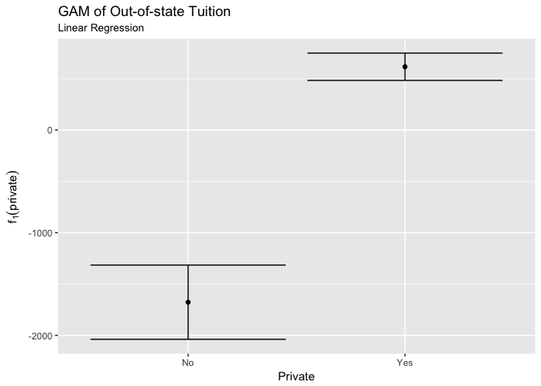

``` r
# <Graph: Room.Board>
data_frame(x = GAM_TERM$Room.Board$x,
           y = GAM_TERM$Room.Board$y,
           se.fit = GAM_TERM$Room.Board$se.y) %>%
  mutate(y_low = y - 1.96 * se.fit,
         y_high = y + 1.96 * se.fit) %>%
  ggplot(aes(x, y)) +
  geom_line() +
  geom_line(aes(y = y_low), linetype = 2) +
  geom_line(aes(y = y_high), linetype = 2) +
  labs(title = "GAM of Out-of-state Tuition",
       subtitle = "Linear Regression",
       x = "Room.Board",
       y = expression(f[2](Room.Board)))   
```

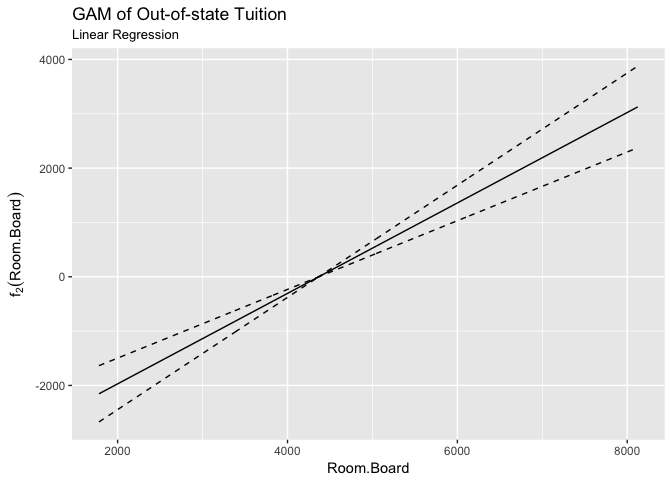

``` r
# <Graph: PhD>
data_frame(x = GAM_TERM$`poly(PhD, 3)`$x,
           y = GAM_TERM$`poly(PhD, 3)`$y,
           se.fit = GAM_TERM$`poly(PhD, 3)`$se.y) %>%
  mutate(y_low = y - 1.96 * se.fit,
         y_high = y + 1.96 * se.fit) %>%
  ggplot(aes(x, y)) +
  geom_line() +
  geom_line(aes(y = y_low), linetype = 2) +
  geom_line(aes(y = y_high), linetype = 2) +
  labs(title = "GAM of Out-of-state Tuition",
       subtitle = "Cubic Model",
       x = "PhD",
       y = expression(f[3](PhD)))
```

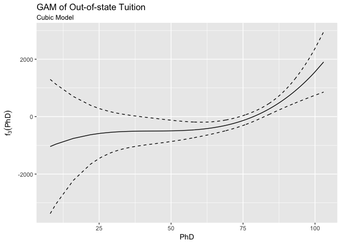

``` r
# <Graph: Expend>
data_frame(x = GAM_TERM$`log(Expend)`$x,
           y = GAM_TERM$`log(Expend)`$y,
           se.fit = GAM_TERM$`log(Expend)`$se.y) %>%
  mutate(y_low = y - 1.96 * se.fit,
         y_high = y + 1.96 * se.fit) %>%
  ggplot(aes(x, y)) +
  geom_line() +
  geom_line(aes(y = y_low), linetype = 2) +
  geom_line(aes(y = y_high), linetype = 2) +
  labs(title = "GAM of Out-of-state Tuition",
       subtitle = "Log Transformation",
       x = "Expend",
       y = expression(f[4](expend)))
```

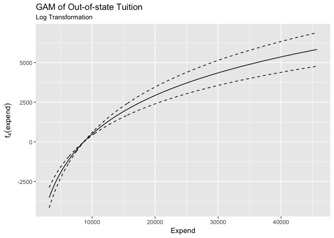

``` r
# <Graph: perc.alumni>
data_frame(x = GAM_TERM$`lo(perc.alumni)`$x,
           y = GAM_TERM$`lo(perc.alumni)`$y,
           se.fit = GAM_TERM$`lo(perc.alumni)`$se.y) %>%
  mutate(y_low = y - 1.96 * se.fit,
         y_high = y + 1.96 * se.fit) %>%
  ggplot(aes(x, y)) +
  geom_line() +
  geom_line(aes(y = y_low), linetype = 2) +
  geom_line(aes(y = y_high), linetype = 2) +
  labs(title = "GAM of Out-of-state Tuition",
       subtitle = "Local Regression",
       x = "perc.alumni",
       y = expression(f[5](perc.alumni)))
```

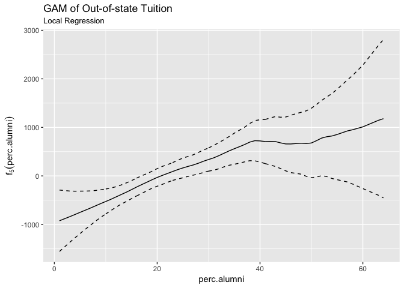

``` r
# <Graph: Grad.Rate>
data_frame(x = GAM_TERM$`bs(Grad.Rate, degree = 2, df = 3)`$x,
           y = GAM_TERM$`bs(Grad.Rate, degree = 2, df = 3)`$y,
           se.fit = GAM_TERM$`bs(Grad.Rate, degree = 2, df = 3)`$se.y) %>%
  mutate(y_low = y - 1.96 * se.fit,
         y_high = y + 1.96 * se.fit) %>%
  ggplot(aes(x, y)) +
  geom_line() +
  geom_line(aes(y = y_low), linetype = 2) +
  geom_line(aes(y = y_high), linetype = 2) +
  labs(title = "GAM of Out-of-state Tuition",
       subtitle = "Splines",
       x = "Grad.Rate",
       y = expression(f[6](Grad.Rate)))
```

    ## Error: Each variable must be a 1d atomic vector or list.
    ## Problem variables: 'x', 'y', 'se.fit'

Simple linear regression for `Private`, linear regression for `Room.Board`, cubic model for `PhD`, log transformation for `Expend`, local regression for `perc.alumni`, and spline with 3 degrees of freedom and 2 degrees polynomial for Grad.Rate are used. The table shows that all the variables are statistically significant. The graphs show that the variables have substantial and significant relationships with out-of-state tuition.

#### 4.Use the test set to evaluate the model fit of the estimated OLS and GAM models, and explain the results obtained.

``` r
OLS = FUNC_MSE(model=FIT_3A, data=DATA_2_SPLIT$test)
OLS
```

    ## [1] 3444333

``` r
GAM = FUNC_MSE(model=GAM_1, data=DATA_2_SPLIT$test)
GAM
```

    ## [1] 3460767

The MSE from OLS is 3.444333310^{6} and the MSE from GAM is 3.460767310^{6}. Smaller MSE indicates the model fits the data better. Therefore, predictions from OLS are more accurate.

#### 5.For which variables, if any, is there evidence of a non-linear relationship with the response?

As log transformation for `Expend` is used, instructional expenditure per student has a non-linear relationship with the out-of-state tuition.
