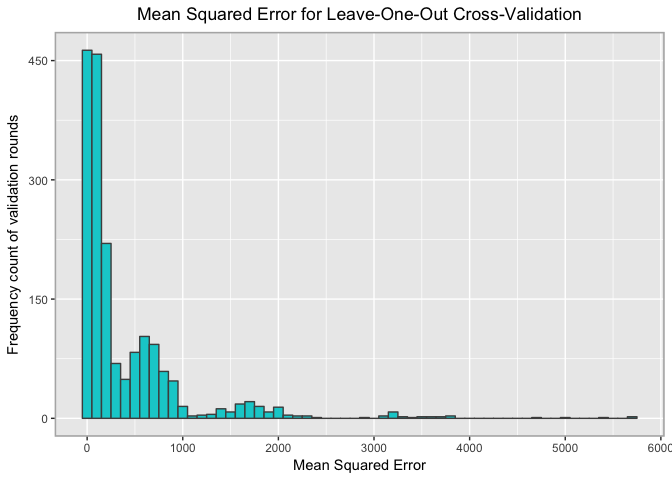
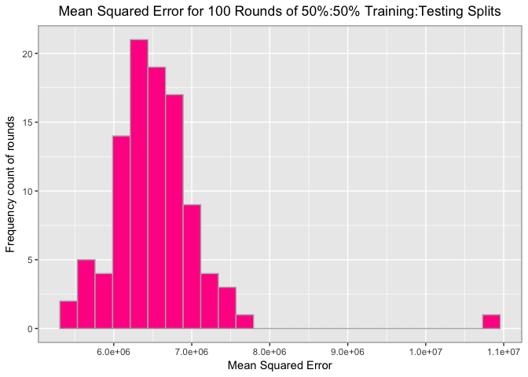
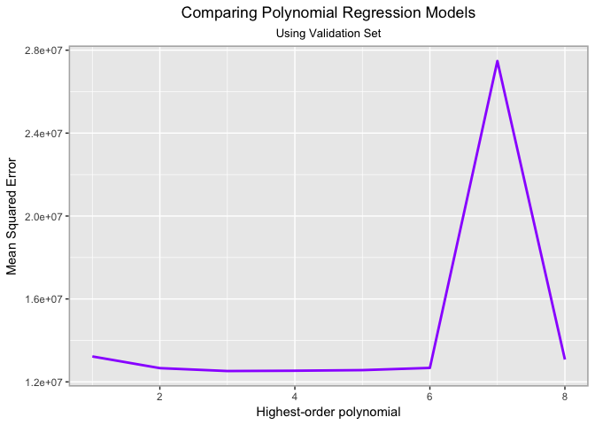
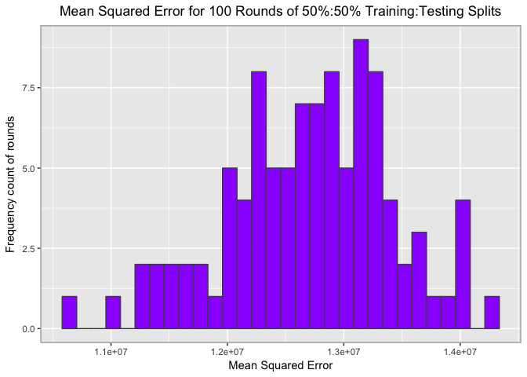
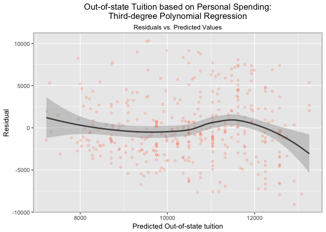
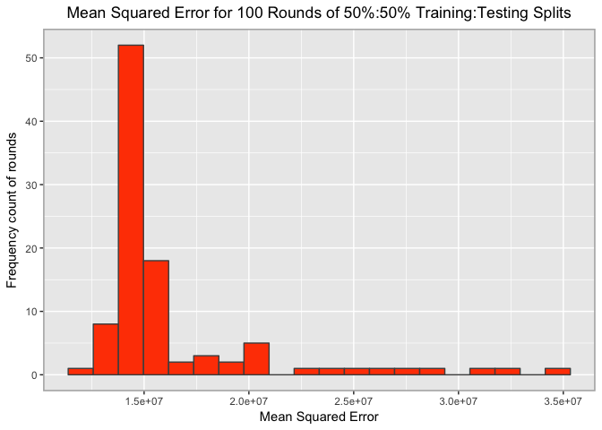
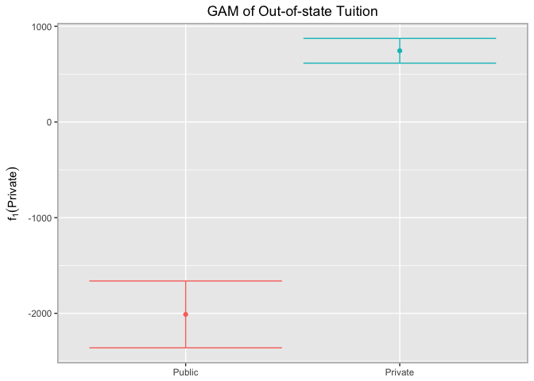
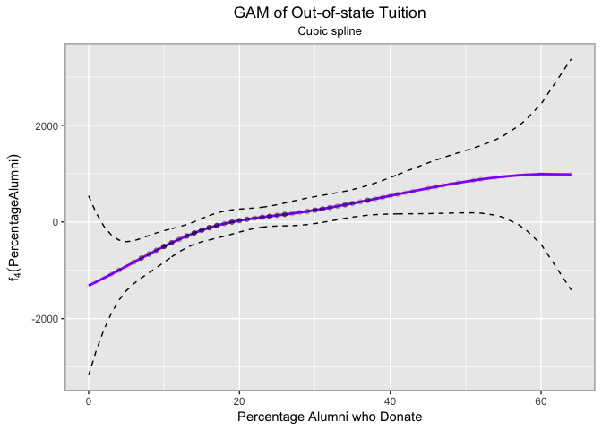
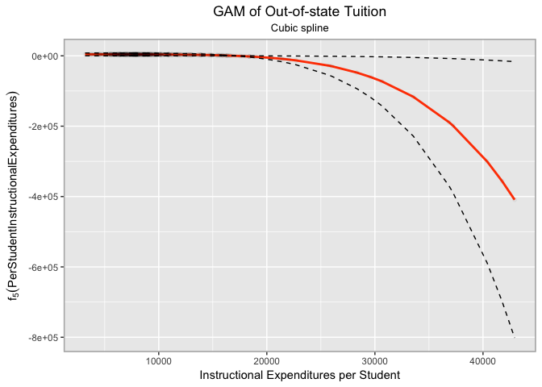

MACS 30100 PS6
================
Erin M. Ochoa
2017 February 27

-   [Part 1: Joe Biden (redux)](#part-1-joe-biden-redux)
-   [Part 2: College (bivariate)](#part-2-college-bivariate)
-   [Part 3: College (GAM)](#part-3-college-gam)

We define a function that will be used later:

``` r
mse = function(model, data) {
  x = modelr:::residuals(model, data)
  mean(x ^ 2, na.rm = TRUE)
}
```

Part 1: Joe Biden (redux)
=========================

We read in the data and create a categorical three-level variable for Party.

``` r
df = read.csv('data/biden.csv')
df$Party[df$dem == 1] = 'Democrat'
df$Party[df$dem == 0 & df$rep == 0] = 'No Affiliation'
df$Party[df$rep == 1] = 'Republican'
```

We estimate the following multiple regression model: 

where *Y* is the Joe Biden feeling thermometer, *X*<sub>1</sub> is age, *X*<sub>2</sub> is gender, *X*<sub>3</sub> is education, *X*<sub>4</sub> is Democrat, and *X*<sub>5</sub> is Republican.

``` r
lm_full_dataset = lm(biden ~ age + female + educ + dem + rep, data = df)
summary(lm_full_dataset)
```

    ## 
    ## Call:
    ## lm(formula = biden ~ age + female + educ + dem + rep, data = df)
    ## 
    ## Residuals:
    ##     Min      1Q  Median      3Q     Max 
    ## -75.546 -11.295   1.018  12.776  53.977 
    ## 
    ## Coefficients:
    ##              Estimate Std. Error t value Pr(>|t|)    
    ## (Intercept)  58.81126    3.12444  18.823  < 2e-16 ***
    ## age           0.04826    0.02825   1.708   0.0877 .  
    ## female        4.10323    0.94823   4.327 1.59e-05 ***
    ## educ         -0.34533    0.19478  -1.773   0.0764 .  
    ## dem          15.42426    1.06803  14.442  < 2e-16 ***
    ## rep         -15.84951    1.31136 -12.086  < 2e-16 ***
    ## ---
    ## Signif. codes:  0 '***' 0.001 '**' 0.01 '*' 0.05 '.' 0.1 ' ' 1
    ## 
    ## Residual standard error: 19.91 on 1801 degrees of freedom
    ## Multiple R-squared:  0.2815, Adjusted R-squared:  0.2795 
    ## F-statistic: 141.1 on 5 and 1801 DF,  p-value: < 2.2e-16

We find \_0, the y-intercept, to be 58.811259 with a standard error of 3.1244366.

We find \_1, the coefficient for age, to be 0.0482589 with a standard error of 0.0282474.

We find \_2, the coefficient for female, to be 4.1032301 with a standard error of 0.9482286.

We find \_3, the coefficient for education, to be -0.3453348 with a standard error of 0.1947796.

We find \_4, the coefficient for Democrat, to be 15.4242556 with a standard error of 1.0680327.

We find \_5, the coefficient for Republican, to be -15.8495061 with a standard error of 1.3113624.

When all the predictors are considered jointly, female, Democrat, and Republican are statistically significant (p&lt;.001) while age and education approach significance at the = .05 level but do not reach it (p&lt;.10).

``` r
mse_full_dataset = mse(lm_full_dataset,df)
```

Using all the observations and the stated predictors, we find the mean squared error of the multiple-regression model to be 395.2701693.

We plot the residuals for the full model against the predicted values:


While the general regression line is flat and the local per-party lines are close to flat, the wide spread above and below zero indicates that there is high variability among the residuals. This suggests that the model does not explain

Next, we split the dataset into training and validation sets in a ratio of 7:3.

``` r
set.seed(1234)

biden_split7030 = resample_partition(df, c(test = 0.3, train = 0.7))
biden_train70 = biden_split7030$train %>%
                tbl_df()
biden_test30 = biden_split7030$test %>%
               tbl_df()

lm_train70 = lm(biden ~ age + female + educ + dem + rep, data = biden_train70)
summary(lm_train70)
```

    ## 
    ## Call:
    ## lm(formula = biden ~ age + female + educ + dem + rep, data = biden_train70)
    ## 
    ## Residuals:
    ##     Min      1Q  Median      3Q     Max 
    ## -75.759 -10.736   0.903  12.930  53.675 
    ## 
    ## Coefficients:
    ##              Estimate Std. Error t value Pr(>|t|)    
    ## (Intercept)  57.33735    3.69768  15.506  < 2e-16 ***
    ## age           0.03728    0.03362   1.109 0.267701    
    ## female        4.17215    1.12671   3.703 0.000222 ***
    ## educ         -0.26017    0.23221  -1.120 0.262750    
    ## dem          16.32775    1.27664  12.790  < 2e-16 ***
    ## rep         -14.60704    1.55800  -9.375  < 2e-16 ***
    ## ---
    ## Signif. codes:  0 '***' 0.001 '**' 0.01 '*' 0.05 '.' 0.1 ' ' 1
    ## 
    ## Residual standard error: 19.89 on 1259 degrees of freedom
    ## Multiple R-squared:  0.2787, Adjusted R-squared:  0.2758 
    ## F-statistic: 97.28 on 5 and 1259 DF,  p-value: < 2.2e-16

``` r
mse_test30 = mse(lm_train70,biden_test30)
```

We fit a multiple-regression model using only the training observations and then calculate the MSE using only the validation set to be 399.8303029. This MSE is slightly higher than the MSE calculated with the full dataset (395.2701693). This is not surprising because the validation dataset is 30% the size of the full dataset and there is likely to be higher variance for a smaller sample.

We plot the residuals for the model developed with the training set but fitted to the testing set:


We see that while the general regression line is flat, the per-party regression lines are inclined, indicating poor fit.

We repeat the validation set approach 100 times, using 100 different splits of the observations into a training set and a validation set:

``` r
rounds = 100

mse_list_100 = vector("numeric", rounds)

set.seed(1234)

for(i in 1:rounds) {
  
  split7030 = resample_partition(df, c(test = 0.3, train = 0.7))
  train70 = split7030$train %>%
            tbl_df()
  test30 = split7030$test %>%
           tbl_df()

  lm_100_train70 = lm(biden ~ age + female + educ + dem + rep, data = train70)

  mse_100_test30 = mse(lm_100_train70,test30)
  mse_list_100[[i]] = mse_100_test30
}

mse_df_100 = as.data.frame(mse_list_100)
```

Each round results in a mean squared error. We take the mean of these and find it to be 401.664279, which is higher than the mean squared error estimated using the full-dataset multiple-regression model (395.2701693) and using the training model with the validation dataset (399.8303029).

We plot a histogram of the per-round mean-squared errors:


The mean squared errors appear to be distributed normally with a mean of 401.664279 and median of 400.1067017. While some of the rounds produced a lower mean squared error, some of the rounds produced a higher mean squared error. Together, these features suggest that despite randomness in the split of the training and test samples, the average mean quared error over 100 rounds is very similar to, albeit slightly higher than, the mean squared error produced by the original multivariate regression using the entire sample (395.2701693).

Next, we estimate the test MSE of the model using the leave-one-out cross-validation (LOOCV) approach:

``` r
loocv_biden_data <- crossv_kfold(df, k = nrow(df))
loocv_biden_models <- map(loocv_biden_data$train, ~ lm(biden ~ age + female + educ + dem + rep, data = .))

loocv_biden_mse_list <- map2_dbl(loocv_biden_models, loocv_biden_data$test, mse)
loocv_biden_mean_mse = mean(loocv_biden_mse_list)

loocv_biden_mse = as.data.frame(loocv_biden_mse_list)
```

Each round of the leave-one-out process returns a mean-squared error. We take the mean of these and find it to be 397.9555046, which is slightly higher than the MSE obtained using the full dataset (395.2701693) or using 100 rounds of testing sets (393.5139341), but lower than the testing dataset (399.8303029) in a single round.

We pool all the mean squared errors returned by LOOCV and plot their distribution:



We can see that while most of the MSEs are small, some are quite high and approach 5800. This indicates that while the model fits reasonably well for most of the values, it fits quite poorly for some.

We use the 10-fold cross validation approach:

``` r
biden_cv10_data = crossv_kfold(df, k = 10)

biden_cv10_model = map(biden_cv10_data$train, ~ lm(biden ~ age + female + educ + dem + rep, data = .))
biden_cv10_mse = map2_dbl(biden_cv10_model, biden_cv10_data$test, mse)
biden_cv_error_10fold = mean(biden_cv10_mse)

biden_cv_mse = as.data.frame(biden_cv10_mse)
```

Using this approach, we find the MSE to be 398.0728532, which is very similar to the errors found and reported earlier.

We plot a histogram of the distribution of MSEs found using 10-fold cross validation:


We see that for ten rounds, most of the MSEs are centered around 400, though one round produced an MSE below 300.

1.  Repeat the 10-fold cross-validation approach 100 times, using 100 different splits of the observations into 10-folds. Comment on the results obtained.

We run 100 rounds of 10-fold cross-validation, each round with different splits:

``` r
mse_list_10fold_100 = vector("list", rounds)

set.seed(1234)

for(i in 1:rounds) {
  
  biden100_cv10_data = crossv_kfold(df, k = 10)

  biden100_cv10_model = map(biden100_cv10_data$train, ~ lm(biden ~ age + female + educ + dem + rep, data = .))

  biden100_cv10_mse = map2_dbl(biden100_cv10_model, biden100_cv10_data$test, mse)
  biden100_cv_error_10fold = mean(biden100_cv10_mse)

  biden100_cv_mse = as.data.frame(biden_cv10_mse)
  
  mse_list_10fold_100[[i]] = biden100_cv10_mse
}

k = 0
mse_list_10fold_100_all = vector("numeric", rounds * 10)

for(i in 1:100){
  for(j in 1:10){
    mse_list_10fold_100_all[[j + k]] = mse_list_10fold_100[[i]][[j]]
  }
  k = k + 10
}

mse_list_100_means = vector("numeric", rounds)

for(i in 1:100){
  avg = mean(mse_list_10fold_100[[i]])
  mse_list_100_means[[i]] = avg
}


biden_100_10fold_mse_all = as.data.frame(mse_list_10fold_100_all)
biden_100_10fold_mse_means = as.data.frame(mse_list_100_means)
```

Each round of the 100 returns 10 MSEs; we take the mean of all of these and find it to be 398.0641646, which is comparable to the MSEs reported earlier.

We pool all the MSEs from the 100 rounds of 10-fold cross validation and plot their distribution:


The MSEs are normally distributed with right skew; the mean, as reported above, is 398.0641646 and the median is 397.4200106.

We plot a histogram of the mean of the MSEs for each of the 100 rounds:


We can see that when considered in the context of the round in which they were returned, there is little variation in the MSEs; all are comparable to the MSEs found and reported earlier.

We bootstrap by sampling with replacement 1000 times from the full dataset:

``` r
set.seed(1234)

biden_bstrap = df %>%
               modelr::bootstrap(1000) %>%
               mutate(model = map(strap, ~ lm(biden ~ age + female + educ + dem + rep, data = .)),
                      coef = map(model, tidy))

biden_bstrap %>%
             unnest(coef) %>%
             group_by(term) %>%
             summarize(est.boot = mean(estimate),
                       se.boot = sd(estimate, na.rm = TRUE))
```

    ## # A tibble: 6 × 3
    ##          term     est.boot    se.boot
    ##         <chr>        <dbl>      <dbl>
    ## 1 (Intercept)  58.96180746 2.94989029
    ## 2         age   0.04756082 0.02846997
    ## 3         dem  15.42942074 1.11104505
    ## 4        educ  -0.35119332 0.19201866
    ## 5      female   4.07552938 0.94880851
    ## 6         rep -15.88710208 1.43153427

The full-dataset model found a \_0 estimate of 58.811259 with a standard error of 3.1244366; bootstrapping finds a \_0 estimate of 58.96180746 with a standard error of 2.94989029.

The full-dataset model found a \_1 (age) estimate of 0.0482589 with a standard error of 0.0282474; bootstrapping finds a \_1 estimate of 0.04756082 with a standard error of 0.02846997.

The full-dataset model found a \_2 (female) estimate of 4.1032301 with a standard error of 0.9482286; bootstrapping finds a \_2 estimate of 4.07552938 with a standard error of 0.94880851.

The full-dataset model found a \_3 (education) estimate of -0.3453348 with a standard error of 0.1947796; bootstrapping finds a \_3 estimate of -0.35119332 with a standard error of 0.19201866.

The full-dataset model found a \_4 (Democrat) estimate of 15.4242556 with a standard error of 1.0680327; bootstrapping finds a \_4 estimate of 15.42942074 with a standard error of 1.11104505.

The full-dataset model found a \_5 (Republican) estimate of -15.8495061 with a standard error of 1.3113624; bootstrapping finds a \_5 estimate of -15.88710208 with a standard error of 1.43153427.

These estimates indicate that bootstrapping performs comparably to the model estimated with the full dataset.

Part 2: College (bivariate)
===========================

We explore the bivariate relationships between three predictor variables, Expend, Terminal, and Personal, with Outstate.

We begin by reading in the data and creating a linear model based on Expend:

``` r
df2 = read.csv('data/College.csv')

lm_outstate_expend = lm(Outstate ~ Expend, data = df2)

mse_outstate_expend = mse(lm_outstate_expend,df2)
summary(lm_outstate_expend)
```

    ## 
    ## Call:
    ## lm(formula = Outstate ~ Expend, data = df2)
    ## 
    ## Residuals:
    ##      Min       1Q   Median       3Q      Max 
    ## -15780.8  -2088.7     57.6   2010.8   7784.5 
    ## 
    ## Coefficients:
    ##              Estimate Std. Error t value Pr(>|t|)    
    ## (Intercept) 5.434e+03  2.248e+02   24.17   <2e-16 ***
    ## Expend      5.183e-01  2.047e-02   25.32   <2e-16 ***
    ## ---
    ## Signif. codes:  0 '***' 0.001 '**' 0.01 '*' 0.05 '.' 0.1 ' ' 1
    ## 
    ## Residual standard error: 2978 on 775 degrees of freedom
    ## Multiple R-squared:  0.4526, Adjusted R-squared:  0.4519 
    ## F-statistic: 640.9 on 1 and 775 DF,  p-value: < 2.2e-16

The model has an MSE of 8.847579410^{6}.

We examine a scatter plot of Outstate vs. Expend:


The relationship does not appear linear. To verify this, we plot the residuals against the predicted values:

``` r
pred_expend = add_predictions(df2, lm_outstate_expend, var = "predExpend")
df2$predExpend = pred_expend$predExpend
df2$residExpend = df2$Outstate - df2$predExpend

ggplot(df2, mapping = aes(predExpend, residExpend)) +
       geom_point(alpha = .15, color = 'deeppink', size = 1.5) +
       geom_smooth(color = 'grey30', method = 'loess') +
       labs(title = "Out-of-state Tuition based on Instructional Expenditure per Student:\nResiduals vs. Predicted Values",
            x = "Predicted Out-of-state tuition",
            y = "Residual") +
       theme(plot.title = element_text(hjust = 0.5),
             panel.border = element_rect(linetype = "solid", color = "grey70", fill=NA, size=1.1))
```


The plot shows heteroscedasticity in the distribution of residuals vs. predicted values; this, along with the loess smoother line, confirm that the relationship between Expend and Outstate is not linear.

We split the data into equally proportioned training and testing sets, then determine that the third-order polynomial regression produces the model with the lowest MSE:

``` r
college_split5050 = resample_partition(df2, c(test = 0.5, train = 0.5))
college_train50 = college_split5050$train %>%
                  tbl_df()
college_test50 = college_split5050$test %>%
                 tbl_df()


college_expend_poly_results = data_frame(terms = 1:8,
                              model = map(terms, ~ glm(Outstate ~ poly(Expend, .), data = college_train50)),
                              MSE = map_dbl(model, mse, data = college_test50))

ggplot(college_expend_poly_results, aes(terms, MSE)) +
       geom_line(color='deeppink',size=1) +
       labs(title = "Comparing Polynomial Regression Models",
       subtitle = "Using Validation Set",
       x = "Highest-order polynomial",
       y = "Mean Squared Error") +
       theme(plot.title = element_text(hjust = 0.5), plot.subtitle = element_text(hjust = 0.5),
             panel.border = element_rect(linetype = "solid", color = "grey70", fill=NA, size=1.1))
```


We estimate the linear model and add fitted values:

``` r
glm_outstate_expend = glm(Outstate ~ I(Expend) + I(Expend ** 2) + I(Expend ** 3), data = college_test50)

summary(glm_outstate_expend)
```

    ## 
    ## Call:
    ## glm(formula = Outstate ~ I(Expend) + I(Expend^2) + I(Expend^3), 
    ##     data = college_test50)
    ## 
    ## Deviance Residuals: 
    ##    Min      1Q  Median      3Q     Max  
    ##  -7799   -1546     144    1702    5504  
    ## 
    ## Coefficients:
    ##               Estimate Std. Error t value Pr(>|t|)    
    ## (Intercept) -4.798e+02  1.393e+03  -0.344    0.731    
    ## I(Expend)    1.526e+00  3.466e-01   4.403 1.39e-05 ***
    ## I(Expend^2) -3.570e-05  2.560e-05  -1.395    0.164    
    ## I(Expend^3)  1.994e-10  5.637e-10   0.354    0.724    
    ## ---
    ## Signif. codes:  0 '***' 0.001 '**' 0.01 '*' 0.05 '.' 0.1 ' ' 1
    ## 
    ## (Dispersion parameter for gaussian family taken to be 6538974)
    ## 
    ##     Null deviance: 6188218360  on 387  degrees of freedom
    ## Residual deviance: 2510965861  on 384  degrees of freedom
    ## AIC: 7196.1
    ## 
    ## Number of Fisher Scoring iterations: 2

``` r
outstate_expend_pred = augment(glm_outstate_expend, newdata = data_grid(df2, Expend)) %>%
  mutate(pred_low = .fitted - 1.96 * .se.fit,
         pred_high = .fitted + 1.96 * .se.fit)

mse_outstate_expend_glm = mse(glm_outstate_expend,college_test50)
```

Next, we plot the regression line:


We see that the curve fits the data much better than the inflexible first-order model applied earlier. The confidence interval widens considerably at the right end, however, because there are very few data points in that vicinity.

Next, we examine a plot of the residuals vs. the predicted values:


Compared to the original plot of residuals vs. fitted values, the loess smoother line here is relatively flat. We compare the MSE to that of the original model: the inflexible first-order model returns an MSE of 8.847579410^{6} and the third-degree model has an MSE of 6.471561510^{6}. We have succeeded in reducing the MSE.

The next thing we check is whether the reduction in MSE is consistent across different splits of the data:

``` r
expend_mse_list_100 = vector("numeric", rounds)

set.seed(1234)

for(i in 1:rounds) {
  split5050 = resample_partition(df2, c(test = 0.5, train = 0.5))
  train50 = split5050$train %>%
            tbl_df()
  test50 = split5050$test %>%
           tbl_df()

  glm_100_train50 = glm(Outstate ~ I(Expend) + I(Expend ** 2) + I(Expend ** 3), data = train50)

  expend_mse_100_test50 = mse(glm_100_train50,test50)
  expend_mse_list_100[[i]] = expend_mse_100_test50
}

expend_mse_df_100 = as.data.frame(expend_mse_list_100)
```

We take the mean of the MSE for all 100 rounds and find that it is 6.534781110^{6}. We find that the reduction in MSE is, on average, consistent across rounds.

To visualize this, we plot a histogram of the MSE distribution for all 100 rounds:



There is only one observed MSE that is higher than the first-order model MSE. This means that for all but one of the observed splits of the data into training and testing sets, the third-order polynomial model performs better than the first-order model.

We continue by considering the Outstate vs. Terminal model:

``` r
lm_outstate_terminal = lm(Outstate ~ Terminal, data = df2)

mse_outstate_terminal = mse(lm_outstate_terminal,df2)
summary(lm_outstate_terminal)
```

    ## 
    ## Call:
    ## lm(formula = Outstate ~ Terminal, data = df2)
    ## 
    ## Residuals:
    ##      Min       1Q   Median       3Q      Max 
    ## -10123.5  -2988.6    253.2   2330.9  13567.4 
    ## 
    ## Coefficients:
    ##             Estimate Std. Error t value Pr(>|t|)    
    ## (Intercept) 1555.008    726.338   2.141   0.0326 *  
    ## Terminal     111.485      8.962  12.440   <2e-16 ***
    ## ---
    ## Signif. codes:  0 '***' 0.001 '**' 0.01 '*' 0.05 '.' 0.1 ' ' 1
    ## 
    ## Residual standard error: 3675 on 775 degrees of freedom
    ## Multiple R-squared:  0.1665, Adjusted R-squared:  0.1654 
    ## F-statistic: 154.8 on 1 and 775 DF,  p-value: < 2.2e-16

While the relationship is statistically significant (p&lt;.001) with a 1 coefficient of 111.485, a scatter plot of the data points indicates that the relationship is not linear:


We confirm this by checking a plot of the residuals vs. the fitted values:

``` r
pred_terminal = add_predictions(df2, lm_outstate_terminal, var = "predTerminal")
df2$predTerminal = pred_terminal$predTerminal
df2$residTerminal = df2$Outstate - df2$predTerminal

ggplot(df2, mapping = aes(predTerminal, residTerminal)) +
       geom_point(alpha = .15, color = 'purple1', size = 1.5) +
       geom_smooth(color = 'grey30', method = 'loess') +
     labs(title = "Out-of-state Tuition based on Percent of Faculty with Terminal Degrees:\nResiduals vs. Predicted Values",
            x = "Predicted Out-of-state tuition",
            y = "Residual") +
       theme(plot.title = element_text(hjust = 0.5),
             panel.border = element_rect(linetype = "solid", color = "grey70", fill=NA, size=1.1))
```


The curved loess line indicates heteroscedasticity in the values of the residuals, confirming that a first-order linear model is not the best fit for these data.

Using the previously defined training and testing datasets, we determine that a third-order model will provide an optimal balance of parsimony and low MSE:

``` r
college_terminal_poly_results = data_frame(terms = 1:8,
                                model = map(terms, ~ glm(Outstate ~ poly(Terminal, .), data = college_train50)),
                                MSE = map_dbl(model, mse, data = college_test50))

ggplot(college_terminal_poly_results, aes(terms, MSE)) +
       geom_line(color='purple1',size=1) +
       labs(title = "Comparing Polynomial Regression Models",
       subtitle = "Using Validation Set",
       x = "Highest-order polynomial",
       y = "Mean Squared Error") +
       theme(plot.title = element_text(hjust = 0.5), plot.subtitle = element_text(hjust = 0.5),
             panel.border = element_rect(linetype = "solid", color = "grey70", fill=NA, size=1.1))
```



We fit the third-order model:

``` r
glm_outstate_terminal = glm(Outstate ~ I(Terminal) + I(Terminal ** 2) + I(Terminal ** 3), data = college_test50)

summary(glm_outstate_terminal)
```

    ## 
    ## Call:
    ## glm(formula = Outstate ~ I(Terminal) + I(Terminal^2) + I(Terminal^3), 
    ##     data = college_test50)
    ## 
    ## Deviance Residuals: 
    ##      Min        1Q    Median        3Q       Max  
    ## -10423.5   -2633.7     201.1    2628.5    7366.8  
    ## 
    ## Coefficients:
    ##                 Estimate Std. Error t value Pr(>|t|)  
    ## (Intercept)    289.94490 8819.59165   0.033    0.974  
    ## I(Terminal)    481.99391  407.25017   1.184    0.237  
    ## I(Terminal^2)   -9.32411    6.09727  -1.529    0.127  
    ## I(Terminal^3)    0.05928    0.02948   2.011    0.045 *
    ## ---
    ## Signif. codes:  0 '***' 0.001 '**' 0.01 '*' 0.05 '.' 0.1 ' ' 1
    ## 
    ## (Dispersion parameter for gaussian family taken to be 12605988)
    ## 
    ##     Null deviance: 6188218360  on 387  degrees of freedom
    ## Residual deviance: 4840699272  on 384  degrees of freedom
    ## AIC: 7450.8
    ## 
    ## Number of Fisher Scoring iterations: 2

``` r
outstate_terminal_pred = augment(glm_outstate_terminal, newdata = data_grid(college_test50, Terminal)) %>%
  mutate(pred_low = .fitted - 1.96 * .se.fit,
         pred_high = .fitted + 1.96 * .se.fit)

mse_outstate_terminal_glm = mse(glm_outstate_terminal,college_test50)
```

We find that MSE, which was 1.347335710^{7} for the first-order model, is 1.247602910^{7} for the third-order model. The third-order model has reduced the MSE.

We generate a scatter plot of the third-order model:


The third-order regression curve fits the data much better than the first-order regression line did.

We examine a scatter plot of the residuals vs. the fitted values:


Now the residuals display relative homoscedasticity.

Next, we check whether the reduction in MSE is consistent across 100 rounds of splits:

``` r
#set.seed(1234)

terminal_mse_list_100 = vector("numeric", rounds)

for(i in 1:rounds) {
  split5050 = resample_partition(df2, c(test = 0.5, train = 0.5))
  train50 = split5050$train %>%
            tbl_df()
  test50 = split5050$test %>%
           tbl_df()

  glm_100_train50 = glm(Outstate ~ I(Terminal) + I(Terminal ** 2) + I(Terminal ** 3), data = train50)

  terminal_mse_100_test50 = mse(glm_100_train50,test50)
  terminal_mse_list_100[[i]] = terminal_mse_100_test50
}

terminal_mse_df_100 = as.data.frame(terminal_mse_list_100)
```

We take the mean MSE of all the rounds and find that it is 1.271351710^{7}. The reduction in MSE is consistent, on average, across rounds.

We visualize this thus:



While there are observed MSEs above the first-order model MSE of 1.401333910^{7}, a reduction in MSE occurs in the majority of splits.

We continue by exploring the relationship between Personal and Outstate.

``` r
lm_outstate_pers = lm(Outstate ~ Personal, data = df2)

mse_outstate_pers = mse(lm_outstate_pers,df2)
summary(lm_outstate_pers)
```

    ## 
    ## Call:
    ## lm(formula = Outstate ~ Personal, data = df2)
    ## 
    ## Residuals:
    ##     Min      1Q  Median      3Q     Max 
    ## -8643.7 -2673.7  -437.7  2446.8 10951.2 
    ## 
    ## Coefficients:
    ##               Estimate Std. Error t value Pr(>|t|)    
    ## (Intercept) 12823.1401   305.8483  41.926   <2e-16 ***
    ## Personal       -1.7771     0.2037  -8.726   <2e-16 ***
    ## ---
    ## Signif. codes:  0 '***' 0.001 '**' 0.01 '*' 0.05 '.' 0.1 ' ' 1
    ## 
    ## Residual standard error: 3841 on 775 degrees of freedom
    ## Multiple R-squared:  0.08945,    Adjusted R-squared:  0.08828 
    ## F-statistic: 76.14 on 1 and 775 DF,  p-value: < 2.2e-16

The first-order model has an MSE of 1.471792910^{7}.

We generate a scatter plot:


The relationship appears nonlinear despite the fact that the first-order coefficient (-1.7771) is statistically significant (p&lt;.001).

For further evidence of the non-linearity of the relationship, we check the residuals:

``` r
pred_pers = add_predictions(df2, lm_outstate_pers, var = "predPers")
df2$predPers = pred_pers$predPers
df2$residPers = df2$Outstate - df2$predPers

ggplot(df2, mapping = aes(predPers, residPers)) +
       geom_point(alpha = .15, color = 'orangered', size = 1.5) +
       geom_smooth(color = 'grey30', method = 'loess') +
       labs(title = "Out-of-state Tuition based on Personal Spending:\nResiduals vs. Predicted Values",
            x = "Predicted Out-of-state tuition",
            y = "Residual") +
       theme(plot.title = element_text(hjust = 0.5),
             panel.border = element_rect(linetype = "solid", color = "grey70", fill=NA, size=1.1))
```


The curved loess line suggests the nonlinearity of the relationship.

Now we determine the order of the polynomial regression that will yield the lowest MSE:

``` r
college_personal_poly_results = data_frame(terms = 1:8,
                                model = map(terms, ~ glm(Outstate ~ poly(Personal, .), data = college_train50)),
                                MSE = map_dbl(model, mse, data = college_test50))

ggplot(college_personal_poly_results, aes(terms, MSE)) +
       geom_line(color='orangered',size=1) +
       labs(title = "Comparing Polynomial Regression Models",
       subtitle = "Using Validation Set",
       x = "Highest-order polynomial",
       y = "Mean Squared Error") +
       theme(plot.title = element_text(hjust = 0.5), plot.subtitle = element_text(hjust = 0.5),
             panel.border = element_rect(linetype = "solid", color = "grey70", fill=NA, size=1.1))
```


Because the first through seventh order polynomial regressions will all yield equal MSE, we generate several plots (most not shown) and decide that the third order term appears to deliver the most balanced residuals.

``` r
glm_outstate_pers = glm(Outstate ~ I(Personal) + I(Personal ** 2) + I(Personal ** 3) , data = college_test50)

outstate_pers_pred = augment(glm_outstate_pers, newdata = data_grid(college_test50, Personal)) %>%
  mutate(pred_low = .fitted - 1.96 * .se.fit,
         pred_high = .fitted + 1.96 * .se.fit)

mse_outstate_personal_glm = mse(glm_outstate_pers,college_test50)
```

The third-order model as imposed on the testing dataset has an MSE of 1.404457810^{7}, which is lower than that of the first order model (1.471792910^{7}).

We plot the third order model:


We can see that this model fits the data better than the first-order model. The confidence interval widens considerably around 3,000, however, because there are very few data points above that threshold.

We examine the residuals of the third order model:



The residuals are now relatively homoscedastic.

We check to see if the reduction in MSE is consistent across 100 rounds of cross validation:

``` r
pers_mse_list_100 = vector("numeric", rounds)

set.seed(1234)

for(i in 1:rounds) {
  split5050 = resample_partition(df2, c(test = 0.5, train = 0.5))
  train50 = split5050$train %>%
            tbl_df()
  test50 = split5050$test %>%
           tbl_df()

  glm_100_train50 = glm(Outstate ~ I(Personal) + I(Personal ** 2) + I(Personal ** 3), data = train50)

  pers_mse_100_test50 = mse(glm_100_train50,test50)
  pers_mse_list_100[[i]] = pers_mse_100_test50
}

pers_mse_df_100 = as.data.frame(pers_mse_list_100)
```

We take the mean of the MSEs from all 100 rounds and find it to be 1.621627310^{7}. This is higher than the first-order MSE of 1.471792910^{7}. This indicates that, despite having constructed a model that appears to fit better, we have constructed a model with higher MSE.

We visualize the distribution of MSEs across 100 rounds:



We find that polynomial regression sometimes reduces MSE but can also sometimes increase it, depending on the random split of the data.

Part 3: College (GAM)
=====================

``` r
df2$PrivateRC[df2$Private == 'Yes'] = 1
df2$PrivateRC[df2$Private == 'No'] = 0

set.seed(1234)

college_split7030 = resample_partition(df2, c(test = 0.3, train = 0.7))
college_train70 = college_split7030$train %>%
                  tbl_df()
college_test30 = college_split7030$test %>%
                 tbl_df()
```

``` r
lm_college_train70 = lm(Outstate ~ PrivateRC + Room.Board + PhD + perc.alumni + Expend + Grad.Rate, data = college_train70)
summary(lm_college_train70)
```

    ## 
    ## Call:
    ## lm(formula = Outstate ~ PrivateRC + Room.Board + PhD + perc.alumni + 
    ##     Expend + Grad.Rate, data = college_train70)
    ## 
    ## Residuals:
    ##     Min      1Q  Median      3Q     Max 
    ## -7331.5 -1333.1   -50.1  1252.3 10049.2 
    ## 
    ## Coefficients:
    ##               Estimate Std. Error t value Pr(>|t|)    
    ## (Intercept) -3.362e+03  5.074e+02  -6.625 8.43e-11 ***
    ## PrivateRC    2.942e+03  2.388e+02  12.319  < 2e-16 ***
    ## Room.Board   9.608e-01  9.976e-02   9.631  < 2e-16 ***
    ## PhD          3.266e+01  6.482e+00   5.039 6.41e-07 ***
    ## perc.alumni  4.572e+01  8.925e+00   5.123 4.20e-07 ***
    ## Expend       2.454e-01  2.244e-02  10.937  < 2e-16 ***
    ## Grad.Rate    2.660e+01  6.278e+00   4.238 2.66e-05 ***
    ## ---
    ## Signif. codes:  0 '***' 0.001 '**' 0.01 '*' 0.05 '.' 0.1 ' ' 1
    ## 
    ## Residual standard error: 1987 on 537 degrees of freedom
    ## Multiple R-squared:  0.759,  Adjusted R-squared:  0.7563 
    ## F-statistic: 281.9 on 6 and 537 DF,  p-value: < 2.2e-16


``` r
college_gam = gam(Outstate ~ PrivateRC + bs(Room.Board, df = 5) + bs(PhD, df=5) + bs(perc.alumni,df=5) + I(Expend) + I(Expend ** 2) + I(Expend ** 3) + I(Expend **4) + I(Expend ** 5) + bs(Grad.Rate,df=5), data = college_train70)#df2)
summary(college_gam)
```

    ## 
    ## Call: gam(formula = Outstate ~ PrivateRC + bs(Room.Board, df = 5) + 
    ##     bs(PhD, df = 5) + bs(perc.alumni, df = 5) + I(Expend) + I(Expend^2) + 
    ##     I(Expend^3) + I(Expend^4) + I(Expend^5) + bs(Grad.Rate, df = 5), 
    ##     data = college_train70)
    ## Deviance Residuals:
    ##      Min       1Q   Median       3Q      Max 
    ## -7416.11 -1045.57    64.17  1234.08  7166.31 
    ## 
    ## (Dispersion Parameter for gaussian family taken to be 3370606)
    ## 
    ##     Null Deviance: 8794017055 on 543 degrees of freedom
    ## Residual Deviance: 1742603523 on 517 degrees of freedom
    ## AIC: 9748.76 
    ## 
    ## Number of Local Scoring Iterations: 2 
    ## 
    ## Anova for Parametric Effects
    ##                          Df     Sum Sq    Mean Sq  F value    Pr(>F)    
    ## PrivateRC                 1 2848042770 2848042770 844.9645 < 2.2e-16 ***
    ## bs(Room.Board, df = 5)    5 2258209893  451641979 133.9943 < 2.2e-16 ***
    ## bs(PhD, df = 5)           5  928626841  185725368  55.1015 < 2.2e-16 ***
    ## bs(perc.alumni, df = 5)   5  353392147   70678429  20.9691 < 2.2e-16 ***
    ## I(Expend)                 1  329160993  329160993  97.6563 < 2.2e-16 ***
    ## I(Expend^2)               1  197353066  197353066  58.5512 9.767e-14 ***
    ## I(Expend^3)               1    3898162    3898162   1.1565  0.282691    
    ## I(Expend^4)               1   27347465   27347465   8.1135  0.004569 ** 
    ## I(Expend^5)               1   16418054   16418054   4.8709  0.027751 *  
    ## bs(Grad.Rate, df = 5)     5   88964142   17792828   5.2788 9.684e-05 ***
    ## Residuals               517 1742603523    3370606                       
    ## ---
    ## Signif. codes:  0 '***' 0.001 '**' 0.01 '*' 0.05 '.' 0.1 ' ' 1

``` r
college_gam_terms <- preplot(college_gam, se = TRUE, rug = FALSE)
```

``` r
data_frame(x = college_gam_terms$PrivateRC$x,
           y = college_gam_terms$PrivateRC$y,
           se.fit = college_gam_terms$PrivateRC$se.y) %>%
  unique %>%
  mutate(y_low = y - 1.96 * se.fit,
         y_high = y + 1.96 * se.fit,
         x = factor(x, levels = 0:1, labels = c("Public", "Private"))) %>%
  ggplot(aes(x, y, ymin = y_low, ymax = y_high)) +
  geom_errorbar(aes(color=x)) +
  geom_point(aes(color=x)) +
  labs(title = "GAM of Out-of-state Tuition",
       x = NULL,
       y = expression(f[1](Private))) + 
       theme(plot.title = element_text(hjust = 0.5), plot.subtitle = element_text(hjust = 0.5), panel.border = element_rect(linetype = "solid", color = "grey70", fill=NA, size=1.1), legend.position = 'none')
```



``` r
data_frame(x = college_gam_terms$`bs(Room.Board, df = 5)`$x,
           y = college_gam_terms$`bs(Room.Board, df = 5)`$y,
           se.fit = college_gam_terms$`bs(Room.Board, df = 5)`$se.y) %>%
  mutate(y_low = y - 1.96 * se.fit,
         y_high = y + 1.96 * se.fit) %>%
  ggplot(aes(x, y)) +
  geom_line(color = 'deeppink', size = 1) +
  geom_line(aes(y = y_low), linetype = 2) +
  geom_line(aes(y = y_high), linetype = 2) + geom_point(alpha = .03) +
  labs(title = "GAM of Out-of-state Tuition",
       subtitle = "Cubic spline",
       x = 'Room & Board',
       y = expression(f[2](RoomAndBoard))) + 
       theme(plot.title = element_text(hjust = 0.5), plot.subtitle = element_text(hjust = 0.5), panel.border = element_rect(linetype = "solid", color = "grey70", fill=NA, size=1.1), legend.position = 'none')
```


``` r
data_frame(x = college_gam_terms$`bs(PhD, df = 5)`$x,
           y = college_gam_terms$`bs(PhD, df = 5)`$y,
           se.fit = college_gam_terms$`bs(PhD, df = 5)`$se.y) %>%
  mutate(y_low = y - 1.96 * se.fit,
         y_high = y + 1.96 * se.fit) %>%
  ggplot(aes(x, y)) +
  geom_line(color = 'darkturquoise', size = 1) +
  geom_line(aes(y = y_low), linetype = 2) +
  geom_line(aes(y = y_high), linetype = 2) + geom_point(alpha = .03) +
  labs(title = "GAM of Out-of-state Tuition",
       subtitle = "Cubic spline",
       x = 'Percentage of Professors with PhDs',
       y = expression(f[3](PhD))) + 
       theme(plot.title = element_text(hjust = 0.5), plot.subtitle = element_text(hjust = 0.5), panel.border = element_rect(linetype = "solid", color = "grey70", fill=NA, size=1.1), legend.position = 'none')
```


``` r
data_frame(x = college_gam_terms$`bs(perc.alumni, df = 5)`$x,
           y = college_gam_terms$`bs(perc.alumni, df = 5)`$y,
           se.fit = college_gam_terms$`bs(perc.alumni, df = 5)`$se.y) %>%
  mutate(y_low = y - 1.96 * se.fit,
         y_high = y + 1.96 * se.fit) %>%
  ggplot(aes(x, y)) +
  geom_line(color = 'purple1', size = 1) +
  geom_line(aes(y = y_low), linetype = 2) +
  geom_line(aes(y = y_high), linetype = 2) + geom_point(alpha = .03) +
  labs(title = "GAM of Out-of-state Tuition",
       subtitle = "Cubic spline",
       x = 'Percentage Alumni who Donate',
       y = expression(f[4](PercentageAlumni))) + 
       theme(plot.title = element_text(hjust = 0.5), plot.subtitle = element_text(hjust = 0.5), panel.border = element_rect(linetype = "solid", color = "grey70", fill=NA, size=1.1), legend.position = 'none')
```



``` r
data_frame(x = college_gam_terms$`I(Expend^5)`$x,
           y = college_gam_terms$`I(Expend^5)`$y,
           se.fit = college_gam_terms$`I(Expend^5)`$se.y) %>%
  mutate(y_low = y - 1.96 * se.fit,
         y_high = y + 1.96 * se.fit) %>%
  ggplot(aes(x, y)) +
  geom_line(color = 'orangered', size = 1) +
  geom_line(aes(y = y_low), linetype = 2) +
  geom_line(aes(y = y_high), linetype = 2) + geom_point(alpha = .03) +
  labs(title = "GAM of Out-of-state Tuition",
       subtitle = "Cubic spline",
       x = 'Instructional Expenditures per Student',
       y = expression(f[5](PerStudentInstructionalExpenditures))) + 
       theme(plot.title = element_text(hjust = 0.5), plot.subtitle = element_text(hjust = 0.5), panel.border = element_rect(linetype = "solid", color = "grey70", fill=NA, size=1.1), legend.position = 'none')
```



``` r
data_frame(x = college_gam_terms$`bs(Grad.Rate, df = 5)`$x,
           y = college_gam_terms$`bs(Grad.Rate, df = 5)`$y,
           se.fit = college_gam_terms$`bs(Grad.Rate, df = 5)`$se.y) %>%
  mutate(y_low = y - 1.96 * se.fit,
         y_high = y + 1.96 * se.fit) %>%
  ggplot(aes(x, y)) +
  geom_line(color = 'springgreen1', size = 1) +
  geom_line(aes(y = y_low), linetype = 2) +
  geom_line(aes(y = y_high), linetype = 2) + geom_point(alpha = .03) +
  labs(title = "GAM of Out-of-state Tuition",
       subtitle = "Cubic spline",
       x = 'Graduation Rate',
       y = expression(f[6](GraduationRate))) + 
       theme(plot.title = element_text(hjust = 0.5), plot.subtitle = element_text(hjust = 0.5), panel.border = element_rect(linetype = "solid", color = "grey70", fill=NA, size=1.1), legend.position = 'none')
```


``` r
college_mse_test30 = mse(lm_college_train70,college_test30)
```

``` r
gam_college_ex_rmbd = gam(Outstate ~ PrivateRC + bs(PhD, df=5) + bs(perc.alumni,df=5) + I(Expend) + I(Expend ** 2) + I(Expend ** 3) + I(Expend **4) + I(Expend ** 5) + bs(Grad.Rate,df=5), data = college_train70)
gam_college_lin_rmbd = gam(Outstate ~ PrivateRC + Room.Board + bs(PhD, df=5) + bs(perc.alumni,df=5) + I(Expend) + I(Expend ** 2) + I(Expend ** 3) + I(Expend **4) + I(Expend ** 5) + bs(Grad.Rate,df=5), data = college_train70)
anova_rmbd = anova(gam_college_ex_rmbd, gam_college_lin_rmbd, college_gam, test="F")
anova_rmbd
```

    ## Analysis of Deviance Table
    ## 
    ## Model 1: Outstate ~ PrivateRC + bs(PhD, df = 5) + bs(perc.alumni, df = 5) + 
    ##     I(Expend) + I(Expend^2) + I(Expend^3) + I(Expend^4) + I(Expend^5) + 
    ##     bs(Grad.Rate, df = 5)
    ## Model 2: Outstate ~ PrivateRC + Room.Board + bs(PhD, df = 5) + bs(perc.alumni, 
    ##     df = 5) + I(Expend) + I(Expend^2) + I(Expend^3) + I(Expend^4) + 
    ##     I(Expend^5) + bs(Grad.Rate, df = 5)
    ## Model 3: Outstate ~ PrivateRC + bs(Room.Board, df = 5) + bs(PhD, df = 5) + 
    ##     bs(perc.alumni, df = 5) + I(Expend) + I(Expend^2) + I(Expend^3) + 
    ##     I(Expend^4) + I(Expend^5) + bs(Grad.Rate, df = 5)
    ##   Resid. Df Resid. Dev Df  Deviance      F    Pr(>F)    
    ## 1       522 1960169128                                  
    ## 2       521 1774017507  1 186151621 55.228 4.476e-13 ***
    ## 3       517 1742603523  4  31413985  2.330   0.05504 .  
    ## ---
    ## Signif. codes:  0 '***' 0.001 '**' 0.01 '*' 0.05 '.' 0.1 ' ' 1

The results of the ANOVA indicate that while both the GAM with the linear term for room & board and the GAM with the cubic spline term for room & board are both statistically significant (at the p&lt;.001 and p&lt;.01 levels, respectively), the former has a much higher F-statistic (55.2279315) compared to sum(2.329995) and therefore has a higher ratio of explained to unexplained variance compared to the latter. This is evidence that the relationship between room & board and out-of-state tuition is linear.

``` r
gam_college_ex_phd = gam(Outstate ~ PrivateRC + bs(Room.Board, df = 5) + bs(perc.alumni,df=5) + I(Expend) + I(Expend ** 2) + I(Expend ** 3) + I(Expend **4) + I(Expend ** 5) + bs(Grad.Rate,df=5), data = college_train70)
gam_college_lin_phd = gam(Outstate ~ PrivateRC + bs(Room.Board, df=5) + PhD + bs(perc.alumni,df=5) + I(Expend) + I(Expend ** 2) + I(Expend ** 3) + I(Expend **4) + I(Expend ** 5) + bs(Grad.Rate,df=5), data = college_train70)
anova_phd = anova(gam_college_ex_phd, gam_college_lin_phd, college_gam, test="F")
anova_phd
```

    ## Analysis of Deviance Table
    ## 
    ## Model 1: Outstate ~ PrivateRC + bs(Room.Board, df = 5) + bs(perc.alumni, 
    ##     df = 5) + I(Expend) + I(Expend^2) + I(Expend^3) + I(Expend^4) + 
    ##     I(Expend^5) + bs(Grad.Rate, df = 5)
    ## Model 2: Outstate ~ PrivateRC + bs(Room.Board, df = 5) + PhD + bs(perc.alumni, 
    ##     df = 5) + I(Expend) + I(Expend^2) + I(Expend^3) + I(Expend^4) + 
    ##     I(Expend^5) + bs(Grad.Rate, df = 5)
    ## Model 3: Outstate ~ PrivateRC + bs(Room.Board, df = 5) + bs(PhD, df = 5) + 
    ##     bs(perc.alumni, df = 5) + I(Expend) + I(Expend^2) + I(Expend^3) + 
    ##     I(Expend^4) + I(Expend^5) + bs(Grad.Rate, df = 5)
    ##   Resid. Df Resid. Dev Df Deviance      F  Pr(>F)  
    ## 1       522 1775797038                             
    ## 2       521 1758505161  1 17291877 5.1302 0.02393 *
    ## 3       517 1742603523  4 15901638 1.1794 0.31888  
    ## ---
    ## Signif. codes:  0 '***' 0.001 '**' 0.01 '*' 0.05 '.' 0.1 ' ' 1

Here, the ANOVA results indicate that the linear model differs significantly from the others (p&lt;.05). The F-statistics are low, though that of the GAM model with the linear term for PhD is higher (1.1794345) compared to 5.1301975). The test indicates that the relationship between PhD and out-of-state tuition is linear.

``` r
gam_college_ex_alumni = gam(Outstate ~ PrivateRC + bs(Room.Board, df = 5) + bs(PhD, df=5) + I(Expend) + I(Expend ** 2) + I(Expend ** 3) + I(Expend **4) + I(Expend ** 5) + bs(Grad.Rate,df=5), data = college_train70)
gam_college_lin_alumni = gam(Outstate ~ PrivateRC + bs(Room.Board, df = 5) + bs(PhD, df=5) + perc.alumni + I(Expend) + I(Expend ** 2) + I(Expend ** 3) + I(Expend **4) + I(Expend ** 5) + bs(Grad.Rate,df=5), data = college_train70)
anova_alumni = anova(gam_college_ex_alumni, gam_college_lin_alumni, college_gam, test="F")
anova_alumni
```

    ## Analysis of Deviance Table
    ## 
    ## Model 1: Outstate ~ PrivateRC + bs(Room.Board, df = 5) + bs(PhD, df = 5) + 
    ##     I(Expend) + I(Expend^2) + I(Expend^3) + I(Expend^4) + I(Expend^5) + 
    ##     bs(Grad.Rate, df = 5)
    ## Model 2: Outstate ~ PrivateRC + bs(Room.Board, df = 5) + bs(PhD, df = 5) + 
    ##     perc.alumni + I(Expend) + I(Expend^2) + I(Expend^3) + I(Expend^4) + 
    ##     I(Expend^5) + bs(Grad.Rate, df = 5)
    ## Model 3: Outstate ~ PrivateRC + bs(Room.Board, df = 5) + bs(PhD, df = 5) + 
    ##     bs(perc.alumni, df = 5) + I(Expend) + I(Expend^2) + I(Expend^3) + 
    ##     I(Expend^4) + I(Expend^5) + bs(Grad.Rate, df = 5)
    ##   Resid. Df Resid. Dev Df Deviance       F    Pr(>F)    
    ## 1       522 1804826283                                  
    ## 2       521 1748816299  1 56009984 16.6172 5.294e-05 ***
    ## 3       517 1742603523  4  6212776  0.4608    0.7645    
    ## ---
    ## Signif. codes:  0 '***' 0.001 '**' 0.01 '*' 0.05 '.' 0.1 ' ' 1

The GAM model with the linear term for percentage alumni who donate is statistically significantly different (p&lt;.001) from the model that excludes the term and the model that uses a spline term. Additionally, that model's F-statistic is higher than the model including the spline term (16.617183 compared to 0.4608055), which indicates that the relationship between percentage of alumni who donate and out-of-state tuition is linear.

``` r
gam_college_ex_expend = gam(Outstate ~ PrivateRC + bs(Room.Board, df = 5) + bs(PhD, df=5) + bs(perc.alumni,df=5) +  bs(Grad.Rate,df=5), data = college_train70)
gam_college_lin_expend = gam(Outstate ~ PrivateRC + bs(Room.Board, df=5) + bs(PhD, df=5) + bs(perc.alumni,df=5) + Expend + bs(Grad.Rate,df=5), data = college_train70)
anova_expend = anova(gam_college_ex_expend, gam_college_lin_expend, college_gam, test="F")
anova_expend
```

    ## Analysis of Deviance Table
    ## 
    ## Model 1: Outstate ~ PrivateRC + bs(Room.Board, df = 5) + bs(PhD, df = 5) + 
    ##     bs(perc.alumni, df = 5) + bs(Grad.Rate, df = 5)
    ## Model 2: Outstate ~ PrivateRC + bs(Room.Board, df = 5) + bs(PhD, df = 5) + 
    ##     bs(perc.alumni, df = 5) + Expend + bs(Grad.Rate, df = 5)
    ## Model 3: Outstate ~ PrivateRC + bs(Room.Board, df = 5) + bs(PhD, df = 5) + 
    ##     bs(perc.alumni, df = 5) + I(Expend) + I(Expend^2) + I(Expend^3) + 
    ##     I(Expend^4) + I(Expend^5) + bs(Grad.Rate, df = 5)
    ##   Resid. Df Resid. Dev Df  Deviance      F    Pr(>F)    
    ## 1       522 2315490474                                  
    ## 2       521 1979753599  1 335736875 99.607 < 2.2e-16 ***
    ## 3       517 1742603523  4 237150076 17.590 1.515e-13 ***
    ## ---
    ## Signif. codes:  0 '***' 0.001 '**' 0.01 '*' 0.05 '.' 0.1 ' ' 1

The ANOVA results indicate that while both the GAM models including Expend are statistically significantly different (p&lt;.001) from the model that excludes it, the model including the linear term has a higher F-statistic than the model with the fifth-order polynomial term (99.6072613 compared to 17.5895704, respectively). This is evidence that the relatinoship between instructional expenditures per student and out-of-state tuition is actually linear. This is contrary to our earlier explorations, in which the fifth-order term resulted in homoscedastic residuals while the simple bivariate regression resulted in heteroscedastic residuals, indicating that the fit of the fifth-order polynomial model was better than that of the simple bivariate model. The greater F-statistic for the model with the linear expenditure term suggests that once the other covariates are taken into account, the relationship between expenditure and out-of-state tuition becomes linear.

``` r
gam_college_ex_grad = gam(Outstate ~ PrivateRC + bs(Room.Board, df = 5) + bs(PhD, df=5) + bs(perc.alumni,df=5) + I(Expend) + I(Expend ** 2) + I(Expend ** 3) + I(Expend **4) + I(Expend ** 5), data = college_train70)
gam_college_lin_grad = gam(Outstate ~ PrivateRC + bs(Room.Board, df=5) + bs(PhD, df=5) + bs(perc.alumni,df=5) + I(Expend) + I(Expend ** 2) + I(Expend ** 3) + I(Expend **4) + I(Expend ** 5) + Grad.Rate, data = college_train70)
anova_gradrate = anova(gam_college_ex_grad, gam_college_lin_grad, college_gam, test="F")
anova_gradrate
```

    ## Analysis of Deviance Table
    ## 
    ## Model 1: Outstate ~ PrivateRC + bs(Room.Board, df = 5) + bs(PhD, df = 5) + 
    ##     bs(perc.alumni, df = 5) + I(Expend) + I(Expend^2) + I(Expend^3) + 
    ##     I(Expend^4) + I(Expend^5)
    ## Model 2: Outstate ~ PrivateRC + bs(Room.Board, df = 5) + bs(PhD, df = 5) + 
    ##     bs(perc.alumni, df = 5) + I(Expend) + I(Expend^2) + I(Expend^3) + 
    ##     I(Expend^4) + I(Expend^5) + Grad.Rate
    ## Model 3: Outstate ~ PrivateRC + bs(Room.Board, df = 5) + bs(PhD, df = 5) + 
    ##     bs(perc.alumni, df = 5) + I(Expend) + I(Expend^2) + I(Expend^3) + 
    ##     I(Expend^4) + I(Expend^5) + bs(Grad.Rate, df = 5)
    ##   Resid. Df Resid. Dev Df Deviance      F   Pr(>F)    
    ## 1       522 1831567664                                
    ## 2       521 1758782002  1 72785663 21.594 4.28e-06 ***
    ## 3       517 1742603523  4 16178479  1.200   0.3099    
    ## ---
    ## Signif. codes:  0 '***' 0.001 '**' 0.01 '*' 0.05 '.' 0.1 ' ' 1

The ANOVA results indicate that the relationship between graduation rate and out-of-state tuition is linear; this is because the GAM model with the linear term is statistically signifcantly different (p&lt;.001) from the others and has a much higher F-statistic (21.5942337 compared to 1.199968).
