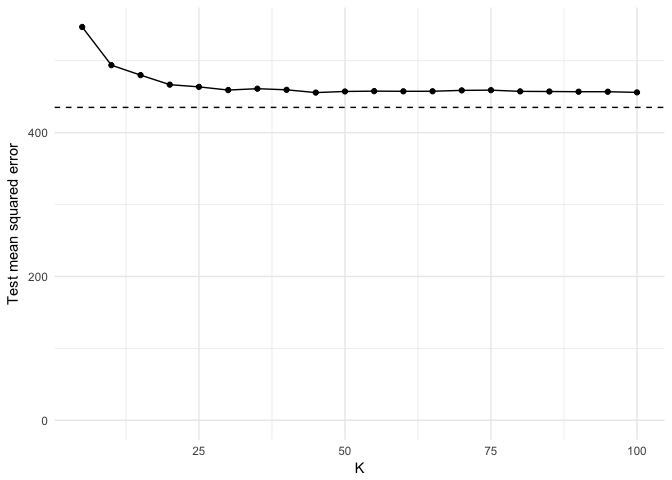
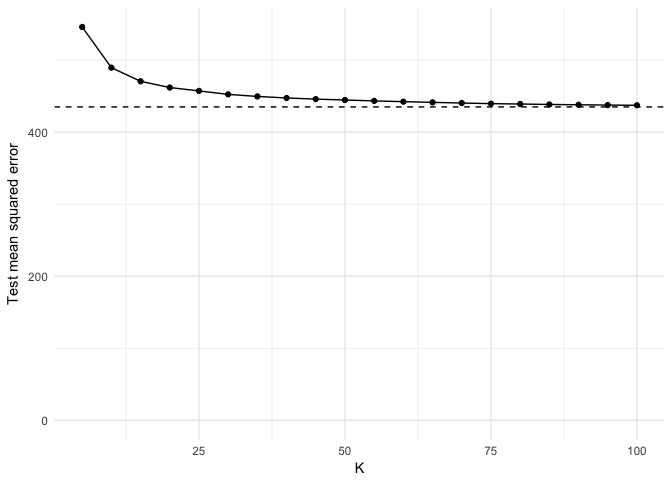
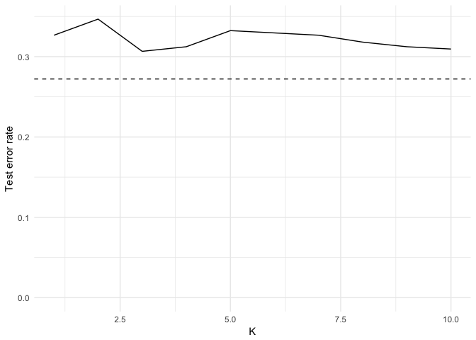
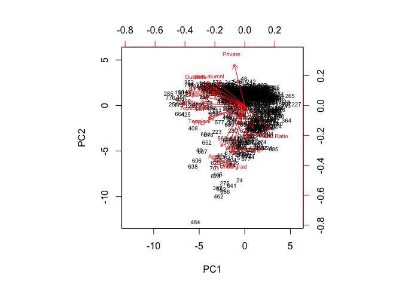
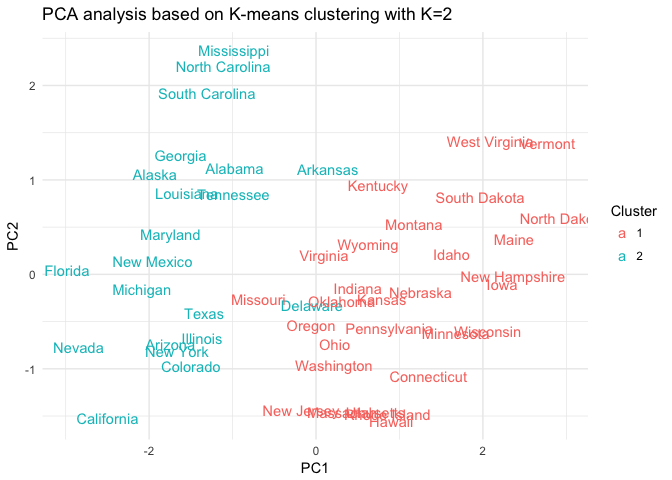
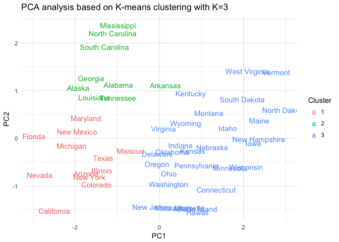
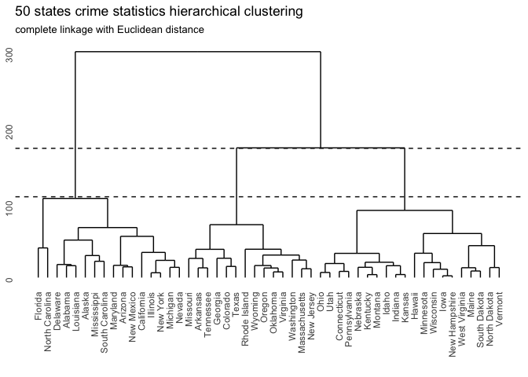
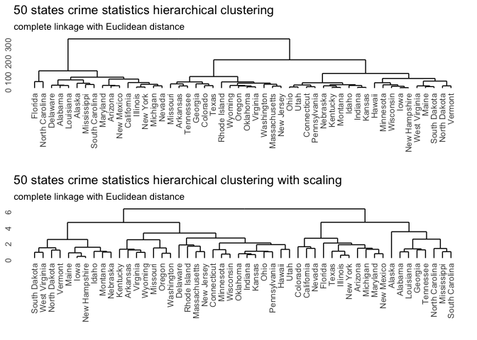

Problem set 9\#Xuancheng Qian
================
Xuancheng Qian
3/15/2017

-   [Attitudes towards feminists \[3 points\]](#attitudes-towards-feminists-3-points)
-   [Voter turnout and depression \[2 points\]](#voter-turnout-and-depression-2-points)
-   [Colleges \[2 points\]](#colleges-2-points)
-   [Clustering states \[3 points\]](#clustering-states-3-points)

``` r
library(tidyverse)
library(forcats)
library(broom)
library(modelr)
library(stringr)
library(ISLR)
library(titanic)
library(rcfss)
library(pROC)
library(grid)
library(gridExtra)
library(FNN)
library(kknn)
library(ggdendro)
library(tidytext)
library(tm)
library(topicmodels)
library(pander)
library(tree)
library(e1071)
library(ggdendro)
library(randomForest)
library(gbm)


options(digits = 3)
set.seed(1234)
theme_set(theme_minimal())
```

``` r
err.rate.rf <- function(model, data) {
  data <- as_tibble(data)
  response <- as.character(model$terms[[2]])
  
  pred <- predict(model, newdata = data, type = "response")
  actual <- data[[response]]
  
  return(mean(pred != actual, na.rm = TRUE))
}
```

``` r
mse <- function(model, data) {
  x <- modelr:::residuals(model, data)
  mean(x ^ 2, na.rm = TRUE)
}
```

Attitudes towards feminists \[3 points\]
========================================

1.  Split the data into a training and test set (70/30%).

``` r
#import data set
df_fem = read.csv('data/feminist.csv')
# str(df)
# 
df_fem<- df_fem
  # na.omit() %>%
  # mutate_each(funs(as.factor(.)), dem, rep,female,income)
set.seed(1234)
fem_split <- resample_partition(df_fem, c(test = 0.3, train = 0.7))
fem_train <- as_tibble(fem_split$train)
fem_test <- as_tibble(fem_split$test)
```

1.  Calculate the test MSE for KNN models with *K* = 5, 10, 15, …, 100, using whatever combination of variables you see fit. Which model produces the lowest test MSE?

``` r
mse_knn <- data_frame(k = seq(5, 100, by=5),
                      knn = map(k, ~ knn.reg(select(fem_train, -feminist), y = fem_train$feminist,
                         test = select(fem_test, -feminist), k = .)),
                      mse = map_dbl(knn, ~ mean((fem_test$feminist - .$pred)^2)))

mse_lm <- lm(feminist ~., data = fem_train) %>%
  mse(fem_test)


ggplot(mse_knn, aes(k, mse)) +
  geom_line() +
  geom_point() +
  geom_hline(yintercept = mse_lm, linetype = 2) +
  labs(x = "K",
       y = "Test mean squared error") +
  expand_limits(y = 0)
```



``` r
mse_fem_knn <-min(mse_knn$mse)
mse_fem_knn_p <-which.min(mse_knn$mse)*5
```

-   Based on the requirements, we split the data into a training and test set (70/30%). Then we calculate the test MSE for KNN models with *K* = 5, 10, 15, …, 100.

-   We include the female, age, dem, rep, educ and income as the predictors. From the plot, we can see that the test MSE decreases rapidly when k &lt;25, and shrinks. The test MSE achieves the minimum when k=45, which is 455.712.

1.  Calculate the test MSE for weighted KNN models with *K* = 5, 10, 15, …, 100 using the same combination of variables as before. Which model produces the lowest test MSE?

``` r
mse_knn <- data_frame(k = seq(5, 100, by=5),
                      knn = map(k, ~ kknn(feminist ~ ., train = fem_train, test = fem_test, k = .)),
                      mse = map_dbl(knn, ~ mean((fem_test$feminist - .$fitted.values)^2)))


mse_lm <- lm(feminist ~., data = fem_train) %>%
  mse(fem_test)


ggplot(mse_knn, aes(k, mse)) +
  geom_line() +
  geom_point() +
  geom_hline(yintercept = mse_lm, linetype = 2) +
  labs(x = "K",
       y = "Test mean squared error") +
  expand_limits(y = 0)
```



``` r
 mse_fem_knn_w<-min(mse_knn$mse)
 mse_fem_knn_w_p <-which.min(mse_knn$mse)*5
```

-   Here we calculated the test MSE for weighted KNN models with *K* = 5, 10, 15, …, 100 using the same combination of variables as before. From the plot, we can see that the test MSE decreases rapidly when k &lt;=50, and continues to decrease with the increase of k. The test MSE achieves the minimum when k=100, which is 437.366.

1.  Compare the test MSE for the best KNN/wKNN model(s) to the test MSE for the equivalent linear regression, decision tree, boosting, and random forest methods using the same combination of variables as before. Which performs the best? Why do you think this method performed the best, given your knowledge of how it works?

``` r
set.seed(1234)

#linear regression
mse_lm <- lm(feminist ~., data = fem_train) %>%
  mse(fem_test)
#decision tree
fem_tree <- tree(feminist~., data = fem_split$train, control = tree.control(nobs = nrow(fem_split$train),
                            mindev = 0))
mse_tree = mse(fem_tree, fem_split$test)

#boosting tree
fem_boost <- gbm(feminist ~ ., data = fem_split$train, n.trees = 10000, interaction.depth = 2)
```

    ## Distribution not specified, assuming gaussian ...

``` r
pred_boost = predict(fem_boost, newdata = fem_split$test, n.trees = 10000)

mse_boost <- mean((pred_boost - df_fem[fem_split$test[2]$idx, ]$feminist)^2)
# mse_boost_m <- numeric(5)
# shrinkages <- numeric(5)
# trees_m <- numeric(5)
# for (t in 1:5){
#   shrinkages[t] <- 10^(-t)
#   trees_m[t]<-10^(5)*2*t
#   biden_boost <- gbm(feminist ~ ., data = fem_split$train, n.trees = trees_m[t], interaction.depth = 1, shrinkage = shrinkages[t])
#   pred_boost = predict(fem_boost, newdata = fem_split$test, n.trees = 10000)
#   mse_boost_m[t] <- mean((pred_boost - df_fem[fem_split$test[2]$idx, ]$feminist)^2)
# }
# 
# data_frame(mse = mse_boost_m, shrinkage = shrinkages) %>% 
#   ggplot(aes(shrinkage, mse)) +
#   geom_point() +
#   geom_line() +
#   labs(title = "Predicting Biden thermometer",
#        subtitle = "Boosting",
#        x = "Shrinkage",
#        y = "Test MSE")


#random forest
(fem_rf <- randomForest(feminist ~ ., data = fem_split$train,
                            ntree = 500))
```

    ## 
    ## Call:
    ##  randomForest(formula = feminist ~ ., data = fem_split$train,      ntree = 500) 
    ##                Type of random forest: regression
    ##                      Number of trees: 500
    ## No. of variables tried at each split: 2
    ## 
    ##           Mean of squared residuals: 439
    ##                     % Var explained: 5.06

``` r
mse_rf = mse(fem_rf, fem_split$test)


fem_tab <- data_frame("model" = c("OLS", "KNN (k=9)", "Weighted KNN (k=100)", "Decision Tree", "Boosting (10000 Trees)","Random Forest (500 Trees)"),
                  "test MSE" = c(mse_lm , mse_fem_knn, mse_fem_knn_w, mse_tree, mse_boost, mse_rf))
pander(fem_tab)
```

<table style="width:50%;">
<colgroup>
<col width="36%" />
<col width="13%" />
</colgroup>
<thead>
<tr class="header">
<th align="center">model</th>
<th align="center">test MSE</th>
</tr>
</thead>
<tbody>
<tr class="odd">
<td align="center">OLS</td>
<td align="center">435</td>
</tr>
<tr class="even">
<td align="center">KNN (k=9)</td>
<td align="center">456</td>
</tr>
<tr class="odd">
<td align="center">Weighted KNN (k=100)</td>
<td align="center">437</td>
</tr>
<tr class="even">
<td align="center">Decision Tree</td>
<td align="center">597</td>
</tr>
<tr class="odd">
<td align="center">Boosting (10000 Trees)</td>
<td align="center">431</td>
</tr>
<tr class="even">
<td align="center">Random Forest (500 Trees)</td>
<td align="center">440</td>
</tr>
</tbody>
</table>

-   From the table above, we can see that boosting method produces the minimum test MSE, which is 430.624. Unlike other methods, Boosting grows trees sequentially, update the residuals by using information from the previously grown trees and adaptively weight the observations to encourage better predictions for points that were previously miscalculated.

Voter turnout and depression \[2 points\]
=========================================

1.  Split the data into a training and test set (70/30).

``` r
#import data set
df_mh = read.csv('data/mental_health.csv')

df_mh<- df_mh %>%
  as_tibble %>%
  # mutate (vote96 = factor(vote96, levels = 0:1, label =c("no_vote", "vote"))) %>%
  na.omit() 

set.seed(1234)
mh_split <- resample_partition(df_mh, c(test = 0.3, train = 0.7))
mh_train <- as_tibble(mh_split$train)
mh_test <- as_tibble(mh_split$test)
```

1.  Calculate the test error rate for KNN models with *K* = 1, 2, …, 10, using whatever combination of variables you see fit. Which model produces the lowest test MSE?

``` r
mh_logit <- glm(vote96~ ., data = mh_train, family = binomial)
# mh_logit_mse <- mse.glm(mh_logit, mh_test)

logit2prob <- function(x){
  exp(x) / (1 + exp(x))
}

mh_glm <- glm(vote96 ~., data = mh_train, family = binomial) 
# estimate the error rate for this model:
grid1<- mh_test %>%
  add_predictions(mh_glm) %>%
  mutate (pred = logit2prob(pred),
          prob = pred,
          pred = as.numeric(pred > 0.5))
mh_logit_mse<-mean(grid1$vote96 != grid1$pred)

mse_knn <- data_frame(k = 1:10,
                      knn_train = map(k, ~ class::knn(select(mh_train, -vote96),
                                                test = select(mh_train, -vote96),
                                                cl = mh_train$vote96, k = .)),
                      knn_test = map(k, ~ class::knn(select(mh_train, -vote96),
                                                test = select(mh_test, -vote96),
                                                cl = mh_train$vote96, k = .)),
                      mse_train = map_dbl(knn_train, ~ mean(mh_test$vote96 != .)),
                      mse_test = map_dbl(knn_test, ~ mean(mh_test$vote96 != .)))

ggplot(mse_knn, aes(k, mse_test)) +
  geom_line() +
  geom_hline(yintercept = mh_logit_mse, linetype = 2) +
  labs(x = "K",
       y = "Test error rate") +
  expand_limits(y = 0)
```



``` r
mse_mh_knn <-min(mse_knn$mse_test)
mse_mh_knn_p <-which.min(mse_knn$mse_test)
```

-   Based on the requirements, we split the data into a training and test set (70/30%). Then we calculate the test MSE for KNN models with *K* = 1, 2, …, 10.

-   We include mheath\_sum, female, age, married, black, educ and inc10 as the predictors. From the plot, we can see that the test MSE achieves the minimum when k= 3, which is 0.307.

1.  Calculate the test error rate for weighted KNN models with *K* = 1, 2, …, 10 using the same combination of variables as before. Which model produces the lowest test error rate?

``` r
mse_knn <- data_frame(k = 1:10,
                      knn = map(k, ~ kknn(vote96 ~ ., train = mh_train, test = mh_test, k = .)),
                      mse_test = map_dbl(knn, ~ mean(mh_test$vote96 != as.numeric(.$fitted.values > 0.5))))


ggplot(mse_knn, aes(k, mse_test)) +
  geom_line() +
  geom_hline(yintercept = mh_logit_mse, linetype = 2) +
  labs(x = "K",
       y = "Test error rate") +
  expand_limits(y = 0)
```


``` r
mse_mh_knn_w<-min(mse_knn$mse_test)
mse_mh_knn_w_p <-which.min(mse_knn$mse_test)
```

-   Here we calculated the test MSE for weighted KNN models with *K* = 1, 2, 3, …, 10 using the same combination of variables as before. From the plot, we can see that the test MSE achieves the minimum when k=10, which is 0.278.

1.  Compare the test error rate for the best KNN/wKNN model(s) to the test error rate for the equivalent logistic regression, decision tree, boosting, random forest, and SVM methods using the same combination of variables as before. Which performs the best? Why do you think this method performed the best, given your knowledge of how it works?

``` r
set.seed(1234)

#svm models
mh_lin_tune <- tune(svm, vote96 ~ ., data = as_tibble(mh_split$train),
                    kernel = "linear",
                    range = list(cost = c(.001, .01, .1, 1, 5, 10, 100)))
summary(mh_lin_tune)
```

    ## 
    ## Parameter tuning of 'svm':
    ## 
    ## - sampling method: 10-fold cross validation 
    ## 
    ## - best parameters:
    ##  cost
    ##   100
    ## 
    ## - best performance: 0.264 
    ## 
    ## - Detailed performance results:
    ##    cost error dispersion
    ## 1 1e-03 0.285     0.0403
    ## 2 1e-02 0.267     0.0380
    ## 3 1e-01 0.264     0.0381
    ## 4 1e+00 0.264     0.0380
    ## 5 5e+00 0.264     0.0381
    ## 6 1e+01 0.264     0.0380
    ## 7 1e+02 0.264     0.0380

``` r
mh_lin <- mh_lin_tune$best.model
summary(mh_lin)
```

    ## 
    ## Call:
    ## best.tune(method = svm, train.x = vote96 ~ ., data = as_tibble(mh_split$train), 
    ##     ranges = list(cost = c(0.001, 0.01, 0.1, 1, 5, 10, 100)), 
    ##     kernel = "linear")
    ## 
    ## 
    ## Parameters:
    ##    SVM-Type:  eps-regression 
    ##  SVM-Kernel:  linear 
    ##        cost:  100 
    ##       gamma:  0.143 
    ##     epsilon:  0.1 
    ## 
    ## 
    ## Number of Support Vectors:  557

``` r
#transform to the classfication
set.seed(1234)
df_mh<- df_mh %>%
   mutate (vote96 = factor(vote96, levels = 0:1, label =c("no_vote", "vote"))) 

mh_split <- resample_partition(df_mh, c(test = 0.3, train = 0.7))


mh_train <- as_tibble(mh_split$train)
mh_test <- as_tibble(mh_split$test)

#decision tree
mh_tree <- tree(vote96~., data = mh_split$train, control = tree.control(nobs = nrow(mh_split$train),
                            mindev = 0))
mse_tree = err.rate.tree(mh_tree, mh_split$test)


#random forest
(mh_rf <- randomForest(vote96 ~ ., data = mh_split$train,
                            ntree = 500))
```

    ## 
    ## Call:
    ##  randomForest(formula = vote96 ~ ., data = mh_split$train, ntree = 500) 
    ##                Type of random forest: classification
    ##                      Number of trees: 500
    ## No. of variables tried at each split: 2
    ## 
    ##         OOB estimate of  error rate: 30.1%
    ## Confusion matrix:
    ##         no_vote vote class.error
    ## no_vote      99  162       0.621
    ## vote         84  471       0.151

``` r
mse_rf = err.rate.rf(mh_rf, mh_split$test)


#boosting tree

mh_boost <- gbm(as.numeric(vote96)-1 ~ ., data = mh_split$train, n.trees = 10000, interaction.depth = 2)
```

    ## Distribution not specified, assuming bernoulli ...

``` r
# pred_boost = predict(mh_boost, newdata = mh_split$test, n.trees = 10000)
mse_boost = predict(mh_boost,newdata = as_tibble(mh_split$test),
                                                       n.trees = 9000:10000) %>%
                               apply(2, function(x) round(x) == as.numeric(as_tibble(mh_split$test)$vote96) - 1) %>%
                               apply(2, mean)
mse_boost <- as.matrix (mse_boost)[1001]

# mse_boost_m <- numeric(5)
# shrinkages <- numeric(5)
# trees_m <- numeric(5)
# for (t in 1:5){
#   shrinkages[t] <- 10^(-t)
#   trees_m[t]<-10^(5)*2*t
#   biden_boost <- gbm(feminist ~ ., data = fem_split$train, n.trees = trees_m[t], interaction.depth = 1, shrinkage = shrinkages[t])
#   pred_boost = predict(fem_boost, newdata = fem_split$test, n.trees = 10000)
#   mse_boost_m[t] <- mean((pred_boost - df_fem[fem_split$test[2]$idx, ]$feminist)^2)
# }
# 
# data_frame(mse = mse_boost_m, shrinkage = shrinkages) %>% 
#   ggplot(aes(shrinkage, mse)) +
#   geom_point() +
#   geom_line() +
#   labs(title = "Predicting Biden thermometer",
#        subtitle = "Boosting",
#        x = "Shrinkage",
#        y = "Test MSE")

 mh_tab <- data_frame("model" = c("GLM", "KNN (k=3)", "Weighted KNN (k=10)", "Decision Tree", "Boosting (10000 Trees)","Random Forest (500 Trees)","SVM with linear kernel"),
                  "test MSE" = c(mh_logit_mse , mse_mh_knn,mse_mh_knn_w, mse_tree, mse_boost, mse_rf,0.265))
 pander(mh_tab)
```

<table style="width:50%;">
<colgroup>
<col width="36%" />
<col width="13%" />
</colgroup>
<thead>
<tr class="header">
<th align="center">model</th>
<th align="center">test MSE</th>
</tr>
</thead>
<tbody>
<tr class="odd">
<td align="center">GLM</td>
<td align="center">0.272</td>
</tr>
<tr class="even">
<td align="center">KNN (k=3)</td>
<td align="center">0.307</td>
</tr>
<tr class="odd">
<td align="center">Weighted KNN (k=10)</td>
<td align="center">0.278</td>
</tr>
<tr class="even">
<td align="center">Decision Tree</td>
<td align="center">0.338</td>
</tr>
<tr class="odd">
<td align="center">Boosting (10000 Trees)</td>
<td align="center">0.275</td>
</tr>
<tr class="even">
<td align="center">Random Forest (500 Trees)</td>
<td align="center">0.298</td>
</tr>
<tr class="odd">
<td align="center">SVM with linear kernel</td>
<td align="center">0.265</td>
</tr>
</tbody>
</table>

-   From the table above, we can see that SVM with linear kernel performs better in terms of error rate. SVM model maximizes margin and could relax the requirement of the maximal margin classifier by allowing the separating hyperplane to not perfectly separate the observations, so the model is slightly more robust compared with other methods in terms of binary classification.

Colleges \[2 points\]
=====================

Perform PCA analysis on the college dataset and plot the first two principal components. Describe the results. What variables appear strongly correlated on the first principal component? What about the second principal component?

``` r
df_college <- read_csv('data/College.csv') %>%
  mutate(Private = ifelse(Private == 'Yes', 1, 0))
```

    ## Parsed with column specification:
    ## cols(
    ##   Private = col_character(),
    ##   Apps = col_double(),
    ##   Accept = col_double(),
    ##   Enroll = col_double(),
    ##   Top10perc = col_double(),
    ##   Top25perc = col_double(),
    ##   F.Undergrad = col_double(),
    ##   P.Undergrad = col_double(),
    ##   Outstate = col_double(),
    ##   Room.Board = col_double(),
    ##   Books = col_double(),
    ##   Personal = col_double(),
    ##   PhD = col_double(),
    ##   Terminal = col_double(),
    ##   S.F.Ratio = col_double(),
    ##   perc.alumni = col_double(),
    ##   Expend = col_double(),
    ##   Grad.Rate = col_double()
    ## )

``` r
pr_out <- prcomp(df_college, scale = TRUE)
biplot(pr_out, scale = 0, cex = .6)
```



``` r
#print(pr_out)
print('First Principal Component')
```

    ## [1] "First Principal Component"

``` r
pr_out$rotation[, 1]
```

    ##     Private        Apps      Accept      Enroll   Top10perc   Top25perc 
    ##     -0.0890     -0.1996     -0.1538     -0.1178     -0.3603     -0.3448 
    ## F.Undergrad P.Undergrad    Outstate  Room.Board       Books    Personal 
    ##     -0.0941      0.0175     -0.3277     -0.2665     -0.0572      0.0719 
    ##         PhD    Terminal   S.F.Ratio perc.alumni      Expend   Grad.Rate 
    ##     -0.3033     -0.3039      0.2103     -0.2367     -0.3330     -0.2731

``` r
print('Second Principal Component')
```

    ## [1] "Second Principal Component"

``` r
pr_out$rotation[, 2]
```

    ##     Private        Apps      Accept      Enroll   Top10perc   Top25perc 
    ##      0.3459     -0.3436     -0.3726     -0.3997      0.0162     -0.0177 
    ## F.Undergrad P.Undergrad    Outstate  Room.Board       Books    Personal 
    ##     -0.4107     -0.2931      0.1915      0.0940     -0.0573     -0.1928 
    ##         PhD    Terminal   S.F.Ratio perc.alumni      Expend   Grad.Rate 
    ##     -0.1162     -0.1042     -0.2044      0.1941      0.0703      0.1178

-   From this problem, we apply the PCA analysis on this dataset. The biplot visualizes the relationship between the first two principal components for the dataset, including both the scores and the loading vectors.
-   From the summary, we can see that Top10perc, Top25perc, Expend, Outstate, Terminal, PhD, Grad.Rate have higher loading on the first principal component. Thus factors like Percent of new students from top 10% of H.S. class, Percent of new students from top 25% of H.S. class, Instructional expenditure per student, Out-of-state tuition, Percent of faculty with terminal degrees and Graduation rate appear strongly correlated on the first principal component
-   For the second principal component, F.Undergrad, Enroll, Accept, Private, Apps have higher loading on this component. Thus Number of fulltime undergraduates, Number of new students enrolled, Number of applications accepted, whether private or public university and Number of applications received appear strongly correlated on the second principal component.

Clustering states \[3 points\]
==============================

1.  Perform PCA on the dataset and plot the observations on the first and second principal components.

``` r
df_crime <- read_csv('data/USArrests.csv') 
```

    ## Parsed with column specification:
    ## cols(
    ##   State = col_character(),
    ##   Murder = col_double(),
    ##   Assault = col_integer(),
    ##   UrbanPop = col_integer(),
    ##   Rape = col_double()
    ## )

``` r
crime_data<- df_crime%>%
  select(-State) 
crim_label <- df_crime%>%
  select(State) 
pr_out <- prcomp(crime_data, scale = TRUE)
biplot(pr_out, scale = 0, cex = .6)
```


-   From the plot, we could that the Assault, Murder, and Rape roughly have equal loading on the first principal component, correlating with the level of crime, while UrbanPop have much higher loading on the second principal component, correlating with the Urban Population.

1.  Perform *K*-means clustering with *K* = 2. Plot the observations on the first and second principal components and color-code each state based on their cluster membership. Describe your results.

``` r
set.seed(1234)

grid_crime <-select(as_data_frame(pr_out$x), PC1:PC2) %>%
  mutate(State = df_crime$State)

crime_cluster <- as.factor(kmeans(crime_data, 2)$cluster)
grid_crime %>%
  mutate(crime_cluster) %>%
  ggplot(aes(PC1, PC2, color = crime_cluster, label = State)) +
    geom_text() + 
    labs(title = 'PCA analysis based on K-means clustering with K=2',
         color = 'Cluster')
```



-   From the plot, we can see that states are classified into 2 groups. This classification criterion correlates with the first principal component. The states in the red groups almost all have the positive values of the first principal component, while the states in another group have negative value of the first principal component. The states in the blue group would have higher crime rates in terms of Assault, Murder, and Rape compared with the states in the red group.

1.  Perform *K*-means clustering with *K* = 4. Plot the observations on the first and second principal components and color-code each state based on their cluster membership. Describe your results.

``` r
set.seed(1234)

grid_crime <-select(as_data_frame(pr_out$x), PC1:PC2) %>%
  mutate(State = df_crime$State)

crime_cluster <- as.factor(kmeans(crime_data, 4)$cluster)
grid_crime %>%
  mutate(crime_cluster) %>%
  ggplot(aes(PC1, PC2, color = crime_cluster, label = State)) +
    geom_text() + 
    labs(title = 'PCA analysis based on K-means clustering with K=4',
         color = 'Cluster')
```


-   From the plot, we can see that states are classified into 4 groups. This classification criterion still correlates with the first principal component. The states in the left-most groups usually have negative value -2 in terms of score of first principal component compared with the states in right-most groups usually have positive value 2. The states in the left two groups that have negative values of the first principal component would have higher crime level in terms of Assault, Murder, and Rape compared with the states in the right two groups with positive values. The states like Vermont, North Dakota in the right-most group would have lowest level of crimes while states in the left-most group like Florida, Nevada would have much higher crime level.

1.  Perform *K*-means clustering with *K* = 3. Plot the observations on the first and second principal components and color-code each state based on their cluster membership. Describe your results.

``` r
set.seed(1234)

grid_crime <-select(as_data_frame(pr_out$x), PC1:PC2) %>%
  mutate(State = df_crime$State)

crime_cluster <- as.factor(kmeans(crime_data, 3)$cluster)
grid_crime %>%
  mutate(crime_cluster) %>%
  ggplot(aes(PC1, PC2, color = crime_cluster, label = State)) +
    geom_text() + 
    labs(title = 'PCA analysis based on K-means clustering with K=3',
         color = 'Cluster')
```


-   From the plot, we can see that states are classified into 3 groups. This classification criterion still correlates with the first principal component. The states in the groups in the left-most groups usually have negative value -2 in terms of score of first principal component compared with the states in right-most groups usually have positive value 2. The middle group would roughly have value 0. The states in the left group have higher crime level in terms of Assault, Murder, and Rape compared with the states in the right group. The middle group have moderate crime level.

1.  Perform *K*-means clustering with *K* = 3 on the first two principal components score vectors, rather than the raw data. Describe your results and compare them to the clustering results with *K* = 3 based on the raw data.

``` r
set.seed(1234)

grid_crime <-select(as_data_frame(pr_out$x), PC1:PC2) %>%
  mutate(State = df_crime$State)


crime_cluster <- as.factor(kmeans(select(grid_crime,-State), 3)$cluster)
grid_crime %>%
  mutate(crime_cluster) %>%
  ggplot(aes(PC1, PC2, color = crime_cluster, label = State)) +
    geom_text() + 
    labs(title = 'PCA analysis based on K-means clustering with K=3',
         color = 'Cluster')
```



-   From the plot, we can see that states are classified into 3 different groups. This classification criterion correlates with the first and second principal component. The upper left group have negative value in first principal component and positive value in second principal component. The lower left group have both negative values in the first and second group. The states in the right group almost have positive values in the first principal component and negative value in the second component. The higher value of the first principal component indicates the lower crime level while the higher value of the second principal component indicates the lower Percent urban population.

1.  Using hierarchical clustering with complete linkage and Euclidean distance, cluster the states.

``` r
set.seed(1234)

grid_crime <-select(as_data_frame(pr_out$x), PC1:PC2) %>%
  mutate(State = df_crime$State)

rownames(crime_data) <-select(df_crime, State)$State

hc_complete <- hclust(dist(crime_data), method = 'complete')
hc1 <- ggdendrogram(hc_complete, labels = TRUE) + 
  labs(title = '50 states crime statistics hierarchical clustering',
       subtitle = "complete linkage with Euclidean distance")
hc1
```


-   Here we apply hierarchical clustering with complete linkage and Euclidean distance. Each leaf represents one of the 50 observations of states. The leafs in the same branch share similar features, for example, Vermont and North Dakota are very close to each other in this clustering and actually the states have lower crime level and lower percent urban population

1.  Cut the dendrogram at a height that results in three distinct clusters. Which states belong to which clusters?

``` r
sort(unique(cophenetic(hc_complete)))
```

    ##  [1]   2.29   3.83   3.93   6.24   6.64   7.36   8.03   8.54  10.86  11.46
    ## [11]  12.42  12.61  12.78  13.04  13.30  13.35  13.90  14.50  15.41  15.45
    ## [21]  15.63  15.89  16.98  18.26  19.44  19.90  21.17  22.37  22.77  24.89
    ## [31]  25.09  28.64  29.25  31.48  31.62  32.72  36.73  36.85  38.53  41.49
    ## [41]  48.73  53.59  57.27  64.99  68.76  87.33 102.86 168.61 293.62

``` r
hc1+ geom_hline(yintercept=105, linetype=2)+
  geom_hline(yintercept=168, linetype=2)
```



``` r
cutree(hc_complete, 3)
```

    ##        Alabama         Alaska        Arizona       Arkansas     California 
    ##              1              1              1              2              1 
    ##       Colorado    Connecticut       Delaware        Florida        Georgia 
    ##              2              3              1              1              2 
    ##         Hawaii          Idaho       Illinois        Indiana           Iowa 
    ##              3              3              1              3              3 
    ##         Kansas       Kentucky      Louisiana          Maine       Maryland 
    ##              3              3              1              3              1 
    ##  Massachusetts       Michigan      Minnesota    Mississippi       Missouri 
    ##              2              1              3              1              2 
    ##        Montana       Nebraska         Nevada  New Hampshire     New Jersey 
    ##              3              3              1              3              2 
    ##     New Mexico       New York North Carolina   North Dakota           Ohio 
    ##              1              1              1              3              3 
    ##       Oklahoma         Oregon   Pennsylvania   Rhode Island South Carolina 
    ##              2              2              3              2              1 
    ##   South Dakota      Tennessee          Texas           Utah        Vermont 
    ##              3              2              2              3              3 
    ##       Virginia     Washington  West Virginia      Wisconsin        Wyoming 
    ##              2              2              3              3              2

-   For this problem, we need to cut the dendrogram at a height that results in three distinct clusters. We can see that $ 102.86 &lt; height &lt; 168.61$ can give us three distinct clusters. The figure and table above give us the three distinct clusters.
-   The left-most cluster (relatively higher crime level) includes Alabama, Alaska, Arizona, California, Delaware, Florida , Illinois, Louisiana, Maryland, Michigan, Mississippi, Nevada, New Mexico, New York, North Carolina, South Carolina.
-   The middle cluster (relatively moderate crime level) includes Arkansas, Colorado, Georgia, Massachusetts, Missouri, New Jersey, Oklahoma, Oregon, Rhode Island, Tennessee, Texas, Virginia, Washington, Wyoming.
-   The right-most cluster (relatively lower crime level) includes Connecticut,Hawaii, Idaho, Indiana, Iowa, Kansas, Kentucky, Maine, Minnesota, Montana, Nebraska, New Hampshire, North Dakota, Ohio, Pennsylvania, South Dakota, Utah, Vermont, West Virginia, Wisconsin.

1.  Hierarchically cluster the states using complete linkage and Euclidean distance, after scaling the variables to have standard deviation 1. What effect does scaling the variables have on the hierarchical clustering obtained? In your opinion, should the variables be scaled before the inter-observation dissimilarities are computed? Provide a justification for your answer.

``` r
hc_complete1 <- hclust(dist(scale(crime_data)), method = 'complete')
hc2 <- ggdendrogram(hc_complete1, labels = TRUE) + 
  labs(title = '50 states crime statistics hierarchical clustering with scaling',
       subtitle = "complete linkage with Euclidean distance")

sort(unique(cophenetic(hc_complete1)))
```

    ##  [1] 0.206 0.350 0.429 0.494 0.530 0.535 0.594 0.646 0.704 0.711 0.739
    ## [12] 0.772 0.778 0.787 0.798 0.829 0.841 0.846 0.982 0.997 1.012 1.035
    ## [23] 1.071 1.080 1.092 1.131 1.183 1.197 1.212 1.250 1.272 1.333 1.399
    ## [34] 1.467 1.623 1.645 1.659 1.854 1.865 2.263 2.295 2.337 2.446 2.475
    ## [45] 3.088 3.255 4.401 4.420 6.077

``` r
grid.arrange(hc1,hc2, ncol = 1, nrow = 2 ) 
```



-   After scaling, the Euclidean distance is much smaller, ranging from 0.206 to 6.077. And the scaling increases the weights of Murder and Rape variables, which have lower original value and lower variance compared with Assault in previous model. Even though these two results obtained through hierarchical clustering are quite similar, but we could find that some members change their membership after rescaling in higher level branch, like Alaska.

-   From statiscal view, units really play an important role in similarity measure. I would strongly suggest that we should scale these variables beforehand because data features have different units and variables may have more or less weight on the analysis based on their units.
