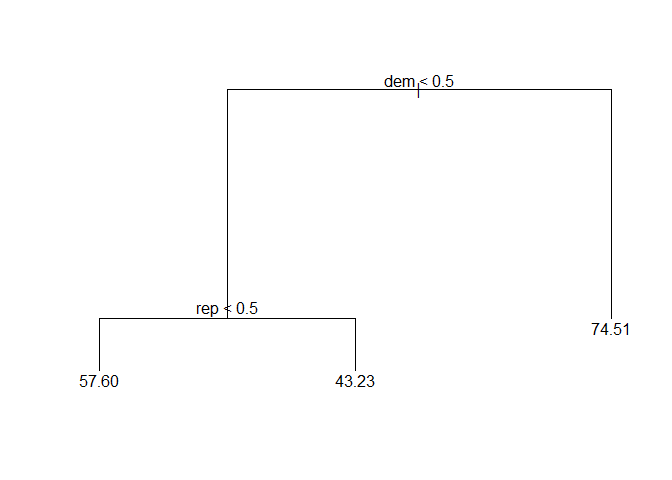
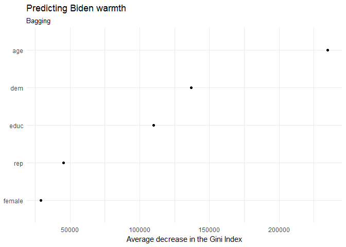
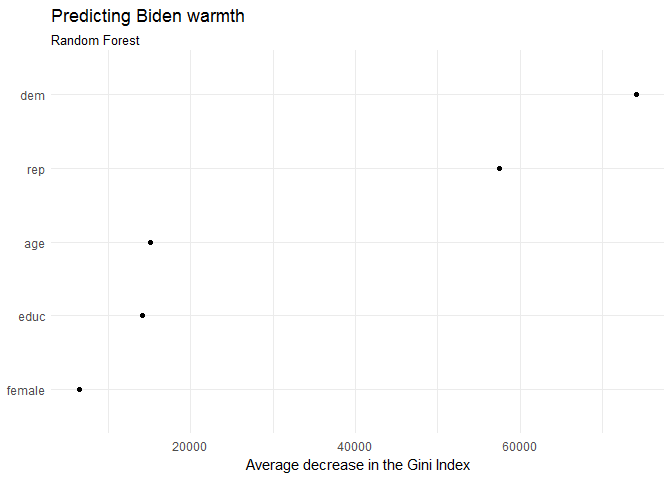
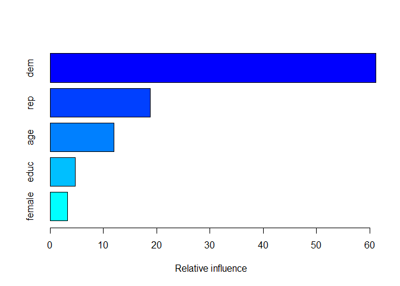
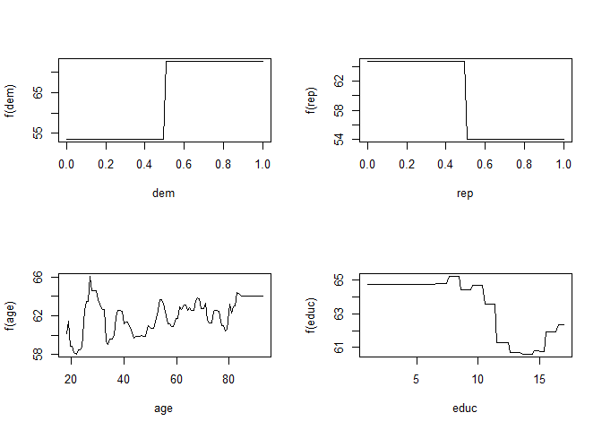
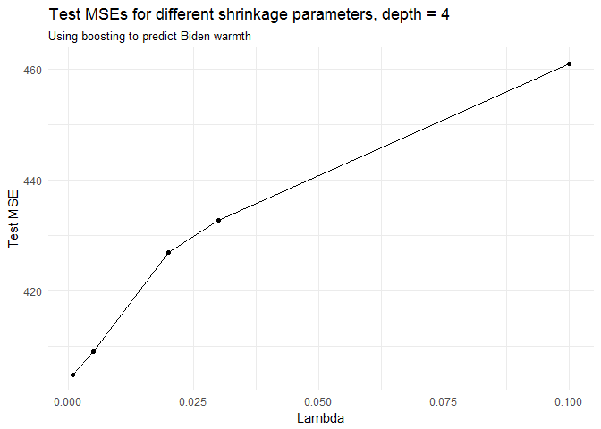

Problem set \#8: tree-based methods and support vector machines
================
Soo Wan Kim
March 4, 2017

-   [Part 1: Sexy Joe Biden (redux times two) \[3 points\]](#part-1-sexy-joe-biden-redux-times-two-3-points)
    -   [Question 1](#question-1)
    -   [Question 2](#question-2)
    -   [Question 3](#question-3)
    -   [4](#section)
    -   [5](#section-1)
    -   [6](#section-2)

Part 1: Sexy Joe Biden (redux times two) \[3 points\]
=====================================================

### Question 1

**Split the data into a training set (70%) and a validation set (30%).**

``` r
biden <- read.csv("data/biden.csv") #import data

biden_split <- resample_partition(biden, c(test = 0.3, train = 0.7)) #split data into 70/30 training/test set
biden_train <- biden_split$train %>% 
  tbl_df()
biden_test <- biden_split$test %>% 
  tbl_df()
```

### Question 2

**Fit a decision tree to the training data, with `biden` as the response variable and the other variables as predictors. Plot the tree and interpret the results. What is the test MSE? Leave the control options for `tree()` at their default values.**

``` r
biden_tree <- tree(biden ~ ., data = biden_train) #fit tree
mod <- biden_tree

# plot tree
tree_data <- dendro_data(mod)

ggplot(segment(tree_data)) +
  labs(title = "Decision tree of Biden warmth",
       subtitle = "Default control options") + 
  geom_segment(aes(x = x, y = y, xend = xend, yend = yend), 
               alpha = 0.5) +
  geom_text(data = label(tree_data), 
            aes(x = x, y = y, label = label_full), vjust = -0.5, size = 3) +
  geom_text(data = leaf_label(tree_data), 
            aes(x = x, y = y, label = label), vjust = 0.5, size = 3) +
  theme_dendro()
```


``` r
mse <- mse(mod, biden_test)
```

The plot includes only two variables, `dem` and `rep`, suggesting that party identification is the most important factor in this model. The plot shows that Democrats are more likely to have higher Biden warmth than non-Democrats, and independents are more likely to have higher Biden warmth than Republicans. The test MSE is 406.4167458.

### Question 3

**Now fit another tree to the training data with the following `control` options:**

`tree(control = tree.control(nobs = # number of rows in the training set,                               mindev = 0))`

**Use cross-validation to determine the optimal level of tree complexity, plot the optimal tree, and interpret the results. Does pruning the tree improve the test MSE?**

The following code runs on the console but doesn't knit for some reason. I interpret the results according to this method and also determine the optimal level of tree complexity using an alternative method.

``` r
biden_tree2 <- tree(biden ~ ., data = biden_train, #fit another tree
                    control = tree.control(nobs = nrow(biden_train),
                            mindev = 0))

# generate 10-fold CV trees
biden_cv <- crossv_kfold(biden_train, k = 10) %>%
  mutate(tree = map(train, ~ tree(biden ~ ., data = .,
     control = tree.control(nobs = nrow(biden_train),
                            mindev = 0))))

# calculate each possible prune result for each fold
biden_cv <- expand.grid(biden_cv$.id, 2:10) %>%
  as_tibble() %>%
  mutate(Var2 = as.numeric(Var2)) %>%
  rename(.id = Var1,
         k = Var2) %>%
  left_join(biden_cv) %>%
  mutate(prune = map2(tree, k, ~ prune.tree(.x, best = .y)),
         mse = map2_dbl(prune, test, mse))

#display test MSE for each number of terminal nodes
biden_cv %>%
  select(k, mse) %>%
  group_by(k) %>%
  summarize(test_mse = mean(mse),
            sd = sd(mse, na.rm = TRUE)) %>%
  ggplot(aes(k, test_mse)) +
  geom_point() +
  geom_line() +
  labs(title = "MSE at each number of terminal nodes",
       subtitle = "Updated control options",
       x = "Number of terminal nodes",
       y = "MSE")
```

According to the output of the above code, the optimal number of terminal nodes is 4.

``` r
#function to calculate MSE
mse <- function(model, data) {
  x <- modelr:::residuals(model, data)
  mean(x ^ 2, na.rm = TRUE)
}

biden_tree2 <- tree(biden ~ ., data = biden_train, 
                    control = tree.control(nobs = nrow(biden_train),
                            mindev = 0))

mod <- prune.tree(biden_tree2, best = 4)

# plot tree
tree_data <- dendro_data(mod)
ggplot(segment(tree_data)) +
  labs(title = "Decision tree of biden warmth",
       subtitle = "Updated control options, 4 terminal nodes") + 
  geom_segment(aes(x = x, y = y, xend = xend, yend = yend), 
               alpha = 0.5) +
  geom_text(data = label(tree_data), 
            aes(x = x, y = y, label = label_full), vjust = -0.5, size = 3) +
  geom_text(data = leaf_label(tree_data), 
            aes(x = x, y = y, label = label), vjust = 0.5, size = 3) +
  theme_dendro()
```


``` r
mse_whole <- mse(biden_tree2, biden_test)
mse_pruned <- mse(mod, biden_test)
```

Again, as in the previous tree, we expect Biden warmth to be highest for Democrats and lowest for Republicans. Among Democrats, Biden warmth is expected to be higher for individuals older than than 53.5 years. Without pruning, the test MSE for this model is 481.4899366. Pruning reduces it to 407.1559614, showing that pruning improves model fit.

Another way to calculate optimal tree complexity:

``` r
#The cv.tree function uses k-fold cross validation (default k = 10) 
#to find the deviance (sum of squared errors) as a function of the cost-complexity parameter k

cv_biden <- cv.tree(biden_tree2) #get sum of squared errors for different tree sizes

opt.trees <- which(cv_biden$dev == min(cv_biden$dev)) #trees where sum of squared errors is minimzed
best.leaves <- min(cv_biden$size[opt.trees]) #optimal number of leaves
```

The optimal number of terminal nodes using this method is 3.

``` r
cv_biden_pruned <- prune.tree(biden_tree2, best=best.leaves) #prune the tree
plot(cv_biden_pruned) #plot optimal tree
text(cv_biden_pruned, pretty = 0)
```



``` r
mod2 <- prune.tree(biden_tree2, best = 3)
mse_pruned2 <- mse(mod2, biden_test)
```

This tree is identical to the one produced in subpart 2. The test MSE for the optimal tree with 3 terminal nodes is 406.4167458, which is slightly lower than the test MSE with 4 terminal nodes (407.1559614).

### 4

**Use the bagging approach to analyze this data. What test MSE do you obtain? Obtain variable importance measures and interpret the results.**

``` r
biden_rf_data <- biden %>% #prep data for random forest method
    mutate_each(funs(as.factor(.)), female, dem, rep) %>%
    na.omit

biden_rf_split <- resample_partition(biden_rf_data, c(test = 0.3, train = 0.7)) #split data into 70/30 training/test set
biden_rf_train <- biden_rf_split$train %>% 
  tbl_df()
biden_rf_test <- biden_rf_split$test %>% 
  tbl_df()

(biden_bag <- randomForest(biden ~ ., data = biden_rf_train, #bagging
                             mtry = 5, ntree = 500))
```

    ## 
    ## Call:
    ##  randomForest(formula = biden ~ ., data = biden_rf_train, mtry = 5,      ntree = 500) 
    ##                Type of random forest: regression
    ##                      Number of trees: 500
    ## No. of variables tried at each split: 5
    ## 
    ##           Mean of squared residuals: 514.9544
    ##                     % Var explained: 8.13

``` r
mse_bagged <- mse(biden_bag, biden_rf_test)

data_frame(var = rownames(importance(biden_bag)),
           MeanDecreaseGini = importance(biden_bag)[,1]) %>%
  mutate(var = fct_reorder(var, MeanDecreaseGini, fun = median)) %>%
  ggplot(aes(var, MeanDecreaseGini)) +
  geom_point() +
  coord_flip() +
  labs(title = "Predicting Biden warmth",
       subtitle = "Bagging",
       x = NULL,
       y = "Average decrease in the Gini Index")
```



Using the bagging approach, age appears to be the most influential factor, followed by being a Democrat and then by education. The test MSE for the bagging approach is 449.7463709.

### 5

**Use the random forest approach to analyze this data. What test MSE do you obtain? Obtain variable importance measures and interpret the results. Describe the effect of *m*, the number of variables considered at each split, on the error rate obtained.**

``` r
(biden_rf <- randomForest(biden ~ ., data = biden_rf_train, #fit Random Forest
                            ntree = 500))
```

    ## 
    ## Call:
    ##  randomForest(formula = biden ~ ., data = biden_rf_train, ntree = 500) 
    ##                Type of random forest: regression
    ##                      Number of trees: 500
    ## No. of variables tried at each split: 1
    ## 
    ##           Mean of squared residuals: 419.082
    ##                     % Var explained: 25.23

``` r
mse_rf <- mse(biden_rf, biden_rf_test)

data_frame(var = rownames(importance(biden_rf)),
           MeanDecreaseGini = importance(biden_rf)[,1]) %>%
  mutate(var = fct_reorder(var, MeanDecreaseGini, fun = median)) %>%
  ggplot(aes(var, MeanDecreaseGini)) +
  geom_point() +
  coord_flip() +
  labs(title = "Predicting Biden warmth",
       subtitle = "Random Forest",
       x = NULL,
       y = "Average decrease in the Gini Index")
```



Using the Random Forest approach, party identification is the most important factor, with other factors having much smaller effects. The test MSE is 378.0215448, showing that the Random Forest approach improves on the bagging approach. Decreasing *m* reduces the error rate by reducing bias in model estimation.

6
-

**Use the boosting approach to analyze the data. What test MSE do you obtain? How does the value of the shrinkage parameter *λ* influence the test MSE?**

First, we calculate the optimal number of iterations when depth = 4:

``` r
biden_boost <- gbm(biden ~ ., data = biden_train, 
                   distribution = "gaussian", n.trees = 5000, interaction.depth = 4)

gbm.perf(biden_boost, plot.it=FALSE)
```

    ## Using OOB method...

    ## [1] 2061

Then we fit the boosting model with the optimal number of trees.

``` r
biden_boost_opt <- gbm(biden ~ ., data = biden_train, 
                   distribution = "gaussian", n.trees = 2051, interaction.depth = 4)

summary(biden_boost_opt)
```



    ##           var   rel.inf
    ## dem       dem 61.172863
    ## rep       rep 18.830381
    ## age       age 12.023435
    ## educ     educ  4.672370
    ## female female  3.300951

``` r
yhat_boost <- predict(biden_boost_opt, newdata = biden_test, n.trees = 2051)
mse_boost <- mean((yhat_boost - biden_test$biden)^2)
```

Party identification is the most influential factor, followed by age.

Partial dependence plots for `dem`, `rep`, `age`, and `educ`:

``` r
par(mfrow =c(2,2))
plot(biden_boost,i="dem")
plot(biden_boost,i="rep")
plot(biden_boost,i="age")
plot(biden_boost,i="educ")
```



Expected Biden warmth increases with Democratic party identification and decreases with Republican party identification. There is an overall upward trend as age increases, and an overall downward trend as education increases.

The test MSE is 405.2348056, which is the lowest of all the MSE values obtained.

Increasing the shrinkage parameter lambda increases the MSE, as shown below:

``` r
#fit different models with varying lambda values
biden_boost1 <- gbm(biden ~ ., data = biden_train, 
                   distribution = "gaussian", n.trees = 2051, interaction.depth = 4,
                   shrinkage = 0.001, verbose = F)

biden_boost2 <- gbm(biden ~ ., data = biden_train, 
                   distribution = "gaussian", n.trees = 2051, interaction.depth = 4,
                   shrinkage = 0.005, verbose = F)
                   
biden_boost3 <- gbm(biden ~ ., data = biden_train, 
                   distribution = "gaussian", n.trees = 2051, interaction.depth = 4,
                   shrinkage = 0.02, verbose = F)

biden_boost4 <- gbm(biden ~ ., data = biden_train, 
                   distribution = "gaussian", n.trees = 2051, interaction.depth = 4,
                   shrinkage = 0.03, verbose = F)

biden_boost5 <- gbm(biden ~ ., data = biden_train, 
                   distribution = "gaussian", n.trees = 2051, interaction.depth = 4,
                   shrinkage = 0.1, verbose = F)

boost_models <- c(biden_boost1, biden_boost2, biden_boost3, biden_boost4, biden_boost5)

#calculate MSEs for each
mse_boost <- function(model) {
  yhat_boost <- predict(model, newdata = biden_test, n.trees = 2051)
  mse <- mean((yhat_boost - biden_test$biden)^2)
}

boost_mse_vals <- as.data.frame(c(mse_boost(biden_boost1), mse_boost(biden_boost2), 
                    mse_boost(biden_boost3), mse_boost(biden_boost4), mse_boost(biden_boost5)))

#report in graph
boost_lambda_vals <- as.data.frame(c(0.001, 0.005, 0.02, 0.03, 0.1))
boost_df <- cbind(boost_lambda_vals, boost_mse_vals)
colnames(boost_df) <- c("Lambda", "MSE")

ggplot(data = boost_df, mapping = aes(x = Lambda, y = MSE)) + 
  geom_point() + 
  geom_line() + 
  labs(title = "Test MSEs for different shrinkage parameters, depth = 4",
       subtitle = "Using boosting to predict Biden warmth",
       x = "Lambda",
       y = "Test MSE")
```


