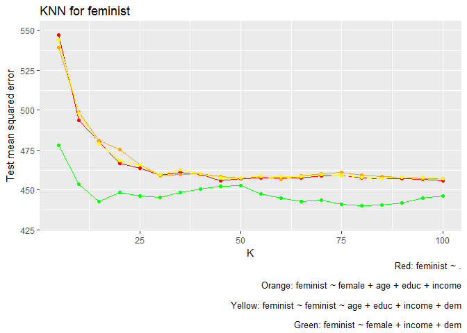
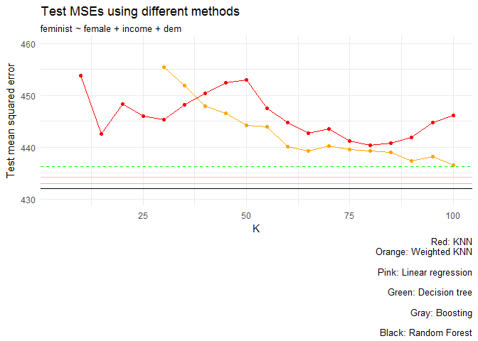
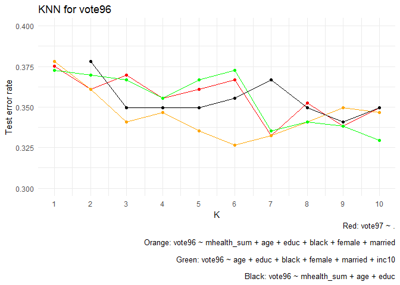
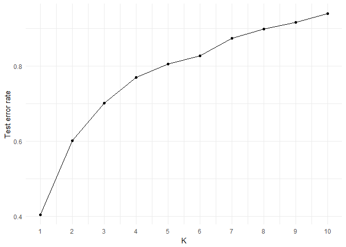
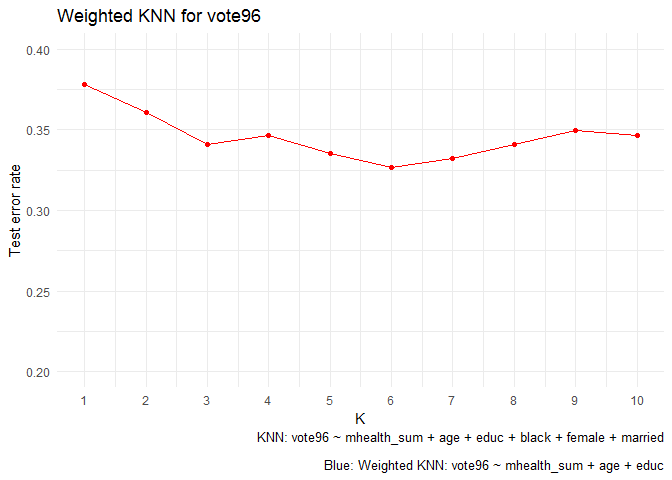
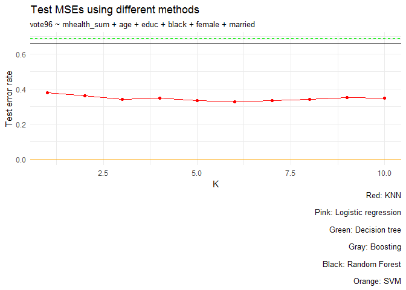
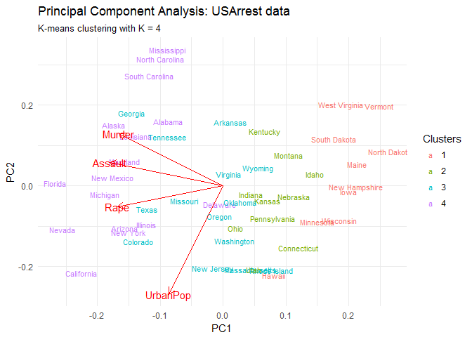

Problem set \#9: nonparametric methods and unsupervised learning
================
Soo Wan Kim
March 15, 2017

-   [Attitudes towards feminists \[3 points\]](#attitudes-towards-feminists-3-points)
-   [Voter turnout and depression \[2 points\]](#voter-turnout-and-depression-2-points)
-   [Colleges \[2 points\]](#colleges-2-points)
-   [Clustering states \[3 points\]1](#clustering-states-3-points1)

Attitudes towards feminists \[3 points\]
========================================

1.  Split the data into a training and test set (70/30%).

``` r
fem <- read.csv("data/feminist.csv")

fem_split <- resample_partition(fem, c(test = 0.3, train = 0.7)) #split data into 70/30 training/test set
fem_train <- fem_split$train %>% 
  tbl_df()
fem_test <- fem_split$test %>% 
  tbl_df()
```

1.  Calculate the test MSE for KNN models with *K* = 5, 10, 15, …, 100, using whatever combination of variables you see fit. Which model produces the lowest test MSE?

First I calculate the test MSE for KNN models for `feminist` using all predictors with *K* = 5, 10, 15, …, 100.

``` r
mse_knn1 <- data_frame(k = c(seq(5, 100, by = 5)),
                      knn = map(k, ~ knn.reg(select(fem_train, -feminist), y = fem_train$feminist,
                         test = select(fem_test, -feminist), k = .)),
                      mse = map_dbl(knn, ~ mean((fem_test$feminist - .$pred)^2)))

#plot test MSE
ggplot(data = mse_knn1, mapping = aes(k, mse)) +
  geom_line() +
  geom_point() +
  ylim(300,600) + 
  labs(title = "KNN for feminist",
       x = "K",
       y = "Test mean squared error",
       subtitle = "feminist ~ .") +
  expand_limits(y = 0)
```


``` r
knn_mse_min <- min(mse_knn1$mse)
knn_mse_min_k <- mse_knn1$k[mse_knn1$mse == min(mse_knn1$mse)]
```

As a whole, MSE decreases as K increases. However, the MSE is minimized at 455.7123299 when K = 45.

Now I test KNN models for `feminist` with four different sets of predictors.

``` r
# estimate test MSE for LM and KNN models

#LM model
mse_lm <- lm(feminist ~ ., data = fem_train) %>%
  mse(fem_test)

#KNN 1: feminist ~ .
mse_knn1 <- data_frame(k = c(seq(5, 100, by = 5)),
                      knn = map(k, ~ knn.reg(select(fem_train, -feminist), y = fem_train$feminist,
                         test = select(fem_test, -feminist), k = .)),
                      mse = map_dbl(knn, ~ mean((fem_test$feminist - .$pred)^2)))

#KNN 2: feminist ~ female + age + educ + income

mse_knn2 <- data_frame(k = c(seq(5, 100, by = 5)),
                      knn = map(k, ~ knn.reg(select(fem_train, -feminist, -dem, -rep), y = fem_train$feminist,
                         test = select(fem_test, -feminist, -dem, -rep), k = .)),
                      mse = map_dbl(knn, ~ mean((fem_test$feminist - .$pred)^2)))

#KNN 3: feminist ~ age + educ + income + dem

mse_knn3 <- data_frame(k = c(seq(5, 100, by = 5)),
                      knn = map(k, ~ knn.reg(select(fem_train, -feminist, -female, -rep), 
                                             y = fem_train$feminist,
                         test = select(fem_test, -feminist, -female, -rep), k = .)),
                      mse = map_dbl(knn, ~ mean((fem_test$feminist - .$pred)^2)))

#KNN 4: feminist ~ female + income + dem

mse_knn4 <- data_frame(k = c(seq(5, 100, by = 5)),
                      knn = map(k, ~ knn.reg(select(fem_train, female, income, dem), y = fem_train$feminist,
                         test = select(fem_test, female, income, dem), k = .)),
                      mse = map_dbl(knn, ~ mean((fem_test$feminist - .$pred)^2)))

#plot test MSE
ggplot() +
  geom_line(data = mse_knn1, mapping = aes(k, mse), color="red") +
  geom_point(data = mse_knn1, mapping = aes(k, mse), color="red") +
  geom_line(data = mse_knn2, mapping = aes(k, mse), color="orange") +
  geom_point(data = mse_knn2, mapping = aes(k, mse), color="orange") +
  geom_line(data = mse_knn3, mapping = aes(k, mse), color="yellow") +
  geom_point(data = mse_knn3, mapping = aes(k, mse), color="yellow") +
  geom_line(data = mse_knn4, mapping = aes(k, mse), color="green") +
  geom_point(data = mse_knn4, mapping = aes(k, mse), color="green") +
  geom_hline(yintercept = mse_lm, linetype = 2) +
  ylim(300,600) + 
  labs(title = "KNN for feminist",
       x = "K",
       y = "Test mean squared error",
       caption = "Red: feminist ~ .\n
       Orange: feminist ~ female + age + educ + income\n
       Yellow: feminist ~ feminist ~ age + educ + income + dem\n
       Green: feminist ~ female + income + dem") +
  expand_limits(y = 0) + 
  theme_gray()
```



`feminist ~ female + income + dem` produces the lowest test MSE. From these results it looks like gender, income, and party identification are the most important factors for predicting feminist warmth.

1.  Calculate the test MSE for weighted KNN models with *K* = 5, 10, 15, …, 100 using the same combination of variables as before. Which model produces the lowest test MSE?

Weighted KNN models for `feminist ~ .` with *K* = 5, 10, 15, …, 100 (default weight):

``` r
mse_wknn1 <- data_frame(k = c(seq(5, 100, by = 5)),
                      knn = map(k, ~ kknn(feminist ~ .,
                                          train = fem_train, test = fem_test, k = .)),
                      mse = map_dbl(knn, ~ mean((fem_test$feminist - .$fitted.values)^2)))

ggplot(data = mse_wknn1, mapping = aes(k, mse)) +
  geom_line() +
  geom_point() +
  ylim(400,700) + 
  labs(title = "Weighted KNN for feminist",
       x = "K",
       y = "Test mean squared error",
       subtitle = "feminist ~ .") +
  expand_limits(y = 0) + 
  theme_gray()
```


``` r
wknn_mse_min <- min(mse_wknn1$mse)
wknn_mse_min_k <- mse_wknn1$k[mse_wknn1$mse == min(mse_wknn1$mse)]
```

Again, MSE decreases as K increases. The MSE is minized at 455.7123299 when K = 100.

Now I test weighted KNN models for `feminist` with the same four sets of predictors as before.

``` r
# estimate test MSE for WKNN models

#WKNN 1: feminist ~ .
mse_wknn1 <- data_frame(k = c(seq(5, 100, by = 5)),
                      knn = map(k, ~ kknn(feminist ~ .,
                                          train = fem_train, test = fem_test, k = .)),
                      mse = map_dbl(knn, ~ mean((fem_test$feminist - .$fitted.values)^2)))

#WKNN 2: feminist ~ female + age + educ + income
mse_wknn2 <- data_frame(k = c(seq(5, 100, by = 5)),
                      knn = map(k, ~ kknn(feminist ~ female + age + educ + income,
                                          train = fem_train, test = fem_test, k = .)),
                      mse = map_dbl(knn, ~ mean((fem_test$feminist - .$fitted.values)^2)))

#WKNN 3: feminist ~ age + educ + income + dem

mse_wknn3 <- data_frame(k = c(seq(5, 100, by = 5)),
                      knn = map(k, ~ kknn(feminist ~ age + educ + income + dem,
                                          train = fem_train, test = fem_test, k = .)),
                      mse = map_dbl(knn, ~ mean((fem_test$feminist - .$fitted.values)^2)))

#WKNN 4: feminist ~ female + income + dem

mse_wknn4 <- data_frame(k = c(seq(5, 100, by = 5)),
                      knn = map(k, ~ kknn(feminist ~ female + income + dem,
                                          train = fem_train, test = fem_test, k = .)),
                      mse = map_dbl(knn, ~ mean((fem_test$feminist - .$fitted.values)^2)))
ggplot() +
  geom_line(data = mse_wknn1, mapping = aes(k, mse), color="red") +
  geom_point(data = mse_wknn1, mapping = aes(k, mse), color="red") +
  geom_line(data = mse_wknn2, mapping = aes(k, mse), color="orange") +
  geom_point(data = mse_wknn2, mapping = aes(k, mse), color="orange") +
  geom_line(data = mse_wknn3, mapping = aes(k, mse), color="yellow") +
  geom_point(data = mse_wknn3, mapping = aes(k, mse), color="yellow") +
  geom_line(data = mse_wknn4, mapping = aes(k, mse), color="green") +
  geom_point(data = mse_wknn4, mapping = aes(k, mse), color="green") +
  geom_hline(yintercept = mse_lm, linetype = 2) +
  ylim(400,700) + 
  labs(title = "Weighted KNN for feminist",
       x = "K",
       y = "Test mean squared error",
       caption = "Red: feminist ~ .\n
       Orange: feminist ~ female + age + educ + income\n
       Yellow: feminist ~ feminist ~ age + educ + income + dem\n
       Green: feminist ~ female + income + dem") +
  expand_limits(y = 0) + 
  theme_gray()
```


Using default weights in the `kknn` package, the `feminist ~ .` model performed the best, followed by the `feminist ~ female + income + dem` model.

1.  Compare the test MSE for the best KNN/wKNN model(s) to the test MSE for the equivalent linear regression, decision tree, boosting, and random forest methods using the same combination of variables as before. Which performs the best? Why do you think this method performed the best, given your knowledge of how it works?

First, I compare test MSEs across methods using all of the predictors (`feminist ~ .`).

``` r
#KNN
mse_knn1 <- data_frame(k = c(seq(5, 100, by = 5)),
                      knn = map(k, ~ knn.reg(select(fem_train, -feminist), y = fem_train$feminist,
                         test = select(fem_test, -feminist), k = .)),
                      mse = map_dbl(knn, ~ mean((fem_test$feminist - .$pred)^2)))
#WKNN
mse_wknn1 <- data_frame(k = c(seq(5, 100, by = 5)),
                      knn = map(k, ~ kknn(feminist ~ .,
                                          train = fem_train, test = fem_test, k = .)),
                      mse = map_dbl(knn, ~ mean((fem_test$feminist - .$fitted.values)^2)))

#LM model
mse_lm <- lm(feminist ~ ., data = fem_train) %>%
  mse(fem_test)

#decision tree
mse_dt <- tree(feminist ~ ., data = fem_train) %>%
  mse(fem_test)

#boosting
#boosting with interaction depth = 4
fem_boost <- gbm(feminist ~ ., data = fem_train, 
                   distribution = "gaussian", n.trees = 5000, interaction.depth = 4)
#get optimal number of trees with interaction depth 4
opt_iter <- gbm.perf(fem_boost, plot.it=FALSE)
```

    ## Using OOB method...

``` r
#boosting with interaction depth = 4 and optimal number of trees for that depth
fem_boost_opt <- gbm(feminist ~ ., data = fem_train, 
                   distribution = "gaussian", n.trees = opt_iter[[1]], interaction.depth = 4)
#predicted boosting values
yhat_boost <- predict(fem_boost_opt, newdata = fem_test, n.trees = opt_iter[[1]])
mse_boost <- mean((yhat_boost - fem_test$feminist)^2)

#random forest
mse_rf <- randomForest(feminist ~ ., data = fem_train, ntree = 500) %>%
  mse(fem_test)

#plot test MSEs
ggplot() +
  geom_line(data = mse_knn1, mapping = aes(k, mse), color="red") +
  geom_point(data = mse_knn1, mapping = aes(k, mse), color="red") +
  geom_line(data = mse_wknn1, mapping = aes(k, mse), color="orange") +
  geom_point(data = mse_wknn1, mapping = aes(k, mse), color="orange") +
  geom_hline(yintercept = mse_lm, linetype = 1, color = "pink") +
  geom_hline(yintercept = mse_dt, linetype = 2, color = "green") +
  geom_hline(yintercept = mse_boost, linetype = 1, color = "gray") +
  geom_hline(yintercept = mse_rf, linetype = 1, color = "black") +
  ylim(420,460) + 
  labs(title = "Test MSEs using different methods",
       subtitle = "feminist ~ .",
       x = "K",
       y = "Test mean squared error",
       caption = "Red: KNN
       Orange: Weighted KNN\n
       Pink: Linear regression\n
       Green: Decision tree\n
       Gray: Boosting\n
       Black: Random Forest") +
  expand_limits(y = 0)
```


The boosting method performed the best, although random forest, decision tree, linear regression and boosting produced similar MSEs. Seeing as how the linear regression outperformed the decision tree and the random forest, the relationship between the predictors and `feminist` is probably very close to linear. Boosting just barely outperformed linear regression. Boosting yields small errors because it fits sequentially to the residuals of each new tree.

Now I compare test MSEs across methods using `feminist ~ female + income + dem`.

``` r
#KNN
mse_knn4 <- data_frame(k = c(seq(5, 100, by = 5)),
                      knn = map(k, ~ knn.reg(select(fem_train, female, income, dem), y = fem_train$feminist,
                         test = select(fem_test, female, income, dem), k = .)),
                      mse = map_dbl(knn, ~ mean((fem_test$feminist - .$pred)^2)))
#WKNN
mse_wknn4 <- data_frame(k = c(seq(5, 100, by = 5)),
                      knn = map(k, ~ kknn(feminist ~ female + income + dem,
                                          train = fem_train, test = fem_test, k = .)),
                      mse = map_dbl(knn, ~ mean((fem_test$feminist - .$fitted.values)^2)))

#LM model
mse_lm <- lm(feminist ~ female + income + dem, data = fem_train) %>%
  mse(fem_test)

#decision tree
mse_dt <- tree(feminist ~ female + income + dem, data = fem_train) %>%
  mse(fem_test)

#boosting
#boosting with interaction depth = 4
fem_boost <- gbm(feminist ~ female + income + dem, data = fem_train, 
                   distribution = "gaussian", n.trees = 5000, interaction.depth = 4)
#get optimal number of trees with interaction depth 4
opt_iter <- gbm.perf(fem_boost, plot.it=FALSE)
```

    ## Using OOB method...

``` r
#boosting with interaction depth = 4 and optimal number of trees for that depth
fem_boost_opt <- gbm(feminist ~ female + income + dem, data = fem_train, 
                   distribution = "gaussian", n.trees = opt_iter[[1]], interaction.depth = 4)
#predicted boosting values
yhat_boost <- predict(fem_boost_opt, newdata = fem_test, n.trees = opt_iter[[1]])
mse_boost <- mean((yhat_boost - fem_test$feminist)^2)

#random forest
mse_rf <- randomForest(feminist ~ female + income + dem, data = fem_train, ntree = 500) %>%
  mse(fem_test)

#plot test MSEs
ggplot() +
  geom_line(data = mse_knn4, mapping = aes(k, mse), color="red") +
  geom_point(data = mse_knn4, mapping = aes(k, mse), color="red") +
  geom_line(data = mse_wknn4, mapping = aes(k, mse), color="orange") +
  geom_point(data = mse_wknn4, mapping = aes(k, mse), color="orange") +
  geom_hline(yintercept = mse_lm, linetype = 1, color = "pink") +
  geom_hline(yintercept = mse_dt, linetype = 2, color = "green") +
  geom_hline(yintercept = mse_boost, linetype = 1, color = "gray") +
  geom_hline(yintercept = mse_rf, linetype = 1, color = "black") +
  ylim(430,460) + 
  labs(title = "Test MSEs using different methods",
       subtitle = "feminist ~ female + income + dem",
       x = "K",
       y = "Test mean squared error",
       caption = "Red: KNN
       Orange: Weighted KNN\n
       Pink: Linear regression\n
       Green: Decision tree\n
       Gray: Boosting\n
       Black: Random Forest") +
  expand_limits(y = 0)
```



For this set of variables random forest performed the best, though linear regression, boosting, and random forest performed similarly. Again, the relationship is probably quite close to linear, but not perfectly so. Boosting and random forest generally produce similar MSEs because they reduce bias by producing multiple decision trees. Random forest reduces bias by sampling with replacement many times, reducing sampling bias.

Now we compare the best models: boosting with all predictors and random forest with `female`, `income`, and `dem`.

``` r
#boosting
#boosting with interaction depth = 4
fem_boost <- gbm(feminist ~ ., data = fem_train, 
                   distribution = "gaussian", n.trees = 5000, interaction.depth = 4)
#get optimal number of trees with interaction depth 4
opt_iter <- gbm.perf(fem_boost, plot.it=FALSE)
```

    ## Using OOB method...

``` r
#boosting with interaction depth = 4 and optimal number of trees for that depth
fem_boost_opt <- gbm(feminist ~ ., data = fem_train, 
                   distribution = "gaussian", n.trees = opt_iter[[1]], interaction.depth = 4)
#predicted boosting values
yhat_boost <- predict(fem_boost_opt, newdata = fem_test, n.trees = opt_iter[[1]])
mse_boost <- mean((yhat_boost - fem_test$feminist)^2)

#random forest
mse_rf <- randomForest(feminist ~ female + income + dem, data = fem_train, ntree = 500) %>%
  mse(fem_test)

#plot test MSEs
ggplot() +
  geom_hline(yintercept = mse_boost, linetype = 1, color = "red") +
  geom_hline(yintercept = mse_rf, linetype = 1, color = "blue") +
  ylim(430,440) + 
  labs(title = "Test MSEs using different methods",
       subtitle = "feminist ~ female + income + dem",
       x = "K",
       y = "Test mean squared error",
       caption = "Red: feminist ~ ., Boosting\n
       Blue: feminist ~ female + income + dem, Random Forest") +
  expand_limits(y = 0)
```


Interestingly, the more parsimonious model outperformed the model with all predictors. However, the test MSEs are very very similar.

Voter turnout and depression \[2 points\]
=========================================

1.  Split the data into a training and test set (70/30).

``` r
mh <- read.csv("data/mental_health.csv") %>%
  na.omit()
#mh$vote96 <- as.numeric(mh$vote96)

mh_split <- resample_partition(mh, c(test = 0.3, train = 0.7)) #split data into 70/30 training/test set
mh_train <- mh_split$train %>% 
  tbl_df()
mh_test <- mh_split$test %>% 
  tbl_df()
```

1.  Calculate the test error rate for KNN models with *K* = 1, 2, …, 10, using whatever combination of variables you see fit. Which model produces the lowest test MSE?

Test MSEs for KNN models for `vote96` using all predictors, *K* = 1, 2, …, 10:

``` r
er_knn1 <- data_frame(k = 1:10,
                      knn_train = map(k, ~ class::knn(select(mh_train, -vote96),
                                                test = select(mh_train, -vote96),
                                                cl = mh_train$vote96, k = .)),
                      knn_test = map(k, ~ class::knn(select(mh_train, -vote96),
                                                test = select(mh_test, -vote96),
                                                cl = mh_train$vote96, k = .)),
                      mse_train = map_dbl(knn_train, ~ mean(mh_test$vote96 != .)),
                      mse_test = map_dbl(knn_test, ~ mean(mh_test$vote96 != .)))

#plot test error rate
ggplot() +
  geom_line(data = er_knn1, mapping = aes(k, mse_test)) +
  labs(x = "K",
       y = "Test error rate") +
  expand_limits(y = 0) +  
  scale_x_continuous(breaks = seq(1,10,1)) + 
  ylim(.25,0.4)
```


``` r
min_err_knn <- min(er_knn1$mse_test)
min_err_knn_k <- er_knn1$k[er_knn1$mse_test == min(er_knn1$mse_test)]
```

Using all predictors, the test error rate is minimized at K = 10 and is 0.31.

Test MSEs for KNN models for `vote96` using four different sets of predictors:

``` r
# vote96 ~ .
er_knn1 <- data_frame(k = 1:10,
                      knn_train = map(k, ~ class::knn(select(mh_train, -vote96),
                                                test = select(mh_train, -vote96),
                                                cl = mh_train$vote96, k = .)),
                      knn_test = map(k, ~ class::knn(select(mh_train, -vote96),
                                                test = select(mh_test, -vote96),
                                                cl = mh_train$vote96, k = .)),
                      mse_train = map_dbl(knn_train, ~ mean(mh_test$vote96 != .)),
                      mse_test = map_dbl(knn_test, ~ mean(mh_test$vote96 != .)))

# vote96 ~ mhealth_sum + age + educ + black + female + married
er_knn2 <- data_frame(k = 1:10,
                      knn_train = map(k, ~ class::knn(select(mh_train, -vote96, -inc10),
                                                test = select(mh_train, -vote96, -inc10),
                                                cl = mh_train$vote96, k = .)),
                      knn_test = map(k, ~ class::knn(select(mh_train, -vote96, -inc10),
                                                test = select(mh_test, -vote96, -inc10),
                                                cl = mh_train$vote96, k = .)),
                      mse_train = map_dbl(knn_train, ~ mean(mh_test$vote96 != .)),
                      mse_test = map_dbl(knn_test, ~ mean(mh_test$vote96 != .)))

# vote96 ~ age + educ + black + female + married + inc10
er_knn3 <- data_frame(k = 1:10,
                      knn_train = map(k, ~ class::knn(select(mh_train, -vote96, mhealth_sum),
                                                test = select(mh_train, -vote96, mhealth_sum),
                                                cl = mh_train$vote96, k = .)),
                      knn_test = map(k, ~ class::knn(select(mh_train, -vote96, mhealth_sum),
                                                test = select(mh_test, -vote96, mhealth_sum),
                                                cl = mh_train$vote96, k = .)),
                      mse_train = map_dbl(knn_train, ~ mean(mh_test$vote96 != .)),
                      mse_test = map_dbl(knn_test, ~ mean(mh_test$vote96 != .)))

# vote96 ~ mhealth_sum + age + educ
er_knn4 <- data_frame(k = 1:10,
                      knn_train = map(k, ~ class::knn(select(mh_train, mhealth_sum, age, educ),
                                                test = select(mh_train, mhealth_sum, age, educ),
                                                cl = mh_train$vote96, k = .)),
                      knn_test = map(k, ~ class::knn(select(mh_train, mhealth_sum, age, educ),
                                                test = select(mh_test, mhealth_sum, age, educ),
                                                cl = mh_train$vote96, k = .)),
                      mse_train = map_dbl(knn_train, ~ mean(mh_test$vote96 != .)),
                      mse_test = map_dbl(knn_test, ~ mean(mh_test$vote96 != .)))

#Plot Test MSEs
ggplot() +
  geom_line(data = er_knn1, mapping = aes(k, mse_test), color="red") +
  geom_point(data = er_knn1, mapping = aes(k, mse_test), color="red") +
  geom_line(data = er_knn2, mapping = aes(k, mse_test), color="orange") +
  geom_point(data = er_knn2, mapping = aes(k, mse_test), color="orange") +
  geom_line(data = er_knn3, mapping = aes(k, mse_test), color="green") +
  geom_point(data = er_knn3, mapping = aes(k, mse_test), color="green") +
  geom_line(data = er_knn4, mapping = aes(k, mse_test), color="black") +
  geom_point(data = er_knn4, mapping = aes(k, mse_test), color="black") +
  scale_x_continuous(breaks = (seq(1,10,1))) + 
  ylim(0.3, 0.4) + 
  labs(title = "KNN for vote96",
       x = "K",
       y = "Test error rate",
       caption = "Red: vote97 ~ .\n
       Orange: vote96 ~ mhealth_sum + age + educ + black + female + married\n
       Green: vote96 ~ age + educ + black + female + married + inc10\n
       Black: vote96 ~ mhealth_sum + age + educ") +
  expand_limits(y = 0)
```



All four sets of predictors perform similarly, but the test error rate is minimized at K = 9 with`vote96 ~ mhealth_sum + age + educ + black + female + married`.

1.  Calculate the test error rate for weighted KNN models with *K* = 1, 2, …, 10 using the same combination of variables as before. Which model produces the lowest test error rate?

Test MSEs for weighted KNN models for `vote96` using all predictors, *K* = 1, 2, …, 10:

``` r
er_wknn <- data_frame(k = 1:10,
                     knn = map(k, ~ kknn(vote96 ~ .,
                                         train=mh_train,
                                         test=mh_test, k =.)),
                     err = map_dbl(knn, ~ mean(mh_test$vote96 != .$fitted.values)))

ggplot(er_wknn, aes(k, err)) +
  geom_line() +
  geom_point() +
  labs(x = "K",
       y = "Test error rate") + 
  scale_x_continuous(breaks = seq(1,10,1), labels = seq(1,10,1))
```



The test error rate is minimized at K = 9.

Test error rates for weighted KNN models for `vote96` with the same four sets of predictors as before:

``` r
# vote96 ~ .
er_wknn1 <- data_frame(k = 1:10,
                     knn = map(k, ~ kknn(vote96 ~ .,
                                         train=mh_train,
                                         test=mh_test, k =.)),
                     err = map_dbl(knn, ~ mean(mh_test$vote96 != .$fitted.values)))

# vote96 ~ mhealth_sum + age + educ + black + female + married
er_wknn2 <- data_frame(k = 1:10,
                     knn = map(k, ~ kknn(vote96 ~ mhealth_sum + age + educ + black + female + married,
                                         train=mh_train,
                                         test=mh_test, k =.)),
                     err = map_dbl(knn, ~ mean(mh_test$vote96 != .$fitted.values)))

# vote96 ~ age + educ + black + female + married + inc10
er_wknn3 <- data_frame(k = 1:10,
                     knn = map(k, ~ kknn(vote96 ~ age + educ + black + female + married + inc10,
                                         train=mh_train,
                                         test=mh_test, k =.)),
                     err = map_dbl(knn, ~ mean(mh_test$vote96 != .$fitted.values)))

# vote96 ~ mhealth_sum + age + educ
er_wknn4 <- data_frame(k = 1:10,
                     knn = map(k, ~ kknn(vote96 ~ mhealth_sum + age + educ,
                                         train=mh_train,
                                         test=mh_test, k =.)),
                     err = map_dbl(knn, ~ mean(mh_test$vote96 != .$fitted.values)))

#Plot Test MSEs
ggplot() +
  geom_line(data = er_wknn1, mapping = aes(k, err), color="red") +
  geom_point(data = er_wknn1, mapping = aes(k, err), color="red") +
  geom_line(data = er_wknn2, mapping = aes(k, err), color="orange") +
  geom_point(data = er_wknn2, mapping = aes(k, err), color="orange") +
  geom_line(data = er_wknn3, mapping = aes(k, err), color="green") +
  geom_point(data = er_wknn3, mapping = aes(k, err), color="green") +
  geom_line(data = er_wknn4, mapping = aes(k, err), color="black") +
  geom_point(data = er_wknn4, mapping = aes(k, err), color="black") +
  ylim(0.3, 0.4) + 
  scale_x_continuous(breaks = (seq(1,10,1))) + 
  labs(title = "Weighted KNN for vote96",
       x = "K",
       y = "Test error rate",
       caption = "Red: vote97 ~ .\n
       Orange: vote96 ~ mhealth_sum + age + educ + black + female + married\n
       Green: vote96 ~ age + educ + black + female + married + inc10\n
       Black: vote96 ~ mhealth_sum + age + educ") +
  expand_limits(y = 0)
```


The test error rate is minimized with `vote96 ~ mhealth_sum + age + educ` at K = 9.

Test error rates for non-weighted KNN `vote96 ~ mhealth_sum + age + educ + black + female + married` vs. weighted KNN `vote96 ~ mhealth_sum + age + educ`:

``` r
ggplot() +
  geom_line(data = er_knn2, mapping = aes(k, mse_test), color="red") +
  geom_point(data = er_knn2, mapping = aes(k, mse_test), color="red") +
  geom_line(data = er_wknn4, mapping = aes(k, err), color="blue") +
  geom_point(data = er_wknn4, mapping = aes(k, err), color="blue") +
  ylim(0.2, 0.4) + 
  scale_x_continuous(breaks = (seq(1,10,1))) + 
  labs(title = "Weighted KNN for vote96",
       x = "K",
       y = "Test error rate",
       caption = "KNN: vote96 ~ mhealth_sum + age + educ + black + female + married\n
       Blue: Weighted KNN: vote96 ~ mhealth_sum + age + educ") +
  expand_limits(y = 0)
```



The non-weighted `vote96 ~ mhealth_sum + age + educ + black + female + married` performs the best.

1.  Compare the test error rate for the best KNN/wKNN model(s) to the test error rate for the equivalent logistic regression, decision tree, boosting, random forest, and SVM methods using the same combination of variables as before. Which performs the best? Why do you think this method performed the best, given your knowledge of how it works?

``` r
#logistic
mh_logistic <- glm(vote96 ~ mhealth_sum + age + educ + black + female + married, 
        data=mh_train, family=binomial)

#decision tree
mh_tree <- tree(vote96 ~ mhealth_sum + age + educ + black + female + married, 
                data=mh_train)

#boosting
#boosting with interaction depth = 4
mh_boost <- gbm(vote96 ~ mhealth_sum + age + educ + black + female + married,
                data = mh_train, n.trees = 5000)
```

    ## Distribution not specified, assuming bernoulli ...

``` r
yhat_boost <- predict(mh_boost, newdata = mh_test, n.trees = 5000)
pred <- as.data.frame(yhat_boost) %>%
  rename(pred = yhat_boost)

#random forest
mh_rf <- randomForest(vote96 ~ mhealth_sum + age + educ + black + female + married,
             data = mh_train, ntree = 500)
#svm
#fit each model with optimal cost parameter
mh_svm_tune <- tune(svm, vote96 ~ mhealth_sum + age + educ + black + female + married,
                    data = as_tibble(mh_train),
                    kernel = "radial",
                    range = list(cost = c(.001, .01, .1, 1, 5, 10, 100)))
mh_svm <- mh_svm_tune$best.model

#test error rate
mh_error <- mh_test %>%
  as_tibble() %>%
  add_predictions(mh_logistic) %>% 
  mutate(pred_log = as.numeric(pred > .5)) %>%
  rename(prob_log = pred) %>%
  add_predictions(mh_tree) %>%
  mutate(pred_tr = as.numeric(pred > .5)) %>%
  rename(prob_tr = pred)

mh_error <- cbind(mh_error, pred) %>%
  mutate(pred_bo = as.numeric(pred > .5)) %>%
  rename(prob_bo = pred) %>%
  add_predictions(mh_rf) %>%
  mutate(pred_rf = as.numeric(pred > .5)) %>%
  rename(prob_rf = pred) %>%
  add_predictions(mh_svm) %>%
  rename(pred_svm = pred)

mh_log_er <- mean(mh_error$vote96 == mh_error$pred_log, na.rm = TRUE)
mh_tr_er <- mean(mh_error$vote96 == mh_error$pred_tr, na.rm = TRUE)
mh_bo_er <- mean(mh_error$vote96 == mh_error$pred_bo, na.rm = TRUE)
mh_rf_er <- mean(mh_error$vote96 == mh_error$pred_rf, na.rm = TRUE)
mh_svm_er <- mean(mh_error$vote96 == mh_error$pred_svm, na.rm = TRUE)

ggplot() +
  geom_line(data = er_knn2, mapping = aes(k, mse_test), color="red") +
  geom_point(data = er_knn2, mapping = aes(k, mse_test), color="red") +
  geom_hline(yintercept = mh_log_er, linetype = 1, color = "pink") +
  geom_hline(yintercept = mh_tr_er, linetype = 2, color = "green") +
  geom_hline(yintercept = mh_bo_er, linetype = 1, color = "gray") +
  geom_hline(yintercept = mh_rf_er, linetype = 1, color = "black") +
  geom_hline(yintercept = mh_svm_er, linetype = 1, color = "orange") +
  #ylim(420,460) + 
  labs(title = "Test MSEs using different methods",
       subtitle = "vote96 ~ mhealth_sum + age + educ + black + female + married",
       x = "K",
       y = "Test error rate",
       caption = "Red: KNN\n
       Pink: Logistic regression\n
       Green: Decision tree\n
       Gray: Boosting\n
       Black: Random Forest\n
       Orange: SVM") +
  expand_limits(y = 0)
```



Colleges \[2 points\]
=====================

Perform PCA analysis on the college dataset and plot the first two principal components. Describe the results. What variables appear strongly correlated on the first principal component? What about the second principal component?

``` r
college <- read.csv("data/college.csv")
college$Private <- as.character(college$Private)
college$Private[college$Private == "Yes"] <- 1
college$Private[college$Private == "No"] <- 0
college$Private <- as.numeric(college$Private)

pca_col <- prcomp(college, scale = TRUE)
biplot(pca_col, scale = 0, cex = .6)
```


The plot is difficult to read due to the number of variables, but `Apps`, `F.Undergrad`, `P.Undergrad`, and `S.F.Ratio` appear to cluster on the first principal component. These are all correlated with the size of the student body. On the second prinicipal component, `Top10perc`, `Top25perc`, `Room.Board`, `Books`, `PhD`, `Terminal`, `Outstate`, and `perc.alumni` appear to cluster together. It seems like higher values on these factors would indicate more prestigious schools.

Clustering states \[3 points\]1
===============================

1.  Perform PCA on the dataset and plot the observations on the first and second principal components.

Using the code provided in the notes leads to the error message: `Error in colMeans(x, na.rm = TRUE) : 'x' must be numeric`. I create a new column identifying the state by number and drop the `State` variable in the PCA analysis.

``` r
usa <- USArrests

pca_usa <- prcomp(usa, scale = TRUE)

biplot(pca_usa, scale = 0, cex = .6)
```


1.  Perform *K*-means clustering with *K* = 2. Plot the observations on the first and second principal components and color-code each state based on their cluster membership. Describe your results.

``` r
usa.out <- usa %>%
  mutate(k2 = kmeans(usa, 2, nstart = 20)[[1]],
         k3 = kmeans(usa, 3, nstart = 20)[[1]],
         k4 = kmeans(usa, 4, nstart = 20)[[1]])
usa.out$k2 <- as.factor(usa.out$k2)
usa.out$k3 <- as.factor(usa.out$k3)
usa.out$k4 <- as.factor(usa.out$k4)

autoplot(pca_usa, data = usa.out, 
         shape = FALSE, label = TRUE, label.size = 3, label.colour = 'k2',
         loadings = TRUE, loadings.label = TRUE, loadings.label.size = 4) +
  labs(title = 'Principal Component Analysis: USArrest data',
       subtitle = 'K-means clustering with k = 2') +
  scale_color_discrete(name = 'Clusters')
```


With K = 2, the states seem cluster by the first principal component. The states are divided roughly in half, with one side on the left and the other on the right. States with higher crime rates cluster in group 1, while states with lower crime rates fall mostly in group 2.

1.  Perform *K*-means clustering with *K* = 4. Plot the observations on the first and second principal components and color-code each state based on their cluster membership. Describe your results.

``` r
autoplot(pca_usa, data = usa.out, 
         shape = FALSE, label = TRUE, label.size = 3, label.colour = 'k4',
         loadings = TRUE, loadings.label = TRUE, loadings.label.size = 4) +
  labs(title = 'Principal Component Analysis: USArrest data',
       subtitle = 'K-means clustering with K = 4') +
  scale_color_discrete(name = 'Clusters')
```



Again, the states seem to cluster along their relative position with regard to crime rates, or by the first principle component.

1.  Perform *K*-means clustering with *K* = 3. Plot the observations on the first and second principal components and color-code each state based on their cluster membership. Describe your results.

``` r
autoplot(pca_usa, data = usa.out, 
         shape = FALSE, label = TRUE, label.size = 3, label.colour = 'k3',
         loadings = TRUE, loadings.label = TRUE, loadings.label.size = 4) +
  labs(title = 'Principal Component Analysis: USArrest data',
       subtitle = 'K-means clustering with K = 3') +
  scale_color_discrete(name = 'Clusters')
```


With K = 3, the states are again clustered mostly by their relative postition on the PC1 axis.

1.  Perform *K*-means clustering with *K* = 3 on the first two principal components score vectors, rather than the raw data. Describe your results and compare them to the clustering results with *K* = 3 based on the raw data.

``` r
vec <- as.data.frame(pca_usa$x[,1:2])
pca_vec <- kmeans(vec, 3, nstart = 20)
cl_vec <- as.factor(pca_vec$cluster)
data <- cbind(vec, cl_vec)

# plot
autoplot(pca_usa, data = data,
         shape = FALSE, label = TRUE, label.size = 3, label.colour = 'cl_vec',
         loadings = TRUE, loadings.label = TRUE, loadings.label.size = 3) +
  labs(title = 'Principal Component Analysis: USArrest data',
       subtitle = 'K-means clustering with K = 3, on principal component score vectors') +
  scale_color_discrete(name = 'Clusters')
```


There is less overlapping among the clusters compared to the results for K = 3 clustering on the raw data. The states are cleanly separated in groups, mostly along the PC1 axis.

1.  Using hierarchical clustering with complete linkage and Euclidean distance, cluster the states.

2.  Cut the dendrogram at a height that results in three distinct clusters. Which states belong to which clusters?

3.  Hierarchically cluster the states using complete linkage and Euclidean distance, after scaling the variables to have standard deviation 1. What effect does scaling the variables have on the hierarchical clustering obtained? In your opinion, should the variables be scaled before the inter-observation dissimilarities are computed? Provide a justification for your answer.
